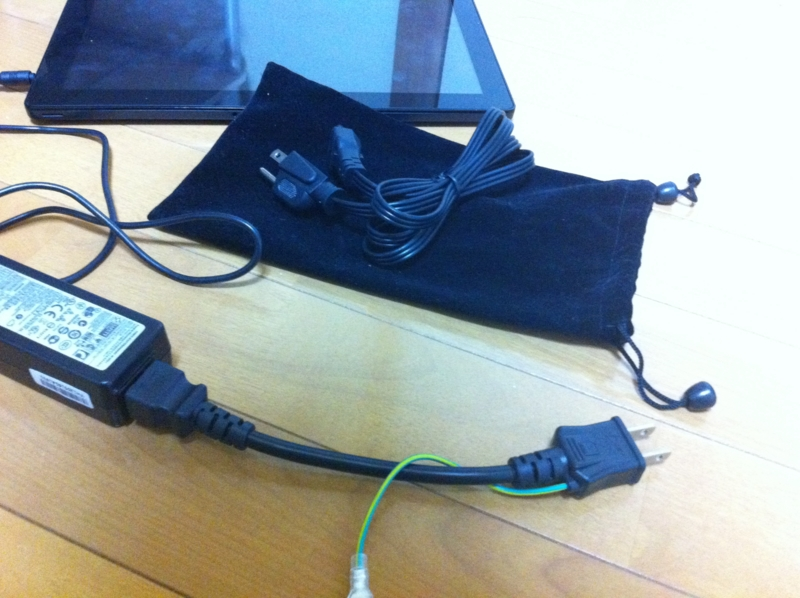

Samsung Series 7 Slate の AC アダプタの予備が欲しくなって、米アマゾンで注文した。二つあれば会社と自宅において置けるので、いちいちコンセントから引っこ抜いて通勤中に持ち歩かずに済む。

<a href="http://www.amazon.com/gp/product/B005NS36XM">Amazon.com: Samsung 40W Replacement AC Adapter for Samsung Series 7 Slate: Samsung XE700T1A, Samsung XE700T1A-A01US, Samsung XE700T1A-A03US, Samsung XE700T1A-A04US, Samsung XE700T1A-A05US, 100% Compatible With P/N: AA-PA2N40L, BA44-00278A, AD-4019W: Computers &amp; Accessories</a>

お値段は4,000円程度（送料・税金込み）。これ、巾着袋付きなんだねぇ。モノ自体はそんなに高くないのだけれど、海を超えると輸送に費用がかさむ。けれどこのおかげで、今週一週間、持ち運びがだいぶ楽になった。

<a href="http://www.amazon.co.jp/exec/obidos/ASIN/B001QCXQXY/bestylesnet-22/">ELECOM ノートPC電源ケーブル/3pin-2pin/0.2m T-PCM302</a>
<ul><li>出版社/メーカー: エレコム</li><li>発売日: 2009/02/02</li><li>メディア: Personal Computers</li><li>購入: 13人 クリック: 32回</li><li><a href="http://d.hatena.ne.jp/asin/B001QCXQXY/bestylesnet-22" target="_blank">この商品を含むブログ (3件) を見る</a></li></ul>

ついでに、3ピン → 2ピン の変換ケーブルも注文。出先だと3ピンのコンセントを確保できるとは限らない。あと、純正のアダプタはちょっとケーブルが長すぎるというのもあって、少し短めのものを買うことにした。ちょっと太くて硬いけど満足。

Windows 8 搭載の新製品の話もちらほら聞こえてくるけど、久しぶりにエキサイティングな製品が多い。この冬は盛り上がるんじゃないかな？　S7S で Windows 8 を使い始めて2週間ほど経つけど、もうタッチパネルのない“モバイル”を買う気にはなれないぐらい、とても気に入っている。

問題はまだまだアプリが少ないことかな……MetroだかストアだかModernだかしらんが（名前ぐらい決めろよ）、もうちょっとアプリが増えてほしい。まぁ、増えろ増えろとじゅもんを唱えてばかりいるのもアホらしいので、自分でも作ってみるつもりではあるが。

あと、3時間ぐらいソリティアしてたらタッチパネルがすごく不安定になってしまったのだけど……

<blockquote cite="http://d.hatena.ne.jp/kaorun/20120709/1341790322">

Samsung Series 7 Slate、ACアダプタをタコ足配線したコンセントからとってると、タッチパネルが非常に不安定になることがあるようなのです。かねてから、タッチ操作が時々おかしくなるな、と思っていたのですが、そこが原因か、と。…（中略）…静電容量タッチパネルは原理的に静電気やノイズに弱いので、ACからのノイズ対策が不十分なのではないかと思います。

<cite><a href="http://d.hatena.ne.jp/kaorun/20120709/1341790322">&#x9759;&#x96FB;&#x5BB9;&#x91CF;&#x30BF;&#x30C3;&#x30C1;&#x30D1;&#x30CD;&#x30EB;&#x3068;&#x30BF;&#x30B3;&#x8DB3;&#x914D;&#x7DDA; - Neutral Scent</a></cite>
</blockquote>

とのこと。一瞬壊しちゃったのかと思って焦ったサ。

