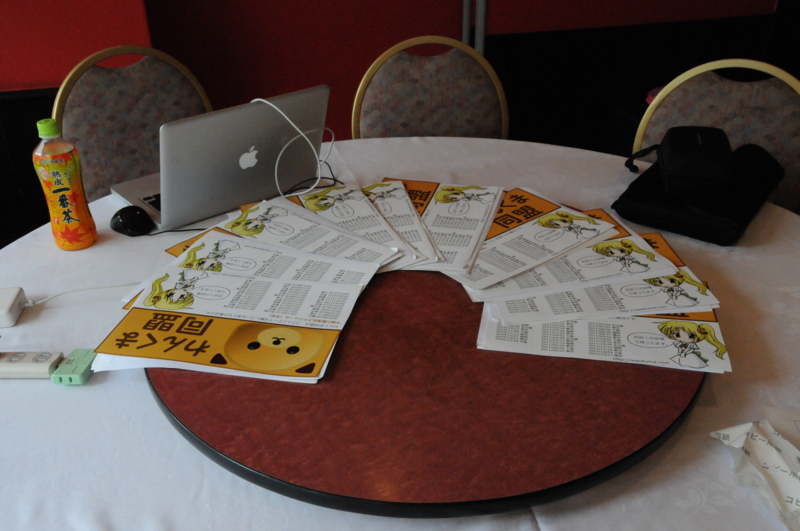

<a href="http://www.wankuma.com/seminar/20120901yokohama04/">&#x308F;&#x3093;&#x304F;&#x307E;&#x540C;&#x76DF;</a>

今回は「C++縛り」だったみたいで、BeOS が死んでから10年以上ロクに触っていない僕にとっては完全なアウェーでしたΣ(´∀｀；)

けれど、最近ってこういうことになっているんだな、と知るにはとても有意義だったのかも。とくに libdcompile の話などは、ノンジャンルの勉強会で聞く機会などあまりないでしょう。ほかの言語で実装されたパラダイムを貪欲にとりこみ進化していく C++ は本当に“ヤベぇ”なぁと思いました。

とはいえ、僕なんかは「（そういうオシャレ機能は）ほかの言語にやらせておけばええんでない？」と思わないでもないのですけれど。

確かに auto などはあってしかるべき、というかないと面倒すぎるだろ、いまさらかよと思います<a href="#f1" name="fn1" title="ただ、 var とか新しい予約語作るべきじゃね……">*1</a>が、あとは Boost 使っとけばいいんじゃないかなぁ、とか<a href="#f2" name="fn2" title="いや、たいして知らんのだけどね">*2</a>。ラムダなんて、ほんとうにいるかどうか言われたら微妙な気がする<a href="#f3" name="fn3" title="C# だったらラムダないのはありえないけど">*3</a>。

ただ、それも C++ はもっとシンプルであるべきとか、仕様的に混乱しているところをもっと整理すれば？とか、そういった期待からそう感じるだけで。C/C++ なんて“言語を書くための言語”とか、“アセンブラ代わり”につかうハードウェア叩くためのトンカチとか、そういうのでええんちゃうの、と。でも、きっと C++11 の新機能は“現場”からの要望に基づいているのだろうし、そういった要望が出てくるということは、C++ が依然理論だの理想だのに埋没していない、第一級の“実践言語”である証拠なのかもしれないな、と感じました。

もちろん、メイン（？）の中華料理も堪能してきましたよ！　でも、シュウマイの写真を撮るの忘れた……まじショック。

<a href="#fn1" name="f1" class="footnote-number">*1</a>:ただ、 var とか新しい予約語作るべきじゃね……

<a href="#fn2" name="f2" class="footnote-number">*2</a>:いや、たいして知らんのだけどね

<a href="#fn3" name="f3" class="footnote-number">*3</a>:C# だったらラムダないのはありえないけど

