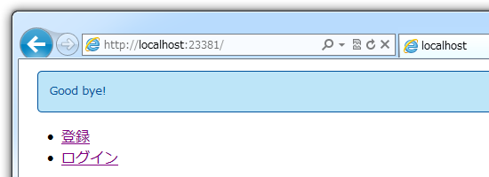

 

<ul>
<li><a href="https://blog.daruyanagi.jp/entry/2012/08/24/095023">WebMatrix &#x3067;&#x30E6;&#x30FC;&#x30B6;&#x30FC;&#x8A8D;&#x8A3C;&#x6A5F;&#x80FD; &#x2015;&#x2015; &#x6E96;&#x5099;&#x7DE8; - &#x3060;&#x308B;&#x308D;&#x3050;</a></li>
<li><a href="https://blog.daruyanagi.jp/entry/2012/08/24/105121">WebMatrix &#x3067;&#x30E6;&#x30FC;&#x30B6;&#x30FC;&#x8A8D;&#x8A3C;&#x6A5F;&#x80FD;&#xFF08;2&#xFF09; &#x2015;&#x2015; WebSecurity&#x3063;&#x3066;&#x3069;&#x3046;&#x3084;&#x3063;&#x3066;&#x4F7F;&#x3046;&#x3093;&#x3060;&#xFF1F; - &#x3060;&#x308B;&#x308D;&#x3050;</a></li>
<li><a href="https://blog.daruyanagi.jp/entry/2012/08/25/003421">WebMatrix &#x3067;&#x30E6;&#x30FC;&#x30B6;&#x30FC;&#x8A8D;&#x8A3C;&#x6A5F;&#x80FD;&#xFF08;3&#xFF09; &#x2015;&#x2015; &#x306A;&#x306B;&#x306F;&#x3068;&#x3082;&#x3042;&#x308C;&#x30E6;&#x30FC;&#x30B6;&#x30FC;&#x767B;&#x9332;&#x3057;&#x306A;&#x3044;&#x3068;&#x59CB;&#x307E;&#x3089;&#x3093; - &#x3060;&#x308B;&#x308D;&#x3050;</a></li>
<li><a href="https://blog.daruyanagi.jp/entry/2012/08/28/191129">WebMatrix &#x3067;&#x30E6;&#x30FC;&#x30B6;&#x30FC;&#x8A8D;&#x8A3C;&#x6A5F;&#x80FD;&#xFF08;4&#xFF09; &#x2015;&#x2015; &#x30ED;&#x30B0;&#x30A4;&#x30F3;&#x3068;&#x30ED;&#x30B0;&#x30AA;&#x30D5; - &#x3060;&#x308B;&#x308D;&#x3050;</a></li>
</ul>
とりあえずログイン機能があらかた実装できたけれど、これだとだれでもユーザーが作れてしまう。まぁ、そういうアプリもあるけど、“管理者”のみがユーザーを作成できるほうが望ましいこともある。そういった“管理者”権限を実現したいときにはどうするかというと、“ロール（Roles）”を使うんだな。

<h3>System.Web.Security.Roles</h3>

ロールの作成方法については、ここらあたり（<a href="http://www.asp.net/web-pages/tutorials/security/16-adding-security-and-membership">Adding Security and Membership to an ASP.NET Web Pages (Razor) Site | Microsoft Docs</a>）が詳しい。

その例だとロールの作成するためにデータベースを直接イジっていて、一瞬「あちゃー、コードでやろうと思ったら SQL 書かなきゃいけないのかな？」と思ってしまったけど、ちゃんと Roles を扱うクラスが用意されていた<a href="#f-f17309a6" name="fn-f17309a6" title="公式ドキュメントでデータベースを直接イジっていたのには、なにか理由があるのだろうか">*1</a>。

<a href="http://msdn.microsoft.com/en-us/library/system.web.security.roles.aspx">http://msdn.microsoft.com/en-us/library/system.web.security.roles.aspx</a>

とりあえずさらっと目を通しておくとよさげ。

<h4>Roles.RoleExists() / Roles.CreateRole()</h4>

まず、 _AppStart.cshtml で“ロールがなければ作成する”という処理を追加してみた。

<pre class="code lang-cs" data-lang="cs" data-unlink>@{
App.DATABASE = &quot;database&quot;; // &lt;-- カッコ悪いし、
App.TABLE_USERS = &quot;Users&quot;; //     あとで静的クラスにまとめて
App.ROLE_ADMIN = &quot;admin&quot;;  //     リードオンリーにしておくべき

WebSecurity.InitializeDatabaseConnection(
App.DATABASE, App.TABLE_USERS, &quot;UserId&quot;, &quot;Name&quot;, true);

if (!Roles.RoleExists(App.ROLE_ADMIN)) // &lt;-- ココ！
{
Roles.CreateRole(App.ROLE_ADMIN);
}
}
</pre>

できたっぽい。拍子抜けしたぞなもし。

<h4>Roles.AddUserToRole()</h4>

つぎに、“初めて登録されたユーザーは管理者にする”ということにしてみようか。

<pre class="code lang-cs" data-lang="cs" data-unlink># ~/Account/Register.cshtml

try
{
WebSecurity.CreateUserAndAccount(
name, password, new { Name = name });
WebSecurity.Login(name, password);

// 最初のユーザーには管理者権限を付与
if (App.GetUserCount() &lt;= 1)
{
Roles.AddUserToRole(name, App.ROLE_ADMIN);
}

Response.Redirect(&quot;~/&quot;);
}
catch (Exception e)
{
ModelState.AddFormError(e.Message);
}
</pre>

ちゃんと UserId 1 に RoleId 1（admin）が紐付けられた。ちなみに、複数のユーザーを一度にロールへ突っ込むためのメソッドもある。

ちなみに、残念ながらユーザーの数を数えるメソッドは用意されていないみたいなので、これは SQL で書かないといけない。

<pre class="code lang-cs" data-lang="cs" data-unlink>@{
App.GetUserCount = (Func&lt;int&gt;)GetUserCount; // &lt;-- 個人的趣味
}

@functions
{
int GetUserCount()
{
const string sql = &quot;SELECT COUNT(*) FROM {0}&quot;;
return Database
.Open(App.DATABASE)
.QueryValue(string.Format(sql, App.TABLE_USERS));
}
}
</pre>
でも、もしかしたらメソッドが用意されていない≒あんまりよくない実装 なのかもしれない。よく利用する処理なら、標準でメソッドが用意されているよね？<a href="#f-ad523936" name="fn-ad523936" title="まぁ、案外そうとも限らないわけだけど">*2</a>　まぁ、それはまた今度考えよう。

<h4>Roles.IsUserInRole() / WebSecurity.RequireRoles()</h4>

んで、ロールが必要な処理には一行このように書き加えておく。この場合は、 Register.cshtml だね。 _PageStart.cshtml に書けば、フォルダ内の cshtml すべてに適用することもできる（はず、確かそうだった）。

<pre class="code lang-cs" data-lang="cs" data-unlink>@{
WebSecurity.RequireRoles(App.ROLE_ADMIN);
}
</pre>

必要なロールをもたなければ、ログインページにリダイレクトされる<a href="#f-6b31afe3" name="fn-6b31afe3" title="今気付いたけど、 Log in to ってなんやねんｗ">*3</a>ようだ<a href="#f-f34e9562" name="fn-f34e9562" title="既定では ~/Account/LogIn みたい">*4</a>。

<pre class="code lang-cs" data-lang="cs" data-unlink>@{
if (!Roles.IsUserInRole(App.ROLE_ADMIN))
{
:
:
</pre>
もちろん、ロールをもつかどうかの判定のみを行うこともできる。 <a href="https://blog.daruyanagi.jp/entry/2012/08/29/201834">&#x5BC4;&#x308A;&#x9053;&#xFF1A; Rails &#x306E; Flash &#x3063;&#x307D;&#x3044;&#x6A5F;&#x80FD;&#x3092; WebMatrix &#x3067;&#x4F7F;&#x3044;&#x305F;&#x3044; - &#x3060;&#x308B;&#x308D;&#x3050;</a> などを使ってユーザーにメッセージを通知したい場合など、いきなりリダイレクトされると困る場合はこっちを使ったほうがよさげだな。

<a href="#fn-f17309a6" name="f-f17309a6" class="footnote-number">*1</a>:公式ドキュメントでデータベースを直接イジっていたのには、なにか理由があるのだろうか

<a href="#fn-ad523936" name="f-ad523936" class="footnote-number">*2</a>:まぁ、案外そうとも限らないわけだけど

<a href="#fn-6b31afe3" name="f-6b31afe3" class="footnote-number">*3</a>:今気付いたけど、 Log in to ってなんやねんｗ

<a href="#fn-f34e9562" name="f-f34e9562" class="footnote-number">*4</a>:既定では ~/Account/LogIn みたい

