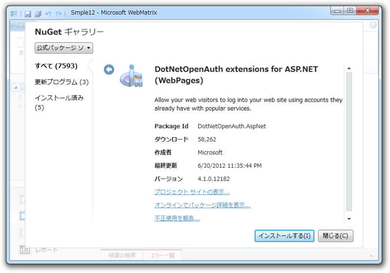
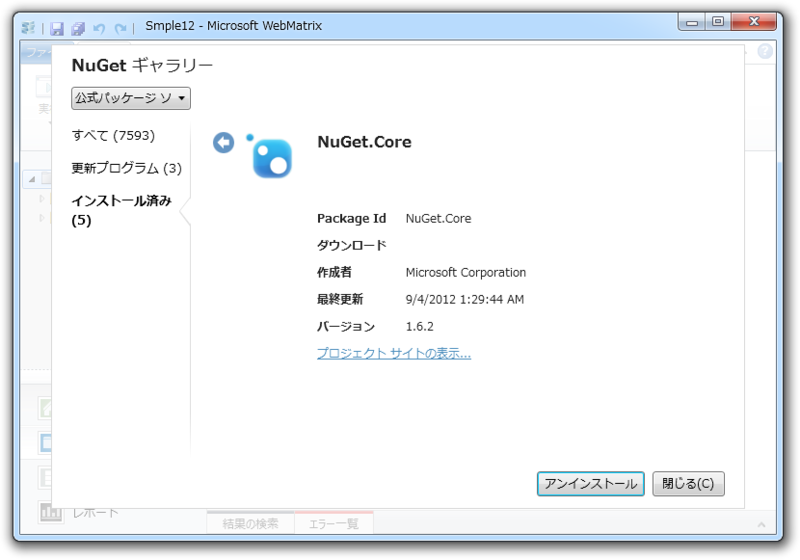
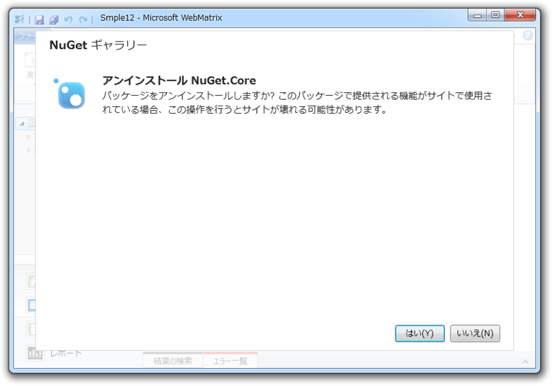
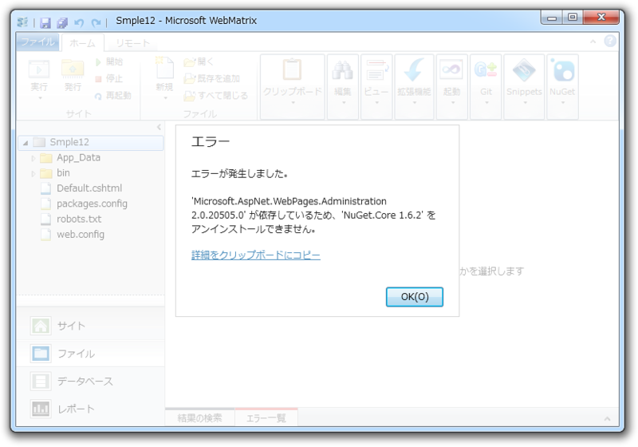
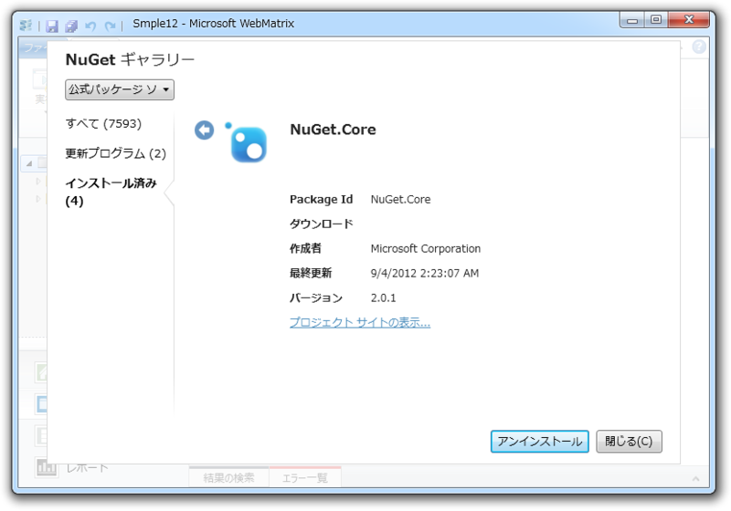
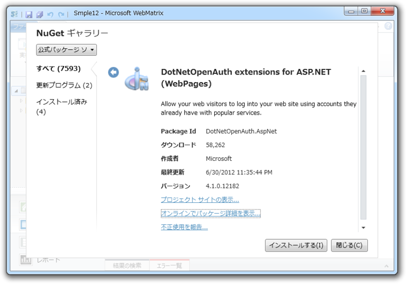
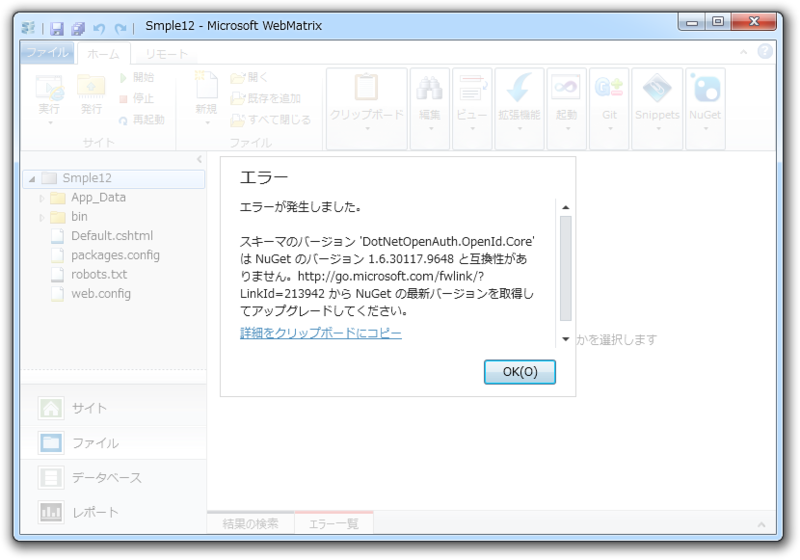

WebMatrix 2 では Twitter や Facebook など、外部サービスの OAuth 認証を使ってログインできるサイトも簡単に作れるらしい。というわけで試すことにした。

いつもどおり Empty Site テンプレートから Webサイトを作成。ついで DotNetOpenAuth extension for ASP.NET (WebPages) を NuGet でインストール。

<b>ガッデム！／(^o^)＼</b> NuGet が古いらしいぞ。

確かに Empty Site テンプレートに含まれるのは 1.6.2 と相当古い。とっくに 2.0 も出てるのにな。しかし、なんで［更新プログラム］のところに出てこないのだろう。自動でアップデートできないじゃないか。一度アンインストールして、再度インストールしてみるかな。

<blockquote cite="https://nuget.org/packages/Microsoft.AspNet.WebPages.Administration">

<h4>Dependencies</h4>

<ul>
<li>Microsoft.AspNet.WebPages (≥ 2.0.20710.0 && < 2.1)</li>
<li>NuGet.Core (≥ 1.6.2 && < 1.7)</li>
</ul>

<cite><a href="https://nuget.org/packages/Microsoft.AspNet.WebPages.Administration">NuGet Gallery | Microsoft ASP.NET Web Pages 2 Administration 2.0.20713.0</a></cite>
</blockquote>

<b>ジーザス！／(^o^)＼</b> これが依存性地獄か！

うまくいっているときには気にならないが、こういう状況になると WebMatrix に搭載されている NuGet クライアントは非常に非力かつ情報不足に感じられて、使うのが辛くなる。

とりあえず、このパッケージが何をしているのかは知らんが、ぶっこ抜くことにした。なに、困ったら初めからやり直せば良い ( ｰ`дｰ´)ｷﾘｯ ＜失うものなどなにもないんだ！

<b>ウェルダン！＼(^o^)／</b> これで NuGet.Core のバージョンが 2.0.1 になった。これでもう一度インストールを……

<b>ゴッドイズデス！／(^o^)＼</b> NuGet.Core は関係なかったのか？　Visual Studio の Nuget は最新版なのだけどなぁ。どこかに古いのが残っていて、それを参照しているのかな。面倒くさいことになった。

まぁ、続きは WebMatrix 2 の正式版まちってことで。ちなみに、今すぐ OAuth を試したい子は Starter Site テンプレートを使うといい。古いバージョンが完璧にセットアップ済みなので、とりあえず試すことができるゾ。

