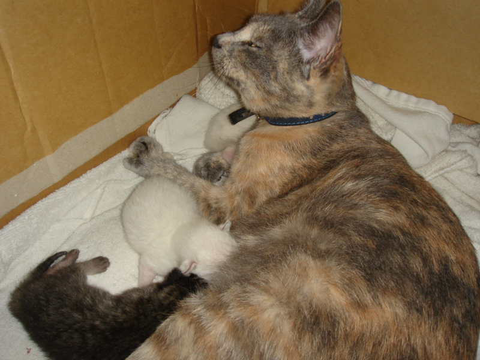
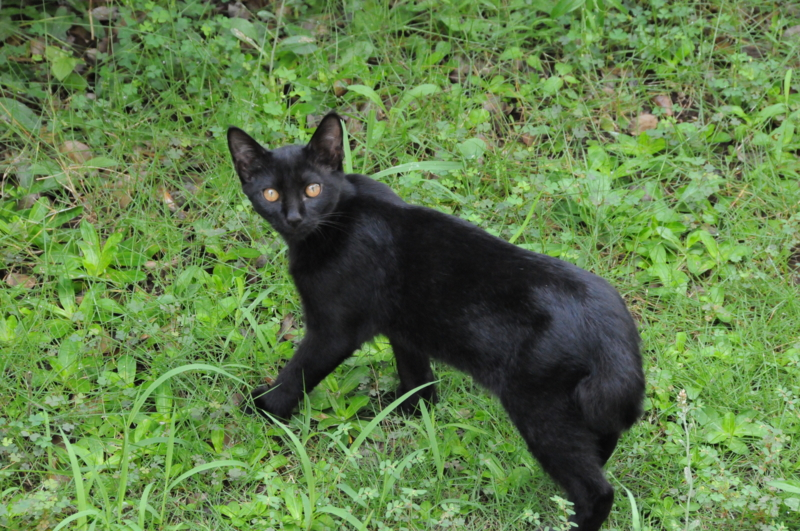
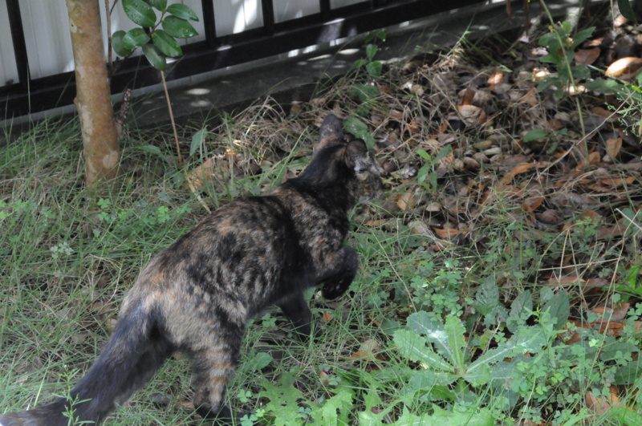

むかし、弟2号が野良ネコを拾ってきて、実家で飼っていた。まこと奔放なネコで、なんせ家でじっとしているのが嫌い。しかも、いつの間にかカラフルな子ネコを産んだりする<a href="#f1" name="fn1" title="子ネコは里子に出して、あとで避妊手術は受けさせたのだけど">*1</a>困ったヤツで、挙句の果てにはある日ふらっと家出してしまった。けれどまだ近くに住んでいるみたいで、たまに顔を見せに帰ってくるようだ。どうやら、周りの家を転々としていて、あちこちでいろんな名前で呼ばれながらかわいがられているみたい。痩せてはいるけどそれはもともとで、そんなにエサにも困っていないらしい。

そんなネコ理解のある地域だからか知らないけれど、最近なんだかネコの数が増えてきた。個人的にはネコ大好きだからいいのだけど、あんまりやりすぎはよくないんじゃね？　といいつつ、実家に帰るたびにニヤニヤしながら眺めている。なんでこいつらはこんなにかわいいんだろうね<a href="#f2" name="fn2" title="逆に、イヌは嫌いじゃないけど好きでもない">*2</a>。

そういえば、アポリネールの『動物詩集』にこんな詩がある。

<blockquote>

Le chat

Je souhaite dans ma maison:   
Une femme ayant sa raison,   
Un chat passant parmi les livres,   
Des amis en toute saison  
Sans lesquels je ne peux pas vivre. 

</blockquote>

理解のある妻がいて 
本の間を歩くネコがいて 
それなしではどの季節も生きてゆけない、そんな友達がいる。 
そんな家に、わたしは住みたい。

実家の周りにいるヤツらはそんなに知的ではないけれど（笑）、それでもやっぱりネコのいる家がいい。まぁ、“理解のある妻”をゲットするのはだいぶ難しいとしても、そのうち猫が飼える家に引っ越したいものだ。たまに友達を呼んで、ゴロゴロしてさ。

<a href="#fn1" name="f1" class="footnote-number">*1</a>:子ネコは里子に出して、あとで避妊手術は受けさせたのだけど

<a href="#fn2" name="f2" class="footnote-number">*2</a>:逆に、イヌは嫌いじゃないけど好きでもない

