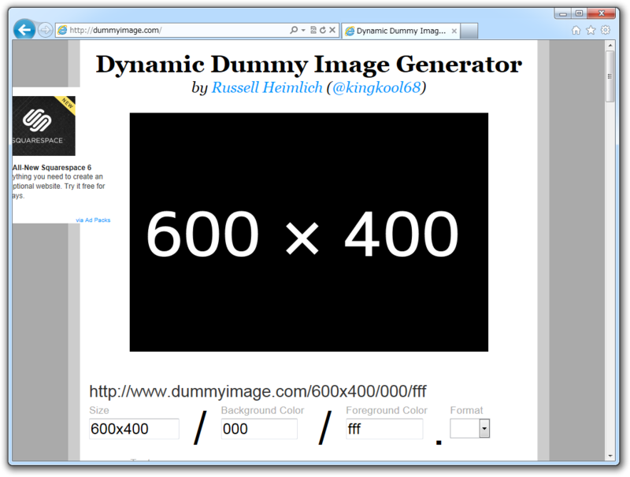
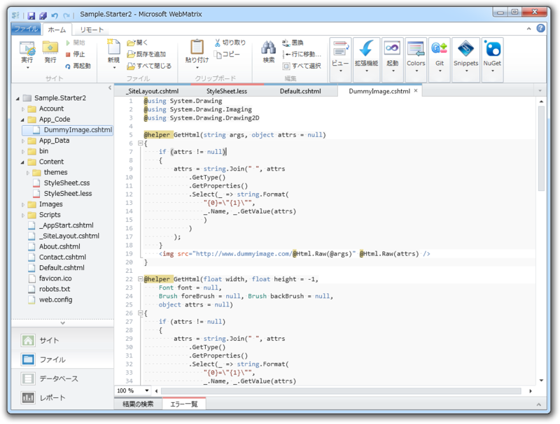
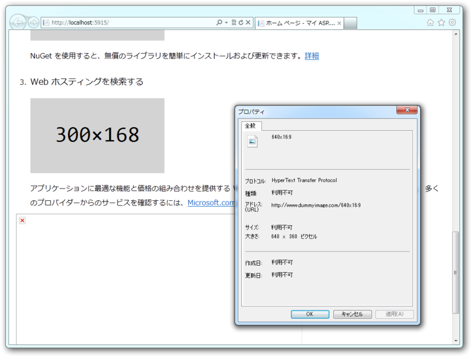
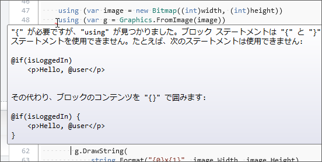

Web サイトのデザインを考えるとき、ダミーイメージは欠かせないよね。少なくとも、自分はそう。そんな悩める怠惰な子ブタたちのために、 <a href="http://dummyimage.com">http://dummyimage.com</a> はある。

こいつはパラメータを与えて URL を投げるだけで、いろんなサイズ・色のダミーイメージをじぇねれいと<a href="#f1" name="fn1" title="クールに発音してくれよ？　じぇねりっと って感じやな">*1</a>してくれるクールなサービスなんだ。

<h3>もっとクールに</h3>

でも、まさか WebMatrix を使っているおシャレさんのなかに、 &ltimg src="htt... だなんて毎度いちいち手入力してるヤツはいないよな。もちろん、ヘルパーにしておいて自動補完機能に入力させるハズだ。機械でできることを手でやるのはアホのすることだ<a href="#f2" name="fn2" title="おれです、ゴメンナサイゴメンナサイ">*2</a>。

<pre class="code lang-cs" data-lang="cs" data-unlink>#~/App_Code/DummyImage.cshtml

@helper GetHtml(string args, object attrs = null)
{
if (attrs != null)
{
attrs = string.Join(&quot; &quot;, attrs
.GetType()
.GetProperties()
.Select(_ =&gt; string.Format(
&quot;{0}=\&quot;{1}\&quot;&quot;,
_.Name, _.GetValue(attrs)
)
)
);
}
&lt;img src=&quot;http://www.dummyimage.com/@Html.Raw(@args)&quot;
@Html.Raw(attrs) /&gt;
}
</pre>
こうやっておけば、

<pre class="code lang-cs" data-lang="cs" data-unlink>@DummyImage.GetHtml(&quot;640x16:9&quot;)
</pre>
と書くだけ<a href="#f3" name="fn3" title="実質的にはほとんど @ , dumm... , g, "640x16:9" と入力するだけ！">*3</a>で、実行時に

<pre class="code lang-cs" data-lang="cs" data-unlink> &lt;img src=&quot;http://www.dummyimage.com/640x16:9&quot;  /&gt;
</pre>
のような HTML コードへ展開される。画像タグに alt 属性をつけなければ瞬時に息絶える W3C 原理主義者や、 style を埋め込みたいなんていうわがままさんはこんな感じで書けばいい。

<pre class="code lang-cs" data-lang="cs" data-unlink>@DummyImage.GetHtml(300,
new { alt = &quot;Dummy image&quot;, style = &quot;border: 1px red solid;&quot;})
</pre>

<h3>激怒してみた</h3>

けれど、世の中うまくいかないものだ。 Web ページを実行してもなかなか画像が表示されない。 dummyimage.com が重過ぎるんだ！（怒

でも、よく考えたらローカルの資源はありあまっているわけで……ダミー画像なんかむしろそっちで作るべきだよね。なんでも Web サービスに頼るのはよくないな。

<pre class="code lang-cs" data-lang="cs" data-unlink>#~/App_Code/DummyImage.cshtml

@using System.Drawing
@using System.Drawing.Drawing2D
@using System.Drawing.Imaging
@using System.Drawing.Text

@helper GetHtml(float width, float height = -1,
Font font = null,
Brush foreBrush = null, Brush backBrush = null,
object attrs = null)
{
// リフレクションで匿名オブジェクトを HTML 属性にするぜー
if (attrs != null)
{
attrs = string.Join(&quot; &quot;, attrs
.GetType()
.GetProperties()
.Select(_ =&gt; string.Format(
&quot;{0}=\&quot;{1}\&quot;&quot;,
_.Name, _.GetValue(attrs)
)
)
);
}

// 一応引数のチェック。負数ははじくか 16:9 に整形
if (width &lt;= 0)
{
throw new ArgumentException(&quot;Width must be &gt; 0&quot;);
}
height = height &gt; 0 ? height : width * 9 / 16;

// ここから画像生成。さいごに BASE64 に変換してタグに埋め込む
var image = new Bitmap((int)width, (int)height);
var base64 = string.Empty;

using (var g = Graphics.FromImage(image))
{
// おまえのパワー、あまってんだろ？　品質最高にしてやんぜー
g.SmoothingMode = SmoothingMode.HighQuality;
g.PixelOffsetMode = PixelOffsetMode.HighQuality;
g.TextRenderingHint = TextRenderingHint.AntiAlias;

// 背景塗りつぶすぜー
g.FillRectangle(
backBrush ?? Brushes.LightGray,
0, 0, width, height);

// どまんなかにテキスト書くぜー
var format = new StringFormat();
format.Alignment = StringAlignment.Center;
format.LineAlignment = StringAlignment.Center;

g.DrawString(
string.Format(&quot;{0}×{1}&quot;, image.Width, image.Height),
font ?? new Font(&quot;Consolas&quot;, 36, FontStyle.Regular),
foreBrush ?? Brushes.Black,
new RectangleF(0, 0, width, height),
format
);
}

// 画像バイナリをテキスト（BASE64）に変換するぜー
using (var stream = new System.IO.MemoryStream())
{
image.Save(stream, ImageFormat.Png);
base64 = Convert.ToBase64String(stream.ToArray());
}

// HTML タグとして出力されるぜー
&lt;img src=&quot;data:image/png;base64,@Html.Raw(@base64)&quot;
@Html.Raw(attrs) /&gt;
}
</pre>

一見長いけど、やってることは FillRect() と DrawImage() 、BASE64 変換だけだよ。

みんな ImageMagick 好きだけど、わしは .NET Framework の方が慣れていていいや。なぜか動かなくて悩んだりせずに済むしな<a href="#f4" name="fn4" title="お前が使い方をわかってないだけや！">*4</a>。

<h3>おまけ激怒</h3>

Razor の制限とはいえ…… using をネストしなければならないのは泣ける！（怒 
まぁ、あとで画像生成部分を @functions に切り出せばよいかな。

気が向いたらこいつは NuGet にしておきたいけれど、ダミーテキストを作るヘルパーもほしくなってきたね……なにかおもしろことできないかな。

<a href="#fn1" name="f1" class="footnote-number">*1</a>:クールに発音してくれよ？　じぇねりっと って感じやな

<a href="#fn2" name="f2" class="footnote-number">*2</a>:おれです、ゴメンナサイゴメンナサイ

<a href="#fn3" name="f3" class="footnote-number">*3</a>:実質的にはほとんど @ , dumm... , g, "640x16:9" と入力するだけ！

<a href="#fn4" name="f4" class="footnote-number">*4</a>:お前が使い方をわかってないだけや！

