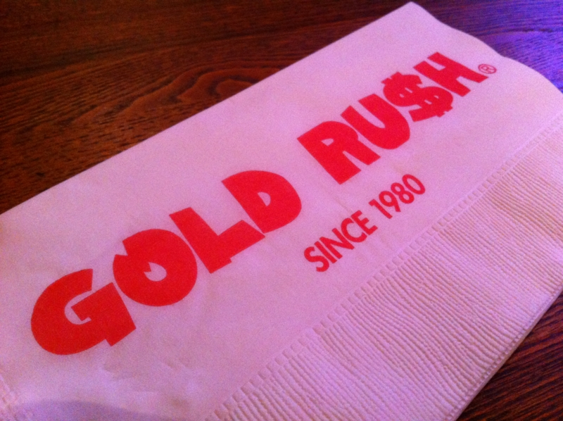
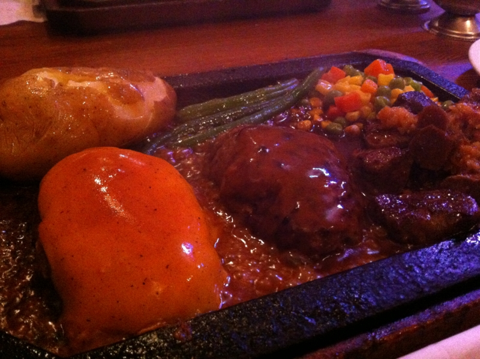
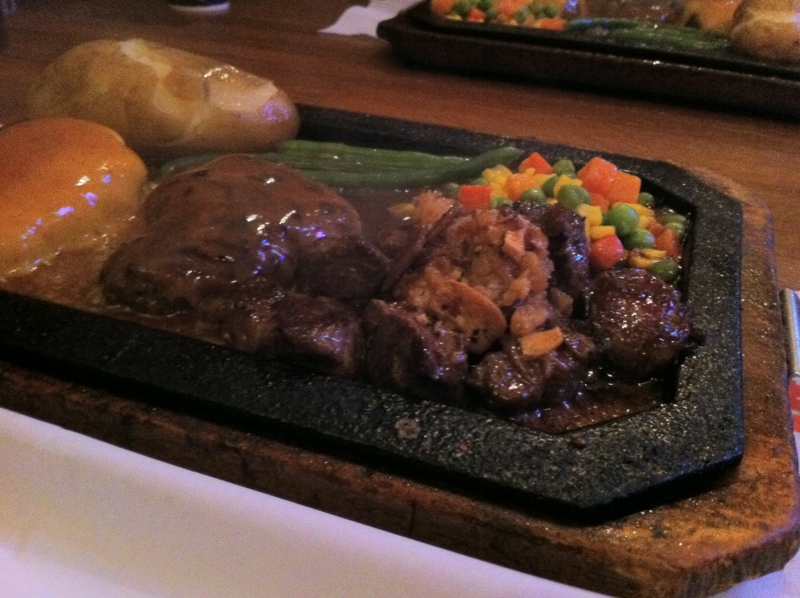

今月は勉強会続きで財政事情が厳しく、倹約生活が続いている。肉なんてもってのほかだ！　けれど、@shibayan が執拗に一緒に肉を食いに行きたいと言う。そこでしょうがなく、新宿まで食べに行ってあげた。ウソです。お肉食べたかったです。

<a href="http://www.gold-rush.jp/">&#x30CF;&#x30F3;&#x30D0;&#x30FC;&#x30B0;&#x5C02;&#x9580;&#x5E97;&ldquo;&#x30B4;&#x30FC;&#x30EB;&#x30C9;&#x30E9;&#x30C3;&#x30B7;&#x30E5;&rdquo;</a>

ワイルドでアメリカンな感じのお店だった。

料理がきてその場でソースを掛けてもらうのだけど、そのときナプキンでカラダを防御するように指示される。でも、ナプキンをつまんでいる指先までは当然防御しきれなくて、

└( ^ω^ )┘ｱｰﾁｰﾁｰ└( ^ω^ )┘ｱｰﾁｰ♪

みたいな感じだった。

Nikon 1 V1 が入院中で、 iPhone だと美味しそうに撮れないのが残念<a href="#f1" name="fn1" title="お店の中がちょっと暗いんだよね">*1</a>。 @shibayan の婚約自慢を聞きながら、ワイルドでアメリカンなステーキ＆ハンバーグを美味しくいただいた。わしもそろそろこの東京砂漠から抜けだして、離島みたいなところでのんびり幸せに暮らしたい。

とつぶやいてみたところ……

<blockquote class="twitter-tweet" data-in-reply-to="243675349764943872" lang="ja">
つ四国 RT @<a href="https://twitter.com/daruyanagi">daruyanagi</a> どこか俺なんかでも移住していい離島とかないかなぁ
&mdash; なかじ＠松山．愛媛さん (@nakaji) <a href="https://twitter.com/nakaji/status/243696092389183488" data-datetime="2012-09-06T13:04:10+00:00">9月 6, 2012</a></blockquote>

四国の人って案外自虐キャラが多い気がする。

<a href="#fn1" name="f1" class="footnote-number">*1</a>:お店の中がちょっと暗いんだよね

