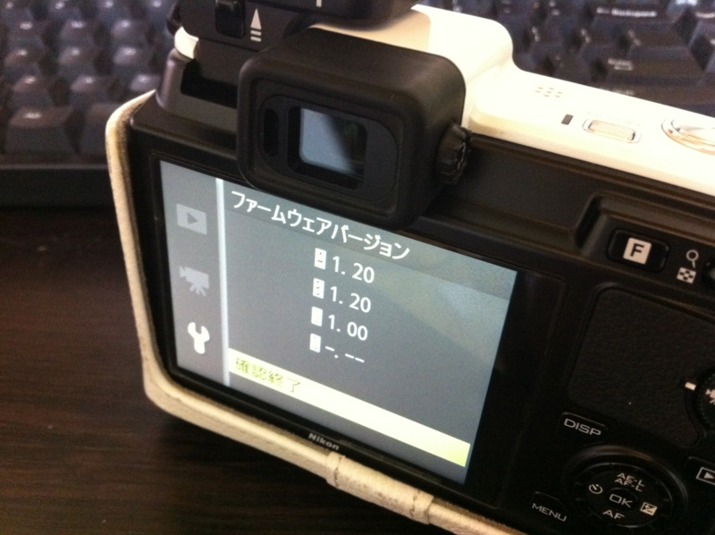

<a href="https://blog.daruyanagi.jp/entry/2012/08/26/114129">&#x30D7;&#x30ED;&#x30B0;&#x30E9;&#x30DF;&#x30F3;&#x30B0;&#x751F;&#x653E;&#x9001;&#x52C9;&#x5F37;&#x4F1A; &#x7B2C;17&#x56DE;&#xFF20;&#x54C1;&#x5DDD; #pronama &#x306B;&#x53C2;&#x52A0;&#x3057;&#x3066;&#x304D;&#x307E;&#x3057;&#x305F; - &#x3060;&#x308B;&#x308D;&#x3050;</a> の懇親会で Nikon 1 V1 の電源が急に入らなくなって修理に出したのが、今さっき帰ってきた。アホでもちゃんと写せるカメラとして結構活躍していたので、これがなくて不便してたんだよね。基盤交換にて対応との由。

今回はニコンのピックアップサービスというのを使って修理に出してみた。これ、クロネコヤマトが空箱を持ってきて、その場で集荷してくれるんだよね。とても便利だと思う。

ただし、1回目、クロネコヤマトのひとが集荷せずにそのまま帰っちゃったのを除いて。

カメラを箱に入れようとしてたら、そのまま帰ってしまってちょっとビビった。もう一度ピックアップサービスを頼んだ時はちゃんとやってくれたのだけど、おかげで空箱がひとつ余ってしまった。どうしよう。そのまま送り返せばいいんだろうか。まぁ、次回のためにもらっておくか。

まぁ、そんな多少の行き違いはあったけれど、別にニコンさんのせいじゃないし、やっぱり梱包材が付きで空箱が届くのは便利だと思った。今度壊れた時も使ってみたい。……壊れないに越したことないけどね！

<h3>追記</h3>

ファームウェアも最新になってた！<a href="#f-31701f0f" name="fn-31701f0f" title="バッテリーも満タンになってた気がする">*1</a>　さすがやな。こういう仕事はうれしい。

<a href="#fn-31701f0f" name="f-31701f0f" class="footnote-number">*1</a>:バッテリーも満タンになってた気がする

