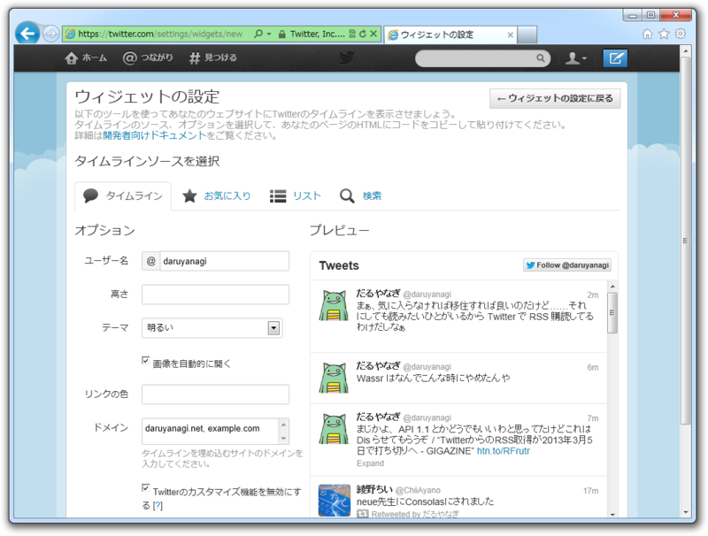
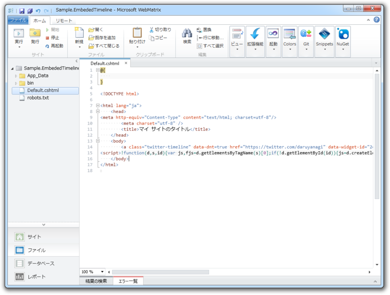
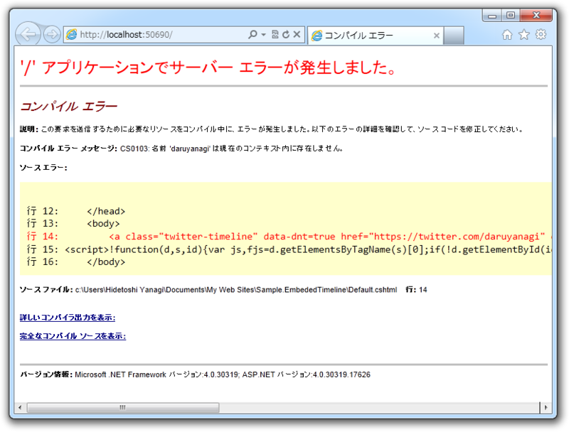
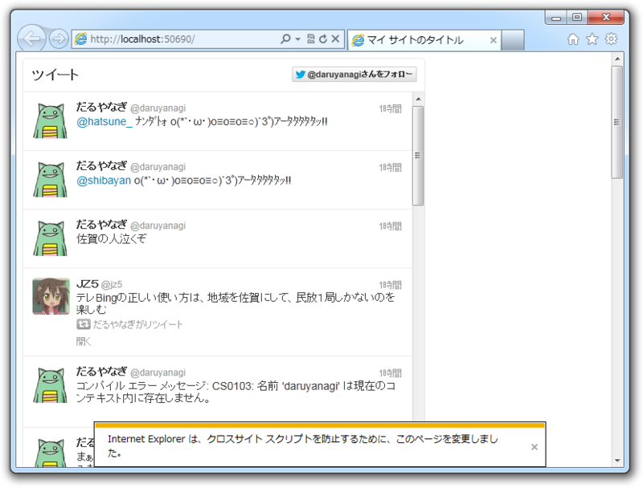

 

<blockquote cite="http://blog.jp.twitter.com/2012/09/blog-post.html">

サイトの上に簡単にTwitterのタイムラインを表示できるツール「埋め込みタイムライン」の提供を始めました。ブログの隣に表示したり、＃ハッシュタグを使ったイベントのページに表示したり、スポーツの試合ページに参加選手のリストを使って選手のツイートを表示するなど、サイト上にリアルタイムのツイートを加えることができます。

<cite><a href="http://blog.jp.twitter.com/2012/09/blog-post.html">http://blog.jp.twitter.com/2012/09/blog-post.html</a></cite>
</blockquote>

さっそく WebMatrix 2 RC版（！）で試してみよう。<a href="https://twitter.com/settings/widgets">Login on Twitter</a> でウィジェットを作って cshtml へ貼り付けてみる。

<h3>ちょっとした注意</h3>

<b>ガッデム／(^o^)＼</b>

貼りつけたスクリプトに @ が含まれているときは注意だね。 Razor はこれを処理すべき変数・メソッドと解釈するので、当然エラーになる。 @ をそのまま出力したい場合は、

<pre class="code" data-lang="" data-unlink>@@daruyanagi    // -&gt; &#34;@daruyanagi&#34; </pre>
と @ を重ねて書けばいい。

<h3>もちろんヘルパーにしてみる……</h3>

と思ったけれど、結局わざわざウィジェットページへ行かなければならないので、ヘルパーにしてもあまり美味しくないと思った。

<pre class="code lang-cs" data-lang="cs" data-unlink># ~/App_Code/Twitter.EmbededTimeline.chtml

@helper GetHtml(
string id, string url, string text = null,
int? width = null, int? height = null, string lang = null,
string theme = null, string link_color = null,
string[] related = null, string aria_polite = null)
{
if (string.IsNullOrEmpty(text))
{
// URL を解析して適当なテキストを生成する処理
// たとえば、
// twitter.com/daruyanagi -&gt; @daruyanagi からのツイート
}

&lt;a class=&quot;twitter-timeline&quot; href=&quot;@url&quot;
data-widget-id=&quot;@id&quot;
data-theme=&quot;@theme&quot;
data-link-color=@link_color
data-related=&quot;@string.Join(&quot;, @related)&quot;
data-aria-polite=&quot;@aria_polite&quot;
width=&quot;@width&quot; height=&quot;@height&quot; lang=&quot;@lang&quot;&gt;@text&lt;/a&gt;
}
</pre>
こんな感じで書いておいて、

<pre class="code lang-html" data-lang="html" data-unlink>&lt;!DOCTYPE html&gt;

&lt;html lang=&quot;ja&quot;&gt;
&lt;head&gt;
&lt;meta http-equiv=&quot;Content-Type&quot; content=&quot;text/html; charset=utf-8&quot;/&gt;
        &lt;meta charset=&quot;utf-8&quot; /&gt;
        &lt;title&gt;マイ サイトのタイトル&lt;/title&gt;

        // これを挿入しておく
        // Assets か RenderSection() でやるとよいけどこれはまた後ほど
        &lt;script id=&quot;twitter-wjs&quot;
                src=&quot;//platform.twitter.com/widgets.js&quot;&gt;&lt;/script&gt;
    &lt;/head&gt;
&lt;body&gt;
@Twitter_EmbededTimeline.GetHtml(
&quot;244022447123333120&quot;,
@&quot;http://twitter.com/daruyanagi&quot;)
@Twitter_EmbededTimeline.GetHtml(
&quot;244027379142492160&quot;,
@&quot;http://twitter.com/daruyanagi/favorites&quot;)
@Twitter_EmbededTimeline.GetHtml(
&quot;244027809108987904&quot;,
@&quot;http://twitter.com/search?q=#corgi&quot;)
&lt;/body&gt;
&lt;/html&gt;
</pre>
と使うんだけど、まぁ、結構微妙だよね。ウィジェット ID と URL の最低2つをコピってこなければならない。それだったら、何も考えずに<a href="#f-934456ce" name="fn-934456ce" title="@ のエスケープはしなきゃだけど">*1</a>吐かれた公式のコードを張ったほうがマシだ。

試しにウィジェット ID を使いまわしていろんなパラメーターを入れると、 IE がなにかお世話をしてくれるみたい。このメッセージは初めてみたかも。

<h3>おまけ</h3>

ちなみに Twitter.EmbededTimeline.chtml のクラス名は、 . が _ に置き換えられて Twitter_EmbededTimeline になる。Visual Studio なんかの IntelliSense でみてみればわかるけど、これはほかの WebPage クラス（cshtml ファイル）でも同じみたい。

<pre class="code lang-cs" data-lang="cs" data-unlink>@Twitter_EmbededTimeline.GetHtml()
</pre>
これをちゃんと（？）

<pre class="code lang-cs" data-lang="cs" data-unlink>@Twitter.EmbededTimeline.GetHtml()
</pre>
みたいに呼びたい場合は、 ~/App_Code/Twitter/EmbededTimeline.chtml ってな感じにサブフォルダーへ分けてしまえば OK 。一手間かかるからちょっと面倒だけどね。

<pre class="code lang-xml" data-lang="xml" data-unlink>&lt;?xml version=&quot;1.0&quot;?&gt;
&lt;configuration&gt;
&lt;system.web&gt;
&lt;compilation&gt;
&lt;codeSubDirectories&gt;
&lt;add directoryName=&quot;Twitter&quot;/&gt;
&lt;/codeSubDirectories&gt;
&lt;/compilation&gt;
&lt;/system.web&gt;
&lt;/configuration&gt;
</pre>
試してはないけど、こんな感じで動くんじゃないかな。

<ul>
<li><a href="https://blog.daruyanagi.jp/entry/2012/08/16/182105">App_Code &#x3067;&#x30B5;&#x30D6;&#x30D5;&#x30A9;&#x30EB;&#x30C0;&#x30FC;&#x3092;&#x5229;&#x7528;&#x3059;&#x308B; - &#x3060;&#x308B;&#x308D;&#x3050;</a></li>
</ul>

<a href="#fn-934456ce" name="f-934456ce" class="footnote-number">*1</a>:@ のエスケープはしなきゃだけど

