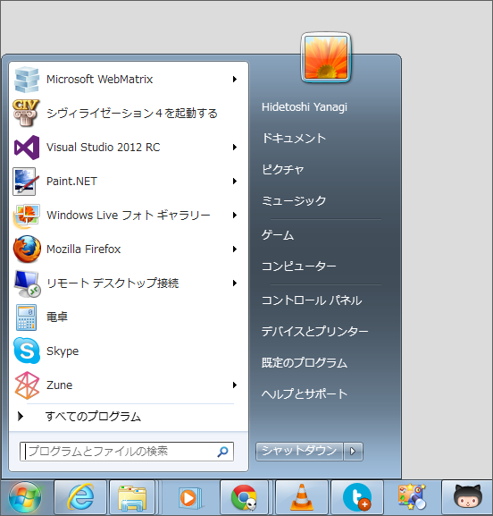
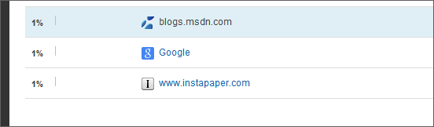
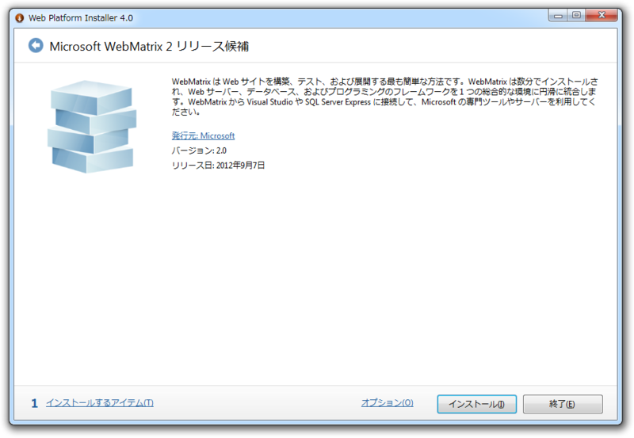
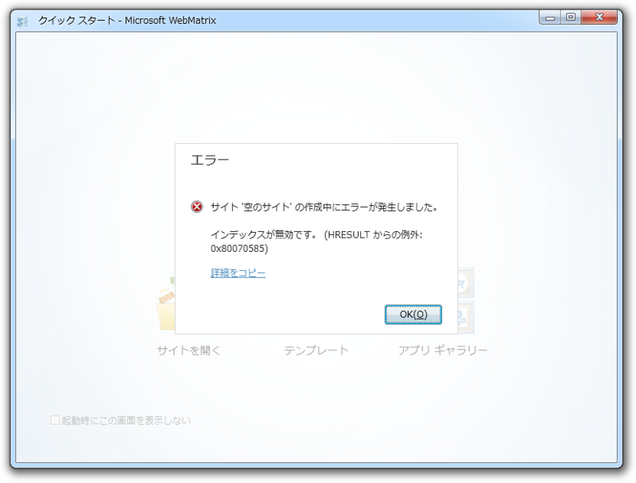

<blockquote cite="http://blogs.msdn.com/b/windowsazurej/archive/2012/09/07/webmatrix-2-is-released-new-windows-azure-features.aspx">

今年 6 月、WebMatrix の最新リリースを Windows Azure Web サイトと組み合わせて、PHP サイトの作成に使用できるようになったことをブログ記事でお伝えしました。それに続き、今回、WebMatrix 2 がリリースされました。この記事では、主な機能の概要をご紹介すると共に、Windows Azure との統合についてご説明します。

<cite><a href="http://blogs.msdn.com/b/windowsazurej/archive/2012/09/07/webmatrix-2-is-released-new-windows-azure-features.aspx">
Windows Azure &#x5BFE;&#x5FDC;&#x306E;&#x65B0;&#x6A5F;&#x80FD;&#x3092;&#x642D;&#x8F09;&#x3057;&#x305F; WebMatrix 2 &#x3092;&#x30EA;&#x30EA;&#x30FC;&#x30B9; - Windows Azure Team Blog (Japan) - Site Home - MSDN Blogs
</a></cite>
</blockquote>

やったー＼(^o^)／

心待ちにしていたのでいち早くお仕事としてお伝えしたかったのですが、今日はあいにくお休みでした。ほかの媒体のニュースを読んで楽しんでいただければと思います。

こんなに愛しているのに！　正直ちょっと悲しい。

はてなブログに引っ越してからは Google 検索での流入がほぼゼロ<a href="#f1" name="fn1" title="この間ドメインを変えたばかりってのも大きいのかも">*1</a>、「WebMatrix」でぐぐってもヒットするのは75枚目という<b>“Google から見捨てられたブログ”</b>の異名をもつ<b>“だるろぐ”</b><a href="#f2" name="fn2" title="Bing ではそこまでひどくはない気がする……と思ったけどそうでもなかった。なぜか27枚目に、わしのはてはハイクが引っかかる……">*2</a>では、あまり速報するモチベーションもあがらないしね。今日はお酒飲んで本読んで、掃除して、洗濯して、寝た。さすがに悲しかったので、少しは検索順位があがると寂しさが紛れるなぁと思い、さっき Google ウェブマスターツールに登録してきました。おれも <a href="http://shiba-yan.hatenablog.jp/entry/20120907/1346974814">WebMatrix 2 &#x6B63;&#x5F0F;&#x7248;&#x304C;&#x3084;&#x3063;&#x3068;&#x30EA;&#x30EA;&#x30FC;&#x30B9;&#x3055;&#x308C;&#x307E;&#x3057;&#x305F; - &#x3057;&#x3070;&#x3084;&#x3093;&#x96D1;&#x8A18;</a> みたいに<b>「WebMatrix メイド」</b>で検索に引っかかるようにがんばろうかな。さしずめ<b>「WebMatrix ホモ」</b>あたりで頑張るか<a href="#f3" name="fn3" title="ちなみにホモは興味ないです">*3</a>。

で、肝心の「WebMatrix 2」ですけど。

Web Platform Installer での表記が“リリース候補”のままだったり、

新規テンプレートが作れなかったり、ちょっと悲しいことになっている。

<pre class="code" data-unlink>DownloadManager Information: 0 : Adding product &#39;EmptySite&#39; to the cart
DownloadManager Information: 0 : Starting install sequence
DownloadManager Information: 0 : Using cached file at C:\Users\Hidetoshi Yanagi\AppData\Local\Microsoft\Web Platform Installer\installers\EmptySite\***\EmptySite_ja.zip instead of downloading from http://download.microsoft.com/download/A/2/2/A22B1165-4759-4AF1-B01E-C31011F746C8/EmptySite_ja.zip
DownloadManager Information: 0 : Loading product xml from: https://go.microsoft.com/?linkid=9810537
DownloadManager Information: 0 : https://go.microsoft.com/?linkid=9810537 responded with 302
DownloadManager Information: 0 : Response headers:
HTTP/1.1 302 Found
Cache-Control: private
Content-Length: 175
Content-Type: text/html; charset=utf-8
Expires: Fri, 07 Sep 2012 13:05:52 GMT
Location: https://www.microsoft.com/web/webpi/4.0/webproductlist.xml
Server: Microsoft-IIS/7.5
X-AspNet-Version: 2.0.50727
X-Powered-By: ASP.NET
Date: Fri, 07 Sep 2012 13:06:52 GMT</pre>
再インストールしても直らなかったので、サーバー側の問題っぽい。ログみてもそんな感じ。まぁ、じきに直ると思けど |дﾟ)ﾁﾗｯ　それとも、RC版の残りカスがどこかに残っているのかな。

結果的には今日お仕事お休みでよかった。

<a href="#fn1" name="f1" class="footnote-number">*1</a>:この間ドメインを変えたばかりってのも大きいのかも

<a href="#fn2" name="f2" class="footnote-number">*2</a>:Bing ではそこまでひどくはない気がする……と思ったけどそうでもなかった。なぜか27枚目に、わしのはてはハイクが引っかかる……

<a href="#fn3" name="f3" class="footnote-number">*3</a>:ちなみにホモは興味ないです

