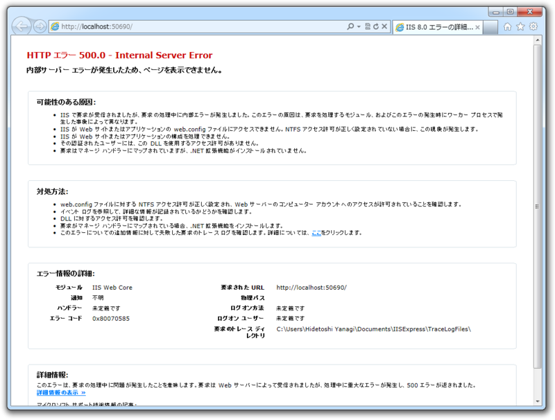

<a href="https://blog.daruyanagi.jp/entry/2012/09/07/221315">&#x300C;Microsoft WebMatrix 2&#x300D;&#x304C;&#x6B63;&#x5F0F;&#x7248;&#x306B;&hellip;&hellip;&#x30AC;&#x30C3;&#x30C7;&#x30E0;&#xFF0F;(^o^)&#xFF3C; - &#x3060;&#x308B;&#x308D;&#x3050;</a> でファーストインプレッションをすっかり書くのを忘れていた。テンプレートからサイトが新規に作成できない問題はすでにフォーラムへ報告しておいたので、既存の Web サイトを開いてみてほかに気付いた点を。

<h3>テキストエディターはかなりよくなった</h3>

<blockquote class="twitter-tweet" data-lang="ja">
WebMatrix2はパフォーマンスがかなり改善されてます。ときどきやたら反応が重かった問題に対応されてますので、ぜひお試しを
&mdash; 帝国兵 (@superriver) <a href="https://twitter.com/superriver/status/243832941581570048?ref_src=twsrc%5Etfw">2012年9月6日</a></blockquote>

少し使ってみたけれど、クリップボードへのコピーでもたついたり、ときどきかなり遅くなったり、挙げ句の果てはクラッシュするといったエディター関連の問題はかなり解消されたみたい。

 

<blockquote cite="https://blog.daruyanagi.jp/entry/2012/08/15/061025">

あと、［Alt］キーでメニューのナビゲーションが出るのだけれど、そっちにフォーカスがとられて矩形選択や IME の切り替えに支障が出るのもなおしてほしいところかな。

<cite><a href="https://blog.daruyanagi.jp/entry/2012/08/15/061025">WebMatrix + ASP.NET Web Pages &#x3067;&#x30AD;&#x30EC;&#x30A4;&#x306B;&#x30B3;&#x30FC;&#x30C7;&#x30A3;&#x30F3;&#x30B0;&#x3057;&#x305F;&#x3044;&#xFF08;5&#xFF09; - &#x3060;&#x308B;&#x308D;&#x3050;</a></cite>
</blockquote>

あんまり期待していなかったこの問題も見事に解消されていた。

IME の切り替えで［Alt］＋［~］を利用しても、メニューナビゲーションにキーボードのフォーカスが奪われることがなくなった。最悪「そっちのキーバインド変えれば済むだろ」と言われるのを覚悟していたので、ちょっと嬉しい。

<h3>［ギャラリー］ボタンの改良</h3>

ギャラリーボタンに「拡張機能」と「NuGet」がまとめられた。

ただ、これは［ファイル］セクションを開いている場合のみ。［サイト］セクションを開いているとドロップダウンが現れず、「拡張機能ギャラリー」がいきなり起動する。この動作の違いは、ちょっと戸惑う。最初だけだけどね。

<h3>リモートサイトの設定</h3>

前からこんなんだっけ？　ちょっと自信はないけれど、わかりやすくなったと思う。 WebMatrix はもう完全に“Widows Azure Web Sites のクライアント”という位置づけなのだなぁ。

<h3>コンポーネント・ライブラリのアップデート</h3>

リリース候補版で作った Web サイトを開くと、“APS.NET Web ページ”をアップデートするかと聞かれる。どちらも試してみたけれど、問題なくアップデートできる。

たぶん、あとからでもバージョンアップできるはず。［サイト］セクションの［設定］を開いてみよう。

しかし、“Starter Site”テンプレートの「Microsoft WebPages OAuth Library」をアップデートしようとすると、エラーが発生する。

これは WebMatrix のせいというわけではないのだけれど、 Microsoft がメンテしてるパッケージだよね……。まぁ、じきに直るんだろうけど。

<h3>Web サイトが開始できない</h3>

手元にあったリリース候補版のテンプレート（初期状態）で幾つか試したのだけれど、“APS.NET Web ページ”のアップデートいかんにかかわらず、すべて動かなかった。

どうもうちの環境ではいろいろ問題があるみたい。仕事柄プレリリースの製品をインストール・アンインストールする機会が多いので、そろそろダメになっているのかもしれない。まぁ、メイン PC も Windows 8 にしようかなぁと考えていたところなので、その後もう一度試してみるかな。

