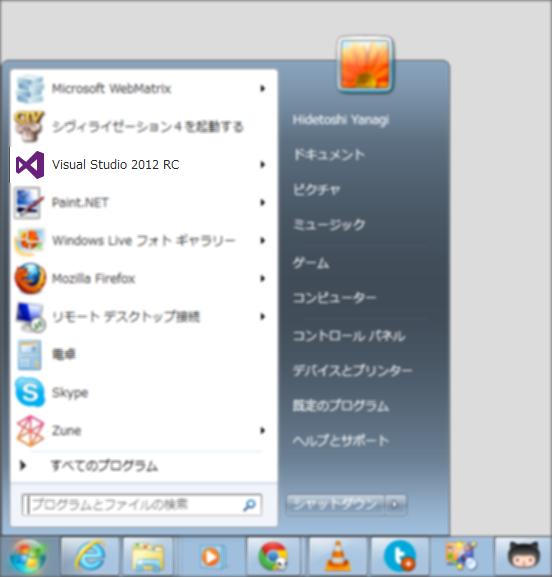

 

<ul>
<li><a href="https://blog.daruyanagi.jp/entry/2012/09/07/221315">&#x300C;Microsoft WebMatrix 2&#x300D;&#x304C;&#x6B63;&#x5F0F;&#x7248;&#x306B;&hellip;&hellip;&#x30AC;&#x30C3;&#x30C7;&#x30E0;&#xFF0F;(^o^)&#xFF3C; - &#x3060;&#x308B;&#x308D;&#x3050;</a></li>
<li><a href="https://blog.daruyanagi.jp/entry/2012/09/08/045120">WebMatrix 2 RTM &#x30D5;&#x30A1;&#x30FC;&#x30B9;&#x30C8;&#x30A4;&#x30F3;&#x30D7;&#x30EC;&#x30C3;&#x30B7;&#x30E7;&#x30F3; - &#x3060;&#x308B;&#x308D;&#x3050;</a></li>
</ul>
うちの環境ではどうも WebMatrix 2 の調子が悪いので、メインPC の OS をクリーンインストール。ついでに Windows 7 から Windows 8 へしてみたところ、何の不自由もなく動きました ／(＾o＾)＼

それにしてもなぜ動かなかったのだろう、と昨日実家に帰ってお肉を食べながら考えていたのだけど、もしかしたらこのせいかもしれない。

あくまでも予想にすぎないのだけれど、Visual Studio 2012 のプレリリース版が入っていたりする場合は、ちゃんと削除してから入れたほうがいいのかも。IIS や ASP.NET Web ページ関連のコンポーネントは共通しているものが多いと思うので。

