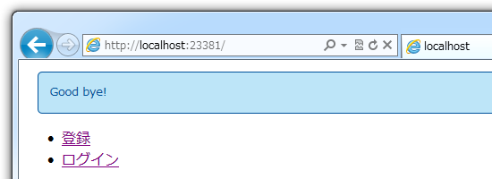
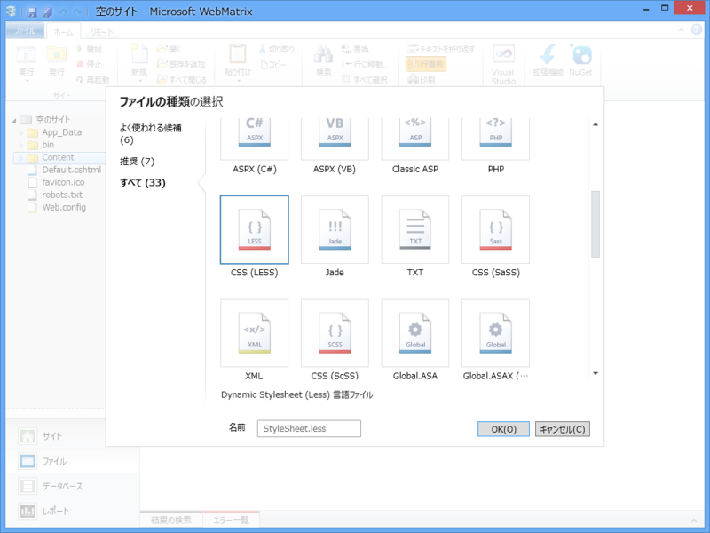
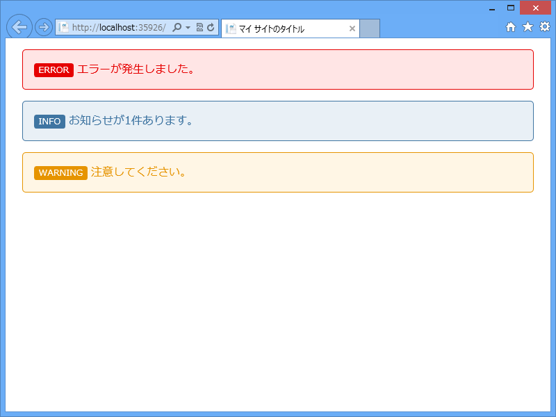
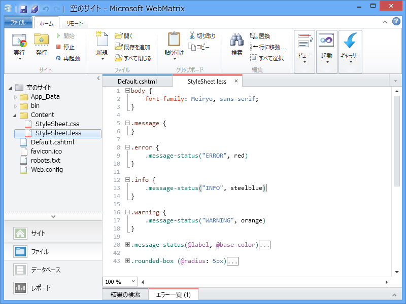

<a href="https://blog.daruyanagi.jp/entry/2012/09/03/093520">WebMatrix &#x3067;&#x30E6;&#x30FC;&#x30B6;&#x30FC;&#x8A8D;&#x8A3C;&#x6A5F;&#x80FD;&#xFF08;5&#xFF09; &#x2015;&#x2015; &#x30ED;&#x30FC;&#x30EB; - &#x3060;&#x308B;&#x308D;&#x3050;</a> なんかで使っているラベル用の CSS は LESS で書いている。変数とか関数とか使えないと、この程度の CSS を書くだけで簡単に破たんできるぜ……。

で、どうやって使うのかというと……例えば、

<pre class="code lang-html" data-lang="html" data-unlink>&lt;!DOCTYPE html&gt;

&lt;html lang=&quot;ja&quot;&gt;
&lt;head&gt;
        &lt;meta charset=&quot;utf-8&quot; /&gt;
        &lt;title&gt;マイ サイトのタイトル&lt;/title&gt;
        &lt;link href=&quot;~/favicon.ico&quot; rel=&quot;shortcut icon&quot;
              type=&quot;image/x-icon&quot; /&gt;
        &lt;link href=&quot;~/Content/StyleSheet.css&quot; rel=&quot;stylesheet&quot;
              type=&quot;text/css&quot; /&gt;
    &lt;/head&gt;
&lt;body&gt;
&lt;div class=&quot;message error&quot;&gt;
エラーが発生しました。
&lt;/div&gt;
&lt;div class=&quot;message info&quot;&gt;
お知らせが1件あります。
&lt;/div&gt;
&lt;div class=&quot;message warning&quot;&gt;
注意してください。
&lt;/div&gt;
&lt;/body&gt;
&lt;/html&gt;
</pre>
こんな cshtml があるとする。次に、新規作成のダイアログで［すべて］タブを選択し、LESS ファイルを作成する。

パスは ~/Content/StyleSheet.less （css → less にするだけ）だよ。あとはどんどん書いていくんだぜ～！　保存するたんびに「OrangeBits Compiler」（後述）が CSS （~/Content/StyleSheet.css）へ変換してくれるから楽ちんでいい。

<pre class="code lang-css" data-lang="css" data-unlink>body {
font-family: Meiryo, sans-serif;
}

.error {
.message-status(&quot;ERROR&quot;, red)
}

.info {
.message-status(&quot;INFO&quot;, steelblue)
}

.warning {
.message-status(&quot;WARNING&quot;, orange)
}
</pre>
関数<a href="#f-b0036404" name="fn-b0036404" title="Mixin（ミックスイン）っていうのかな？">*1</a>のおかげで、メインの部分はこんなにコンパクトだよ。ちなみに message-status というイケてない名前の関数の中身は、以下の通り。上のスタイルシートの続きに書いていく。だいたいそんな感じで使うんだなっていうのがわかると思う。

<pre class="code lang-css" data-lang="css" data-unlink>.message-status(@label, @base-color) {
// 引数がとれる！

// 変数の宣言と組み込み関数による色の演算
@dark-color: darken(@base-color, 5%);
@light-color: lighten(@base-color, 45%);

border: 1px solid black;
border-color: @dark-color;
color: @dark-color;
background-color: @light-color;

margin: 1em;
padding: 1em;
.rounded-box(); // &lt;- スタイルの Mixin

// ネストしたスタイルの指定
// &amp; はちょっと特殊な変数（？）で、現在の要素を表す
// &amp;:before を .label で使うと .label:before になる
&amp;:before {
content: @label;
font-size: 80%;
color: white;
background-color: @dark-color;
padding: 0 0.5em;
.rounded-box(3px);
}
}

.rounded-box (@radius: 5px) { // &lt;- 超便利じゃない？
border-radius: @radius;
-webkit-border-radius: @radius;
-moz-border-radius: @radius;
}
</pre>

こうやってまとめられるところはまとめておくと、CSS が肥大化してもメンテナンス性・可読性への影響が少ないんじゃないかな。

邪魔ならみえないように折りたたんでおくこともできるしね。

WebMatrix 2 では、追加で「Orangebits Compiler」を導入することで、この LESS が簡単に扱えるようになっているのでぜひ試すべし。

<ul>
<li><a href="https://blog.daruyanagi.jp/entry/2012/08/15/161932">WebMatrix &#x3067; LESS &#x3092;&#x4F7F;&#x304A;&#x3046;&#xFF01; - &#x3060;&#x308B;&#x308D;&#x3050;</a></li>
</ul>

<a href="#fn-b0036404" name="f-b0036404" class="footnote-number">*1</a>:Mixin（ミックスイン）っていうのかな？

