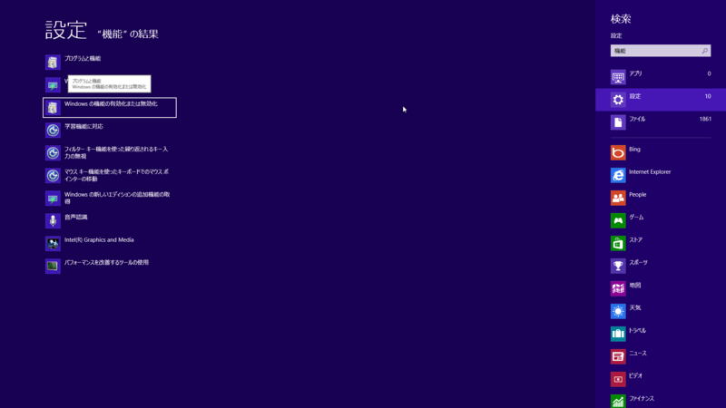
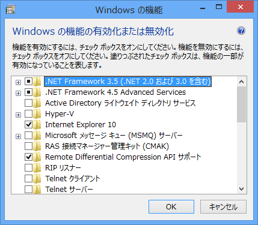
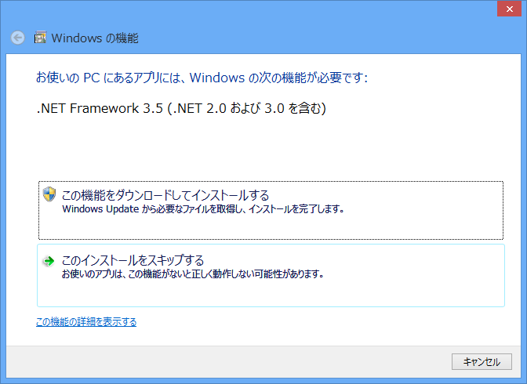
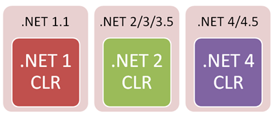
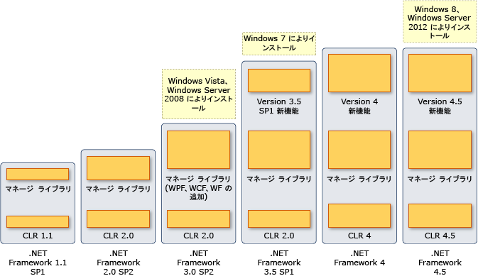

［Windows の機能の有効化または無効化］を開いて……（キーボードだけでぺぺぺっとやるんだぜ？）

.NET Framework 3.5 を有効にするのが正しいやり方。.NET Framework 3.0 や .NET Framework 2.0 ベースのアプリも動くようになる。

でも、これが面倒で、なおかつ「Paint.NET」のファンならば、セットアップ後にさくっと「Paint.NET」をインストールしておくという手もある<a href="#f1" name="fn1" title="「Paint.NET」に限らず、こういう気の利いたアプリケーションのインストールを先にやると手間が省けるということ">*1</a>。インストール時に .NET Framework 3.5 が有効になるよ。

<a href="http://www.forest.impress.co.jp/lib/pic/piccam/picedit/paintdotnet.html">&#x7A93;&#x306E;&#x675C; - Paint.NET</a>

<h3>めんどくさくね？</h3>

via <a href="http://www.hanselman.com/blog/NETVersioningAndMultiTargetingNET45IsAnInplaceUpgradeToNET40.aspx">.NET Versioning and Multi-Targeting - .NET 4.5 is an in-place upgrade to .NET 4.0 - Scott Hanselman</a>

なんでこんなことになっているのか…… CLR 1.0 / CLR 2.0 を標準では有効化しない、という方針によるもの？　ちなみに CLR 3.0 は存在せず、現在の最新版は .NET Framework 4/4.5 のベースとなっている CLR 4/4.5 。そろそろ CLR 2.0 はやめて、CLR 4.x を使ってなーということなのかも。

気持ちはわからんでもないけどめんどくさい。

via <a href="http://msdn.microsoft.com/ja-jp/library/vstudio/bb822049.aspx">&#x30D0;&#x30FC;&#x30B8;&#x30E7;&#x30F3;&#x304A;&#x3088;&#x3073;&#x4F9D;&#x5B58;&#x95A2;&#x4FC2;</a>

<a href="#fn1" name="f1" class="footnote-number">*1</a>:「Paint.NET」に限らず、こういう気の利いたアプリケーションのインストールを先にやると手間が省けるということ

