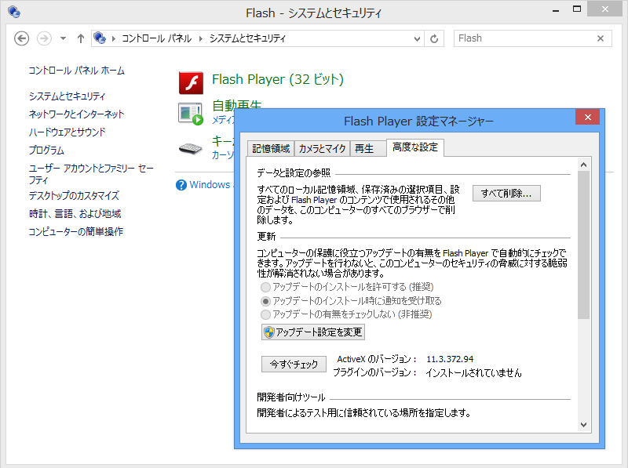
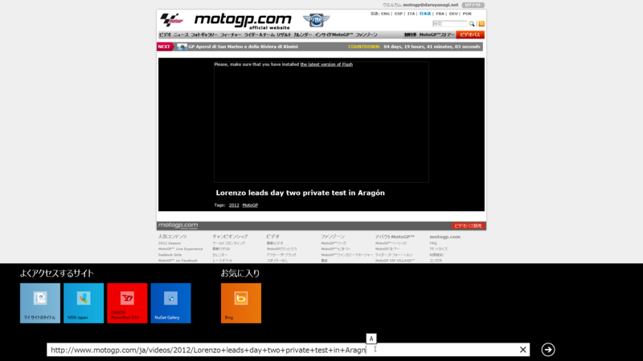
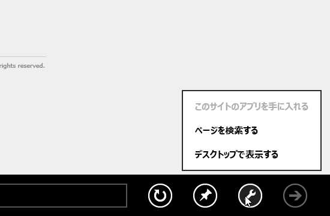

Windows 8 には Adobe Flash Player （32ビット！？）がビルトインされていて<a href="#f1" name="fn1" title="Active X版のみ">*1</a>、標準で Flash コンテンツを表示できる。更新の設定は［アップデートのインストール時に通知を受け取る］になっていて、推奨されている［アップデートのインストールを許可する］にはなっていない。なんでだろう。

あと、 Metro 版<a href="#f2" name="fn2" title="なんか名前変わったらしいけど？　まだ正式な名前は発表されてないし？　なんとでも呼べば？">*2</a>の Internet Explorer では Flash プラグインが動作する Web サイトが限定されている<a href="#f3" name="fn3" title="互換性ビューリストに登録されている必要がある">*3</a>。たとえば、 MotoGP.com では動画が視聴できない……。

この制限はデスクトップ版 Internet Explorer にはないので、もしどうしても見たい場合はデスクトップで開きなおすことになる。話は変わるけれど、個人的にはこれの逆の機能もほしいのだけれど……ごろ寝で使っているときには Metro IE のほうが見やすいんだよね。間違ってデスクトップで開いちゃうと、ちょっと悲しい気分になる。

まぁともかく、もうちょっと Flash が使えるサイトが増えるか、プラグインレスで利用できるサイトが増えるかしてほしいかな。

<a href="#fn1" name="f1" class="footnote-number">*1</a>:Active X版のみ

<a href="#fn2" name="f2" class="footnote-number">*2</a>:なんか名前変わったらしいけど？　まだ正式な名前は発表されてないし？　なんとでも呼べば？

<a href="#fn3" name="f3" class="footnote-number">*3</a>:互換性ビューリストに登録されている必要がある

