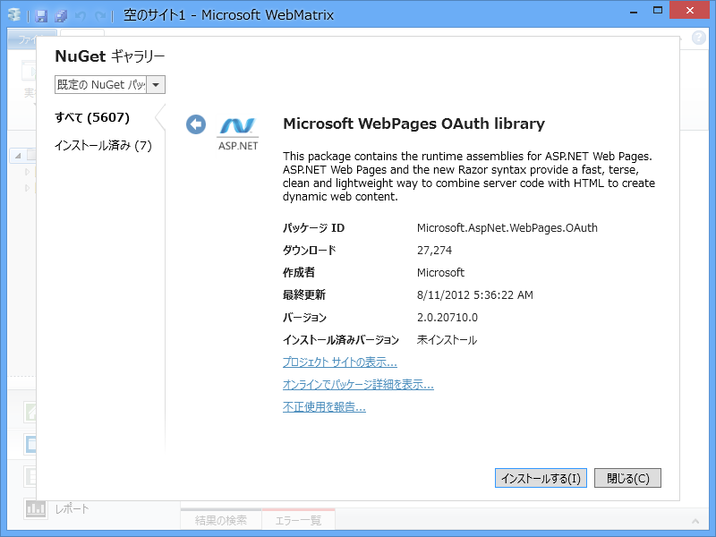
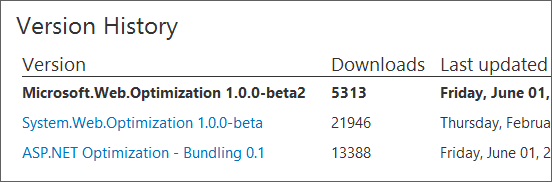
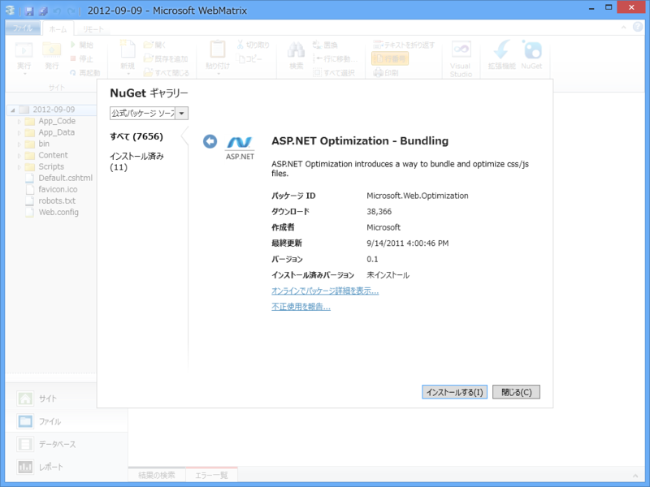
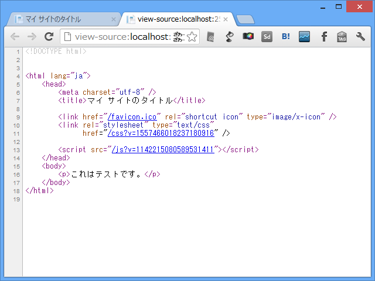
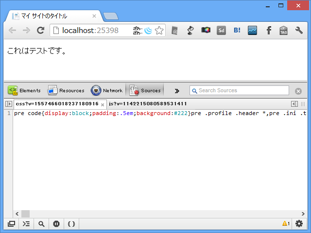
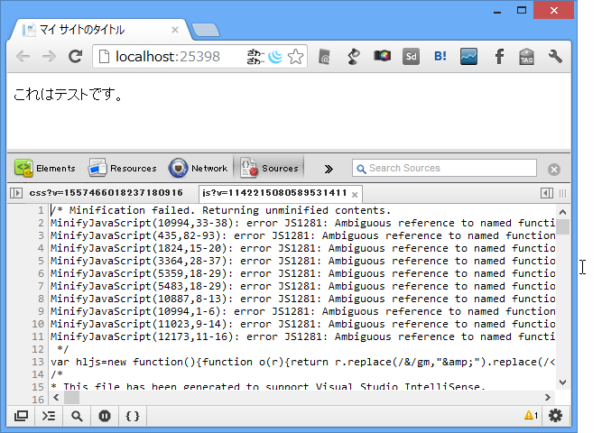

ほんとは OAuth を早く試してみたいのだけれど……

残念ながらこの通りなので。NuGet Gallery にいくとこのバージョンは存在するのだけど、何がおかしいのだろうか。とりあえず報告しておいた。

<h3>Bunlde ＋ Minify ＝ Optimization</h3>

さてはて。というわけで、最後にやってみたかった CSS / Javascript の Bunlde とMinify を試してみる。 

Minify はコードの可読性のためにもうけられたコメントや改行なんかを取っ払ってファイルサイズを小さくすること。 

Bundle はヘルパーやパーシャルビューからメインテンプレートにリソースを登録可能にする CSS / Javascript の管理機能だと思えばいいと思う。ちいさなリソースをまとめて（Bunlde）ドバッと送信しちゃえば、多少パフォーマンスも上がるしねぇ。あと、 jQuery なんかはファイル名にバージョンナンバーが含まれていて、アップデートするたびに手動でリンクも書き換えなくちゃならないのだけど、そういう管理も少し楽になる。

<pre class="code" data-unlink>bundles.Add(
new ScriptBundle(&#34;~/bundles/jquery&#34;, jqueryCdnPath)
.Include(&#34;~/Scripts/jquery-{version}.js&#34;));</pre>

<h3>公式の Optimization ライブラリ</h3>

とはいえ、最後にしたのにはわけがあって……

名前がコロコロ変わっているうえ、まだ v1.0 に到達していないというありさま（<a href="http://nuget.org/packages/microsoft.web.optimization">http://nuget.org/packages/microsoft.web.optimization</a>）。WebMatrix からも一応（一番古いのを）使うことはできるのだけど……もう少し様子見が必要かな。今回はそのまま突っ切っちゃうけど、将来的にはこんな感じにできるんだよっていう参考程度に。 MVC 4 だったらもう使えるのかなぁ。

<h3>Microsoft.Web.Optimization</h3>

まず、Microsoft.Web.Optimization をインストール。

<pre class="code" data-unlink># ＿AppStart.cshtml

@using Microsoft.Web.Optimization

@{
var csses = new Bundle(&quot;~/css&quot;, typeof(CssMinify)); // 仮想パス
csses.AddDirectory(&quot;~/Content/&quot;, &quot;*.css&quot;, true); // ファイル登録
BundleTable.Bundles.Add(csses); // マネージャーに登録

var scripts = new Bundle(&quot;~/js&quot;, typeof(JsMinify));
scripts.AddDirectory(&quot;~/Scripts/&quot;, &quot;*.js&quot;, true);
BundleTable.Bundles.Add(scripts);
}
</pre>
で、 Scripts フォルダーや Content フォルダーを Bundle に登録。

<pre class="code" data-unlink>&lt;!DOCTYPE html&gt;

@using Microsoft.Web.Optimization

&lt;html lang=&quot;ja&quot;&gt;
&lt;head&gt;
        &lt;meta charset=&quot;utf-8&quot; /&gt;
        &lt;title&gt;マイ サイトのタイトル&lt;/title&gt;

        &lt;link href=&quot;~/favicon.ico&quot; rel=&quot;shortcut icon&quot;
              type=&quot;image/x-icon&quot; /&gt;

        // 仮想パス &quot;~/css&quot; として登録したバンドルを解決
        &lt;link rel=&quot;stylesheet&quot; type=&quot;text/css&quot;
         href=&quot;@BundleTable.Bundles.ResolveBundleUrl(&quot;~/css&quot;)&quot; /&gt;

        &lt;script src=&quot;@BundleTable.Bundles.ResolveBundleUrl(&quot;~/js&quot;)&quot;&gt;
        &lt;/script&gt;
    &lt;/head&gt;
&lt;body&gt;
&lt;p&gt;これはテストです。&lt;/p&gt;
&lt;/body&gt;
&lt;/html&gt;
</pre>
で、テンプレートで Bundle を解決。スクリプトなんかは body の最後につっこむほうがナウいかもしれない。ページの読み込みが早くなるんだってさ。

ソースを見たらこんな感じ。 ?v=*** というのは最新版が読み込まれますように、というオマジナイだと思う。

肝心の中身を見てみると…… CSS はちゃんと Minify されているようにみえる。

JavaScript はなんかエラー出た。使い方が悪いのかもしれないけれど、まぁ、正式版になったらまた検証してみるって感じで。

<h3>Scripts セクションで誤魔化す</h3>

とまぁ、こんな感じなのだけれど、「ちょろっとビューからスクリプトを動的に追加したいなぁ」というだけならば、もっとお手軽な方法も使える。

<pre class="code" data-unlink># Sample.cshtml

@section Scripts
{
&lt;link rel=&#34;stylesheet&#34; type=&#34;text/css&#34; href=&#34;***1&#34; /&gt;
&lt;link rel=&#34;stylesheet&#34; type=&#34;text/css&#34; href=&#34;***2&#34; /&gt;
}</pre>
こうやって Scripts セクションを用意しておいて、

<pre class="code" data-unlink># _SiteLayout.cshtml

:
:
@RenderBody(&#34;Scripts&#34;, false)
&lt;/body&gt;
&lt;/html&gt;</pre>
とレイアウト側で呼び出せば OK。“スターター サイト”テンプレートで使われていたやり方をマネしてみただけだけどね！

<h3>追記</h3>

@chack411 さん曰く、 <a href="http://nuget.org/packages/Microsoft.AspNet.Web.Optimization">http://nuget.org/packages/Microsoft.AspNet.Web.Optimization</a> を使うのが正しいそうです（ありがとうございます！）。また後日試してみましょう。

