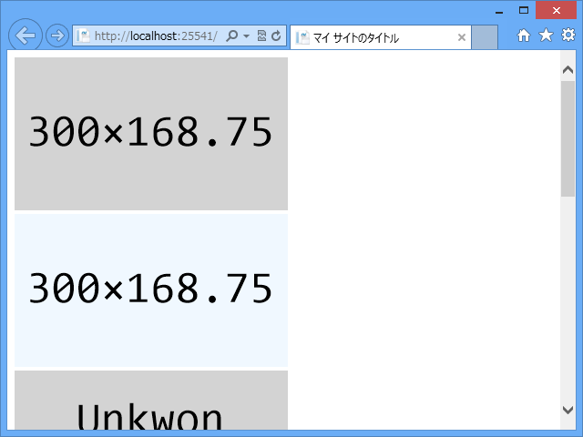

<a href="https://blog.daruyanagi.jp/entry/2012/09/05/050157">&#x30C0;&#x30DF;&#x30FC;&#x30A4;&#x30E1;&#x30FC;&#x30B8;&#x304C;&#x3082;&#x3089;&#x3048;&#x306A;&#x304F;&#x3066;&#x6FC0;&#x6012;&#x3057;&#x305F;&#x306E;&#x3067; WebMatrix &#x3067;&#x30B9;&#x30DE;&#x30FC;&#x30C8;&#x306B;&#x89E3;&#x6C7A;&#x3057;&#x3066;&#x307F;&#x305F;&#x3051;&#x3069;&#x4E00;&#x90E8;&#x6FC0;&#x6012;&#x3057;&#x305F; - &#x3060;&#x308B;&#x308D;&#x3050;</a> で作成したヘルパーを NuGet として公開しました。

<a href="https://nuget.org/packages/DummyImage">https://nuget.org/packages/DummyImage</a>

使い方は簡単！

 

<pre class="code lang-cs" data-lang="cs" data-unlink>// 幅だけ指定すると 16:9 になります
@DummyImage.GetHtml(300)

// 好みの属性を与えられます
@DummyImage.GetHtml(300, attrs: new { Alt = &quot;Alt Txet&quot;, })

// あとは Intellisense でもみてカスタマイズしてください
@DummyImage.GetHtml(
300, backBrush: System.Drawing.Brushes.AliceBlue);
</pre>
あと、各種広告や解像度で一般的なサイズをキーワードで指定することもできます。

<h4>Ad Sizes</h4>

<table>
<tr>
<th>Keyword	</th>
<th>Shortcuts	</th>
<th>Dimensions	</th>
<th>Regular Expression</th>
</tr>
<tr>
<td>mediumrectangle	</td>
<td>medrect	</td>
<td>300×250	</td>
<td>^(med)\w+(rec\w+)</td>
</tr>
<tr>
<td>squarepopup	</td>
<td>sqrpop	</td>
<td>250×250	</td>
<td>^(s\w+pop)</td>
</tr>
<tr>
<td>verticalrectangle	</td>
<td>vertrec	</td>
<td>240×400	</td>
<td>^(ver)\w+(rec)</td>
</tr>
<tr>
<td>largerectangle	</td>
<td>lrgrec	</td>
<td>336×280	</td>
<td>^(large or lrg)(rec)</td>
</tr>
<tr>
<td>rectangle	</td>
<td>rec	</td>
<td>180×150	</td>
<td> ^(rec)</td>
</tr>
<tr>
<td>popunder	</td>
<td>pop	</td>
<td>720×300	</td>
<td>^(pop)</td>
</tr>
<tr>
<td>fullbanner	</td>
<td>fullban	</td>
<td>468×60	</td>
<td>^(f\w+ban)</td>
</tr>
<tr>
<td>halfbanner	</td>
<td>halfban	</td>
<td>234×60	</td>
<td>^(h\w+ban)</td>
</tr>
<tr>
<td>microbar	</td>
<td>mibar	</td>
<td>88×31	</td>
<td>^(m\w+bar)</td>
</tr>
<tr>
<td>button1	</td>
<td>but1	</td>
<td>120×90	</td>
<td>^(b\w+1)</td>
</tr>
<tr>
<td>button2	</td>
<td>but2	</td>
<td>120×60	</td>
<td>^(b\w+2)</td>
</tr>
<tr>
<td>verticalbanner	</td>
<td>vertban	</td>
<td>120×240	</td>
<td>^(ver\w+ban)</td>
</tr>
<tr>
<td>squarebutton	</td>
<td>sqrbut	</td>
<td>125×125	</td>
<td>^(s\w+but)</td>
</tr>
<tr>
<td>leaderboard	</td>
<td>leadbrd	</td>
<td>728×90	</td>
<td>^(lea\w+rd)</td>
</tr>
<tr>
<td>wideskyscraper	</td>
<td>wiskyscrpr	</td>
<td>160×600	</td>
<td>^(w\w+sk\w+r)</td>
</tr>
<tr>
<td>skyscraper	</td>
<td>skyscrpr	</td>
<td>120×600	</td>
<td>^(sk\w+r)</td>
</tr>
<tr>
<td>halfpage	</td>
<td>hpge	</td>
<td>300×600	</td>
<td>^(h\w+g)</td>
</tr>
</table>
第一引数に string をとるオーバーロードがあるので、それにつっこんでください。

<pre class="code lang-cs" data-lang="cs" data-unlink>@DummyImage.GetHtml(&quot;midrect&quot;)

@DummyImage.GetHtml(&quot;skyscraper&quot;)　// &lt;- テキストが縦に……
</pre>
さすがに正規表現には対応していません。

<h4>Screen Standards</h4>

<table>
<tr>
<th>Keyword	</th>
<th>Dimensions</th>
</tr>
<tr>
<td>cga	</td>
<td>320x200</td>
</tr>
<tr>
<td>qvga	</td>
<td>320x240</td>
</tr>
<tr>
<td>vga	</td>
<td>640x480</td>
</tr>
<tr>
<td>wvga	</td>
<td>800x480</td>
</tr>
<tr>
<td>svga	</td>
<td>800x480</td>
</tr>
<tr>
<td>wsvga	</td>
<td>1024x600</td>
</tr>
<tr>
<td>xga	</td>
<td>1024x768</td>
</tr>
<tr>
<td>wxga	</td>
<td>1280x800</td>
</tr>
<tr>
<td>wsxga	</td>
<td>1440x900</td>
</tr>
<tr>
<td>wuxga	</td>
<td>1920x1200</td>
</tr>
<tr>
<td>wqxga	</td>
<td>2560x1600</td>
</tr>
</table>

<h4>Video Standards</h4>

<table>
<tr>
<th>Keyword	</th>
<th>Dimensions</th>
</tr>
<tr>
<td>ntsc	</td>
<td>720x480</td>
</tr>
<tr>
<td>pal	</td>
<td>768x576</td>
</tr>
<tr>
<td>hd720	</td>
<td>1280x720</td>
</tr>
<tr>
<td>hd1080	</td>
<td>1920x1080</td>
</tr>
</table>
ちなみに、大文字と小文字は区別しないと思います。

作ってから思ったけど、 enum にして Intellisense を利かせるべきだったと後悔。こんなん覚えられへん……次のバージョンをだす気になったらつけよう。あ、一つバグを見つけた<a href="#f-325cefa4" name="fn-325cefa4" title="キーワードを指定したとき、 text 引数がダミーイメージに反映されない">*1</a>。また近いうちに次のバージョンを出すと思います。

<a href="#fn-325cefa4" name="f-325cefa4" class="footnote-number">*1</a>:キーワードを指定したとき、 text 引数がダミーイメージに反映されない

