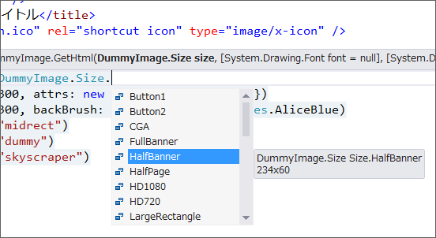

さっそくですけど、<a href="https://blog.daruyanagi.jp/entry/2012/09/11/070914">DummyImage 1.0.0 - &#x3060;&#x308B;&#x308D;&#x3050;</a> のアップデートです。

<a href="https://nuget.org/packages/DummyImage">https://nuget.org/packages/DummyImage</a> 

<h3>変更点</h3>

<h4>1.1.0 (2012/09/11)</h4>

 

<ul>
<li>［追加］@DummyImage.GetHtml(DummyImage.Size) をサポート。Intellisense で楽ちん！<a href="#f-26f22aee" name="fn-26f22aee" title="クソめんどくさかった">*1</a></li>
<li>［修正］Visual Studio 2012 for Web で動作確認＆手直し</li>
</ul>

<h4>1.2.0 (2012/09/11)</h4>

<ul>
<li>［修正］GetHtml() の一部オーバーロードで text: を指定できない</li>
</ul>

<a href="#fn-26f22aee" name="f-26f22aee" class="footnote-number">*1</a>:クソめんどくさかった

