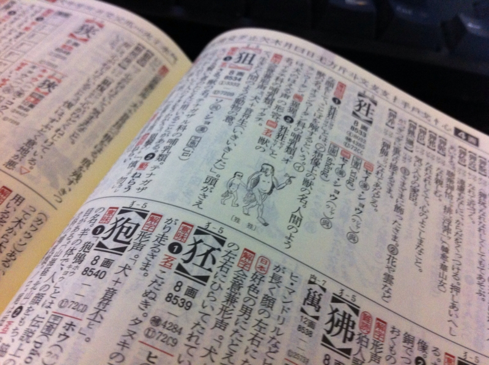

やっぱりちゃんとした漢字字典がほしい。でも、今月はお金がない。そんな感じで密林<a href="#f1" name="fn1" title="むろん、Amazon のことでアル">*1</a>をさまよっていたら、よさげな字典が売っていた。

中古で～1,000円！　中古で～1,000円！　リーズナブルやな。開いてみたけど、ほとんど使っていなかったらしくて、こういう辞書につきものの手垢やクセがまったくついていなかった。

内容はちょっと物足りない気がするけど、ところどころにイラストが結構入っていておもしろい。このページは「猩々」の「猩」という字のページだけれども、ちゃんとイラストが載っている。<b>なんで親子連れやねん。</b>「猩々」は最近では『もののけ姫』なんかで馴染み深いと思うけれど<a href="#f2" name="fn2" title="能でも有名らしいけど、自分は観たことない">*2</a>、確か『山海経』にもでてくる。……と思ったら、こっちも<b>親子連れ</b>だった。

<a href="http://www.chinjuh.mydns.jp/sengai/simio/p04.htm">&#x5C71;&#x6D77;&#x7D4C;&#x52D5;&#x7269;&#x8A18;&#x30FB;&#x30B7;&#x30E7;&#x30A6;&#x30B8;&#x30E7;&#x30A6;</a>

まぁ、山海経にはイラスト付きバージョンがあるので、それから引っこ抜いてきたのかな。あと Wikipediaからの引用だけど、『礼記』には

<blockquote>

鸚鵡は能く言して飛鳥を離れず。猩々は能く言して禽獣を離れず

</blockquote>

という記述もあるそうな。しゃべれるけど所詮ケモノだという扱いなのだろうか。

物足りないのは、こういうことが単に「想像上の生き物」で済まされちゃっているところだけれど、これはしょうがないのかもしれない。紙幅にも限りがあろうし、第一、あんまり凝って高価になれば自分が買えなくなる。けれど「人語を解し、赤い顔をした人間のごとき容姿で、酒を好む」ぐらいは書いていてくれていてもいいし、『山海経』や『礼記』に出てると書いてくれていれば自分的にはだいぶ助かる。あと、こういう字典で知りたいのは字の成り立ちだけれど、その点もちょっと弱い。けれど、用例を結構挙げてくれているので助かる。

結論としては、1,000円だったら安い、手ごろで机の上においていつでも引くには十分かもってところ。でも、もう一冊、ガッツリしたのもほしいな。そういうので鉄板の字典ってなんだろう。知ってたら教えてほしい。白川先生の字典とかになるんだろうか。

<a href="http://www.amazon.co.jp/exec/obidos/ASIN/4053018285/bestylesnet-22/">漢字源</a>
<ul><li>作者: 藤堂明保,竹田晃,松本昭,加納喜光</li><li>出版社/メーカー: 学習研究社</li><li>発売日: 2007/01/10</li><li>メディア: 単行本</li><li>購入: 1人 クリック: 46回</li><li><a href="http://d.hatena.ne.jp/asin/4053018285/bestylesnet-22" target="_blank">この商品を含むブログ (6件) を見る</a></li></ul>

ちなみにわしの部屋には『広辞苑』と『言海』しかない（

<a href="#fn1" name="f1" class="footnote-number">*1</a>:むろん、Amazon のことでアル

<a href="#fn2" name="f2" class="footnote-number">*2</a>:能でも有名らしいけど、自分は観たことない

