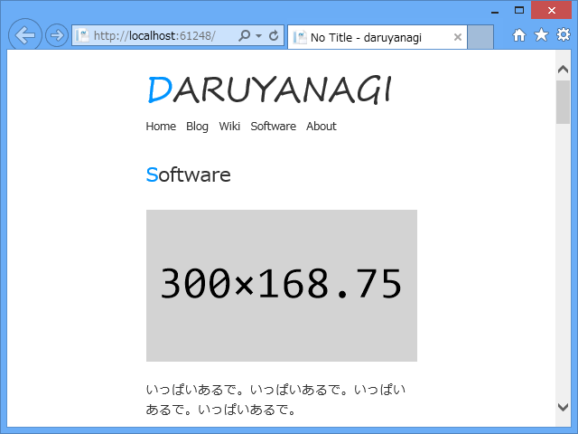
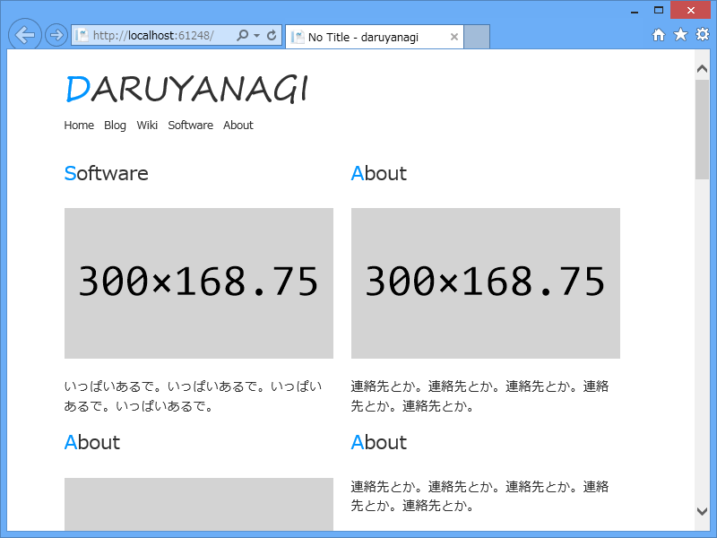
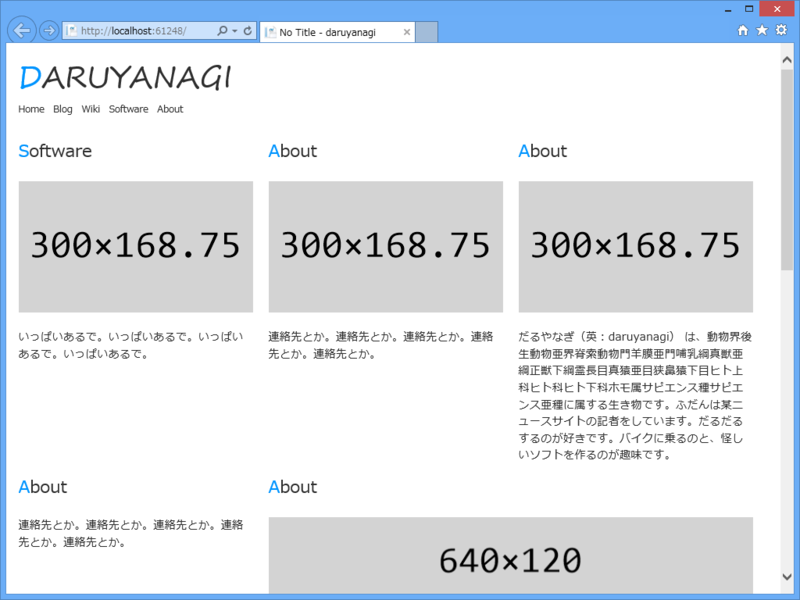

WebMatrix 2 は iPhone での見栄えも簡単にチェックできてなかなかいい。

<h3>CSS グリッド</h3>

最近、Twitter Bootstrap は大げさすぎるなぁ、もうちょっと軽量のグリッドシステムないかな、と思っていたのだけど、こういうのを見つけた。

<ul>
<li><a href="http://webdesignrecipes.com/css-grid-system-layout/">http://webdesignrecipes.com/css-grid-system-layout/</a> </li>
<li><a href="http://jsfiddle.net/ernestohs/nQpSj/">Complex Grid Example - JSFiddle</a></li>
</ul>
いい感じかもしれない。

<pre class="code lang-css" data-lang="css" data-unlink>.container { width: 940px; margin: 0 auto;}
.grid1, .grid2, .grid3, .grid4, .grid5, .grid6, .grid7, .grid8, .grid9, .grid10, .grid11 {
float: left;
display: inline;
margin-left: 20px;
}
.grid1 {width: 60px;}
.grid2 {width: 140px;}
.grid3 {width: 220px;}
.grid4 {width: 300px;}
.grid5 {width: 380px;}
.grid6 {width: 460px;}
.grid7 {width: 540px;}
.grid8 {width: 620px;}
.grid9 {width: 700px;}
.grid10 {width: 780px;}
.grid11 {width: 860px;}
.first {margin-left: 0;clear: left;}

/* clearfix */
.clearfix:after {
visibility: hidden;
display: block;
font-size: 0;
content: &quot; &quot;;
clear: both;
height: 0;
}
/* IE6 */
* html .clearfix { zoom: 1;}
/* IE7 */
*:first-child+html .clearfix {zoom: 1;}
</pre>
で、grid* で幅を指定して、先頭になるグリッドに .first をつければいいみたい。ネストもできるよ。あったまいい！

<h3>More responsible！</h3>

でも、それだと一つ問題がある。レスポンシブじゃない。今回はブラウザー幅に応じて並び替えもやってほしいと思っていたのだけれど、このやり方だと先頭になるグリッドを決めなきゃいけない。でも、ブラウザー幅に応じて並び替えが前提だと、事前にどのグリッドが先頭であるかを指定することができない。

640px ぐらいの幅を……

ちょっと大きく……

もっと大きく！

というわけで、少しだけ手直しをした（ダミーイメージには <a href="https://blog.daruyanagi.jp/entry/2012/09/11/070914">DummyImage 1.0.0 - &#x3060;&#x308B;&#x308D;&#x3050;</a> を使っています（ステマ））。

<pre class="code lang-css" data-lang="css" data-unlink>.container {
overflow: auto;
margin: 0 auto 2em auto;

* {
max-width: 100%;  // &lt;-- 画像とかがはみ出ないように
}
}

.grid1, .grid2, .grid3, .grid4, .grid5, .grid6,
.grid7, .grid8, .grid9, .grid10, .grid11, .grid12 {
float: left;
display: inline;
margin-left: 20px;
position: relative; // &lt;-- 追加
left: -20px;        // &lt;-- 追加
}
.grid1  { width: 60px;  }
.grid2  { width: 140px; }
.grid3  { width: 220px; }
.grid4  { width: 300px; }
.grid5  { width: 380px; }
.grid6  { width: 460px; }
.grid7  { width: 540px; }
.grid8  { width: 620px; }
.grid9  { width: 700px; }
.grid10 { width: 780px; }
.grid11 { width: 860px; }
.grid12 { width: 940px; } // &lt;-- 追加

/*.first {margin-left: 0;clear: left;}*/

.claerfix {
&amp;:after {
visibility: hidden;
display: block;
font-size: 0;
content: &quot; &quot;;
clear: both;
height: 0;
}
/* IE6 */
* html &amp; {
zoom: 1;
}
/* IE7 */
*:first-child + html &amp; {
zoom: 1;
}
}
</pre>
全体に左マージンをつけて、その分左にずらす。これで first は要らなくなった（というか使えなくなった）。 clearfix も LESS で書いておけば意味的にまとめられていい感じ。

<pre class="code lang-css" data-lang="css" data-unlink>@media (min-width: 981px) {
.container {
width: 960px;
}
}

@media (max-width: 980px) {
.container {
width: 640px;
}
}

@media (max-width: 640px) {
.container {
width: 300px;
}
}
</pre>
ここら辺は適当だけど、あとは MediaQuery でコンテナの幅を変えてやると、さっきみたいなレスポンシブなデザインになる。

WebMatrix 2 の LESS とモバイルテスト機能があれば、こういう CSS の作成も結構楽になる！　Razor や Node.js がわかんない人でも、WebMatrix は便利やな（ステマ）。あとはこういうのをどんどん NuGet にしてもらえれば……Web 開発はバラ色や！

<ul>
<li><a href="https://blog.daruyanagi.jp/entry/2012/08/15/161932">WebMatrix &#x3067; LESS &#x3092;&#x4F7F;&#x304A;&#x3046;&#xFF01; - &#x3060;&#x308B;&#x308D;&#x3050;</a></li>
<li><a href="https://blog.daruyanagi.jp/entry/2012/09/09/172243">WebMatrix &#x3067; LESS &#x3092;&#x4F7F;&#x304A;&#x3046;&#xFF01;&#xFF08;2&#xFF09; - &#x3060;&#x308B;&#x308D;&#x3050;</a></li>
<li><a href="https://blog.daruyanagi.jp/entry/2012/07/16/011825">&#x300C;WebMatrix 2&#x300D;&#x306E;&#x30A2;&#x30C3;&#x30D7;&#x30C7;&#x30FC;&#x30C8; - &#x3060;&#x308B;&#x308D;&#x3050;</a></li>
</ul>

