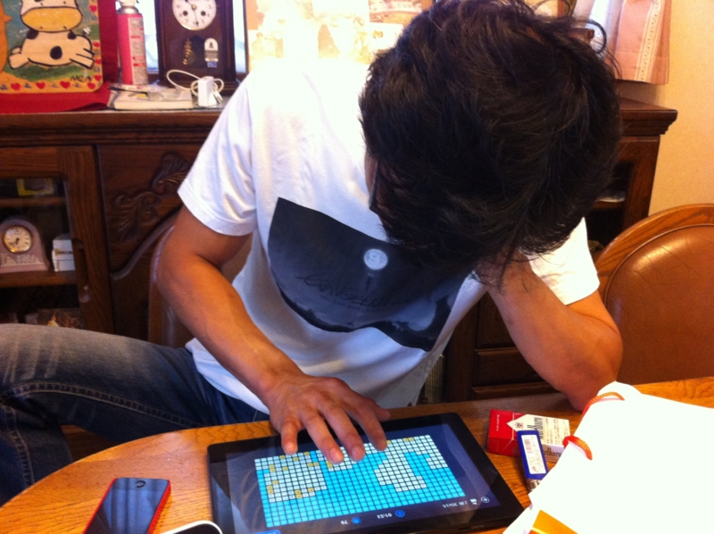
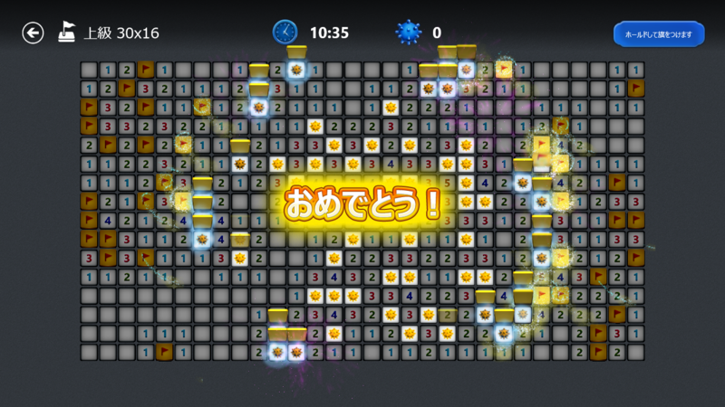

9月の初めに実家へ帰った時。 Samsung Series 7 Slate （Windows 8）でマインスイーパーを楽しんでいたところ、弟 1 号が興味をもったみたいなので試しにやらせてみた。

そしたらちょっと面白いんだな。

iPad なんかを触るときは指の腹で画面をタッチするのに、マインスイーパーのときだけ指の先でタッチしようとする。すると、うまくタッチできなくてイライラするわけだ。そこへ「ちょんちょんって触るんじゃなくて、べたーっと触れや」と助言すると、またいつもみたいに指の腹でタッチするようになって、これはうまくいく。

ボタンがちょっと小さいってだけで、こんなに使い方って変わるものなのだなぁ。たったそれだけのことで操作性が下がって、揚句アプリストアに「クソアプリ！」とか書かれちゃう。なかなか難しいものだ。

Windows 8 のマインスイーパーは、タイルを複数一度に押すような誤タッチと思われる操作を行うと、ユーザーへそれを伝えようとする。どのようにかって言われると表現めんどくさいのでしないけど。ともかく、誤タッチしてもそのまま落ち着いて指を離せば、タイルが意図せずめくられることはない。結構うまくできていると思う。でも、ボタンの小ささだけはいかんともしがたいな。誤操作が続くなら案内を表示する、といった対応にしないといけないのかもしれない。

ぶっちゃけ、これから機能面でのイノベーションっていうのはなかなか起こりにくいと思う。なので、そういう細かい気配りがこれからはアプリの優劣を決めていくのかもしれない。それが「ユーザー体験」ってやつなのかなぁ。

ちなみに、マインスイーパーは最高で7分30秒（上級）を切れるようになりました。なかなか早くなった気がする。

