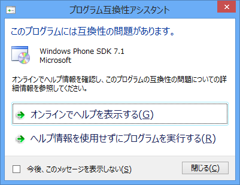
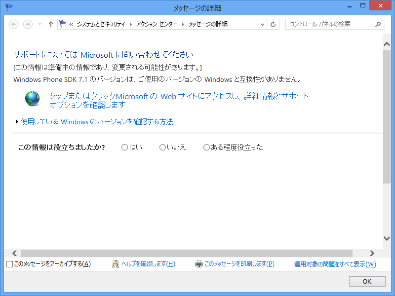

<b>ガッデム／(＾o＾)＼</b>

連休中に Windows Phone アプリでも作るかなぁ、と思っていたらこれですよ！　どうも Windows Mobile の頃から、Windows のモバイルプラットフォーム開発にはこういうめんどくささがある。SDK と Visual Studio に組み合わせの制限があったりとか。

<blockquote cite="http://www.computerworld.jp/topics/577/Microsoft%E3%82%A6%E3%82%A9%E3%83%83%E3%83%81/204846/%E3%83%9E%E3%82%A4%E3%82%AF%E3%83%AD%E3%82%BD%E3%83%95%E3%83%88%E3%80%81%E3%80%8CWindows%20Phone%208%E3%80%8D%E3%81%AE%E9%96%8B%E7%99%BA%E8%80%85%E5%90%91%E3%81%91SDK%E3%82%92%E3%83%AA%E3%83%AA%E3%83%BC%E3%82%B9%E3%81%B8">

　米国Microsoftは9月12日、次期モバイルOSのソフトウェア開発キットを提供する「Windows Phone SDK 8.0 プレビュー・プログラム」に対する申し込み受付を開始したことを、同社の公式ブログで発表した。

　開発者は「Microsoft Connect」サイトから同プログラムに申し込みが可能で、米国西海岸時間9月17日の5時まで受け付ける。承認された場合、締め切り日から間もなく、Windows Phone 8 SDK（ソフトウェア開発キット）のダウンロード方法やサポート方法などを案内する連絡をMicrosoftから受けることになる。

<cite><a href="http://www.computerworld.jp/topics/577/Microsoft%E3%82%A6%E3%82%A9%E3%83%83%E3%83%81/204846/%E3%83%9E%E3%82%A4%E3%82%AF%E3%83%AD%E3%82%BD%E3%83%95%E3%83%88%E3%80%81%E3%80%8CWindows%20Phone%208%E3%80%8D%E3%81%AE%E9%96%8B%E7%99%BA%E8%80%85%E5%90%91%E3%81%91SDK%E3%82%92%E3%83%AA%E3%83%AA%E3%83%BC%E3%82%B9%E3%81%B8">&#x30DE;&#x30A4;&#x30AF;&#x30ED;&#x30BD;&#x30D5;&#x30C8;&#x3001;&#x300C;Windows Phone 8&#x300D;&#x306E;&#x958B;&#x767A;&#x8005;&#x5411;&#x3051;SDK&#x3092;&#x30EA;&#x30EA;&#x30FC;&#x30B9;&#x3078;|Microsoft&#x30A6;&#x30A9;&#x30C3;&#x30C1;|&#x30C8;&#x30D4;&#x30C3;&#x30AF;&#x30B9;|Computerworld</a></cite>
</blockquote>

おれはこっちももらえないし、悲しい（←だから早くアプリ作れっていったじゃん！）。というわけで、Metro アプリ<a href="#f1" name="fn1" title="絶対こっちのほうがいい……ストアアプリだなんてやだ！">*1</a>でも作ることにしようかなと思っている。

<a href="#fn1" name="f1" class="footnote-number">*1</a>:絶対こっちのほうがいい……ストアアプリだなんてやだ！

