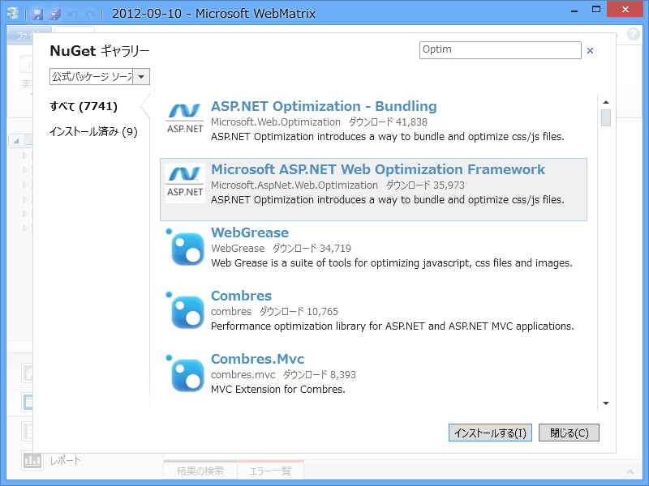
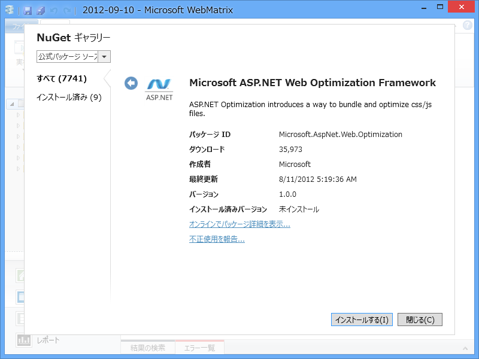
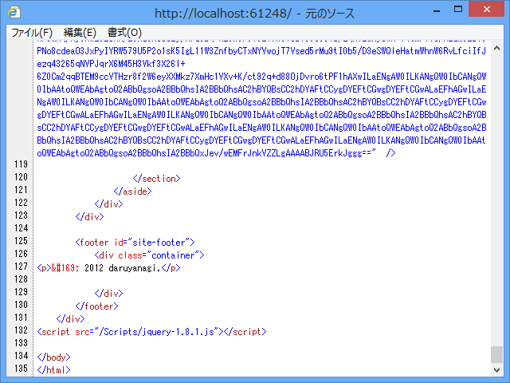
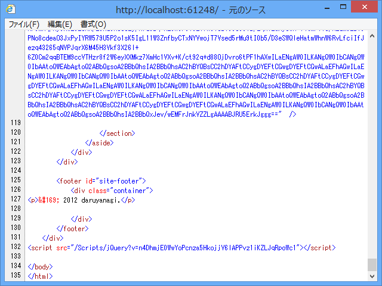
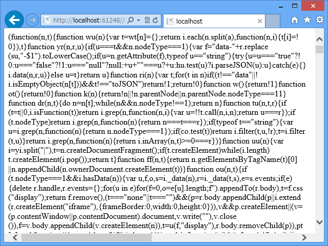
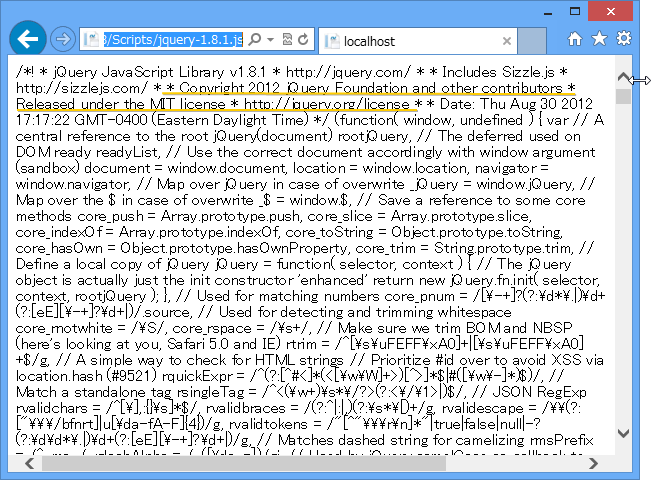

<blockquote cite="https://blog.daruyanagi.jp/entry/2012/09/10/062101">

@chack411 さん曰く、 <a href="http://nuget.org/packages/Microsoft.AspNet.Web.Optimization">http://nuget.org/packages/Microsoft.AspNet.Web.Optimization</a> を使うのが正しいそうです（ありがとうございます！）。また後日試してみましょう。

<cite><a href="https://blog.daruyanagi.jp/entry/2012/09/10/062101">CSS / Javascript &#x306E; Bunlde &#x3068; Minify &#x3092; WebMatrix &#x3067;&#x5229;&#x7528;&#x3059;&#x308B; - &#x3060;&#x308B;&#x308D;&#x3050;</a></cite>
</blockquote>

というわけで試してみたよ。

<h3>NuGet のインストール</h3>

合言葉は「Optimization」！　検索で出てきた<b>2番目</b>の「Microsoft ASP.NET Web Optimization Framework」をインストールしよう。そうなんだ……前回は何も考えずに一番上をいれていたんだけど、これはどうやらディスコンみたいなんだ。

話は変わるけど、NuGet で使いにくいのは、

<ul>
<li>どれを使うべきか</li>
<li>どうやって使うのか</li>
</ul>
がわかんないことだと思う。前者は［開発終了］フラグなんかをつけられるといいと思う<a href="#f-7ccd8146" name="fn-7ccd8146" title="開発終了したけどすぐに消すわけにはいかない、ということはあると思う">*1</a>し、評価システムがあれば助かると思った。後者は NuGet パッケージのルートに Markdown ファイルを置くだけで Web ページに簡単な ReadMe を表示できるとか<a href="#f-0b5f8be8" name="fn-0b5f8be8" title="GitHub みたいなやつだね！">*2</a>、そういう仕組みがあればいいのかなぁ、と思う。まぁ、自分の NuGet に満足な（英語の！）解説を付けていない人が言えることではないけれど。

依存関係で入ってくる「WebGrease」は、Minify <a href="#f-c5e4a6fe" name="fn-c5e4a6fe" title="余計なコメントや改行・空白を削るなどしてペイロードを軽くすること">*3</a>を行うコマンドラインツールみたい。

<a href="http://kenhaines.net/post/2012/06/09/WebGrease-As-seen-in-Visual-Studio-2012.aspx">http://kenhaines.net/post/2012/06/09/WebGrease-As-seen-in-Visual-Studio-2012.aspx</a>

Microsoft の中の人が作ってるみたいだね。

<h3>基本的な使い方</h3>
<pre class="code lang-html" data-lang="html" data-unlink># ~/Views/Shared/_SiteLayout.cshtml

&lt;!DOCTYPE html&gt;

@using System.Web.Optimization // Web.config いじれば要らないかな

@{
// Script をバンドル
BundleTable.Bundles.Add(
new ScriptBundle(&quot;~/Scripts/jQuery&quot;)
.Include(&quot;~/Scripts/jquery-{version}.js&quot;));

// CSS をバンドル
BundleTable.Bundles.Add(
new StyleBundle(&quot;~/Content/Styles&quot;)
.Include(&quot;~/Content/*.css&quot;));

// BundleTable.EnableOptimizations = true;
}

&lt;html lang=&quot;@App.Language&quot;&gt;
&lt;head&gt;
    ：
    @Styles.Render(&quot;~/Content/Styles&quot;) // CSS の LINK タグを出力
&lt;/head&gt;
&lt;body&gt;
：
@Scripts.Render(&quot;~/Scripts/jQuery&quot;) // Scriptタグを出力
&lt;/body&gt;
&lt;/html&gt;
</pre>
大まかな流れは、

<ol>
<li>System.Web.Optimization をインクルード</li>
<li>BundleTable.Bundles に SciprBundle や StyleBundle をつっこむ</li>
<li>Script.Render() や Style.Render() でタグを生成</li>
</ol>
ってな感じ。 Bundle には仮想 URL を割り当てて、Render() するときにそれを指定する。あと、Bundle にはスクリプトやスタイルを複数 Include() 可能。そのとき、 {version} や * みたいなワイルドカードのようなものが使えるみたい。たとえば、jQuery を NuGet で更新してバージョンをあげてもレイアウトファイルを手直ししなくていいし、指定したフォルダに新しい CSS を追加しても実行時に自動でバンドルされるので便利だな。

<h3>実際の出力と BundleTable.EnableOptimizations</h3>

で、実際の出力はどうなるかというと、 @Scripts.Render("~/Scripts/jQuery") の場合はこんな感じ。

おおー、最新版が読み込まれているぞ。けれど、 Minify まではされていない。

Minify までしてほしい場合は、

<pre class="code lang-cs" data-lang="cs" data-unlink>    BundleTable.EnableOptimizations = true;
</pre>
しておく。すると、出力はこんな感じに変わる。

スクリプトの内容はこんな感じ。

改行が飛んでいるので少しわかりにくいけれど、最適化を有効にしない場合はこんな感じ。

著作権表示などのコメントがいっぱい残っているのがわかる。「Microsoft ASP.NET Web Optimization Framework」を利用したら、こういうのを全部取って、リソースの転送量を抑えてくれるので便利！……というわけで、今回はおしまい。

ASP.NET MVC4 だとこうのも標準で入っているみたい。メイドの人が言ってた。

<a href="http://shiba-yan.hatenablog.jp/entry/20111103/1320331131">Microsoft.Web.Optimization &#x3067; JavaScript &#x3068; CSS &#x306E;&#x6700;&#x9069;&#x5316;&#x3092;&#x884C;&#x3046; - &#x3057;&#x3070;&#x3084;&#x3093;&#x96D1;&#x8A18;</a>

WebMatrix は標準で Application_Start / RegisterBundles() みたいなのが標準では用意されていないけれど、なんなら自分で作ってもいいね。まぁ、そんなのが必要になるぐらいキッチリとデカいアプリケーションを書きたくなったら、自然と MVC みたいなフレームワーク＋ IDE 支援がほしくなると思う。それまでは、WebMatrix でお勉強するのもありだと思うよ。

<a href="#fn-7ccd8146" name="f-7ccd8146" class="footnote-number">*1</a>:開発終了したけどすぐに消すわけにはいかない、ということはあると思う

<a href="#fn-0b5f8be8" name="f-0b5f8be8" class="footnote-number">*2</a>:GitHub みたいなやつだね！

<a href="#fn-c5e4a6fe" name="f-c5e4a6fe" class="footnote-number">*3</a>:余計なコメントや改行・空白を削るなどしてペイロードを軽くすること

