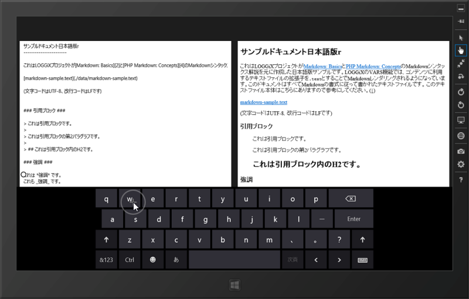
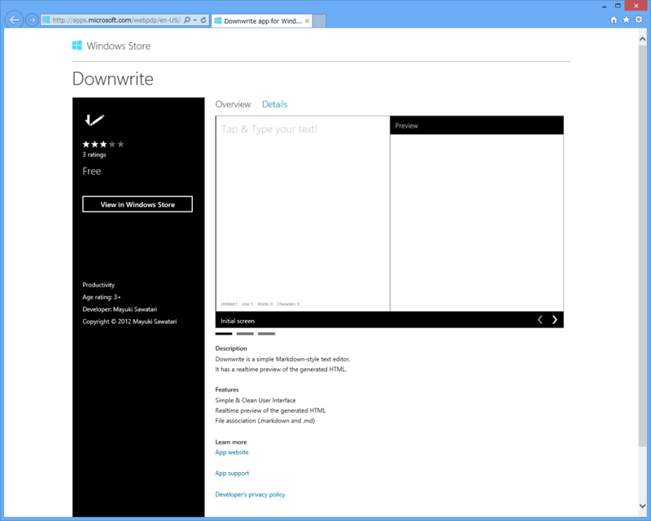

「Markdown エディターがあれば便利かなぁ」と思って少し挑戦してみたけれど、だいぶめんどくさい。

まず、MarkdownSharp が動かない。これは30分ぐらいかけて手直ししたら動くようになった。HashTable 使っているのを Dictionary に、ArrayList を List に……といった感じ。MD5 の計算ルーチンも動かなかったので、これも WinRT 向けに書き直した。RegexOption.Compiled がないっぽいんだけど、どういうことなんだろうか。まぁ、適当に消しといたけど。

そこまではいいんだ。

とりあえずデザインなんかを考えずに、エディターとプレビュー用の WebView を同じ画面に置いて、エディターの内容を NavigateToString() で WebView に表示するというのを作った。

そしたら、 NavigateToString() するたびにフォーカスが WebView にとられてしまう。これは困った。WPF/Silverlight でも似たようなのを作ってあるのだけれど<a href="#f1" name="fn1" title="途中で飽きて放置してある">*1</a>、そっちはそんな挙動じゃなかったのだけど。

<pre class="code lang-cs" data-lang="cs" data-unlink>MarkdownSharp.Markdown markdown = new MarkdownSharp.Markdown();

private void editor_TextChanged_1(
object sender, TextChangedEventArgs e)
{
preview.NavigateToString(markdown.Transform(editor.Text));
await Dispatcher.RunAsync(
Windows.UI.Core.CoreDispatcherPriority.High, () =&gt;
editor.Focus(Windows.UI.Xaml.FocusState.Programmatic));
}
</pre>
ダメもとで強引にエディターへフォーカスを戻そうとしてもやっぱりイマイチだし……どうすればいいんだろうな。ページを遷移させてプレビューさせるのはもちろんできるのだけれど、それはあまりにも不便すぎる。頑張って Rx にして、キー入力のアイドル時にプレビュー → 即座にフォーカスをエディターへ戻すというのも考えたけど、フォーカスが移るたびにソフトウェアキーボードがぴょこぴょこするのが萎える。

同様の悩みを抱える人はいるみたいで、 Connect にもバグ報告があった。でも、すぐには治りそうにないよなぁ……。どうしよ。また違うネタ考えるかな。RSS のテンプレをちょちょいといじって提出するのでも最悪構わないけれど、それも面白くないしなぁ。

<a href="https://connect.microsoft.com/VisualStudio/feedback/details/753422/webview-in-windows-8-does-not-gain-focus-automatically-when-hovering-mouse-back-to-it">https://connect.microsoft.com/VisualStudio/feedback/details/753422/webview-in-windows-8-does-not-gain-focus-automatically-when-hovering-mouse-back-to-it</a>

まぁ、もうちょっと勉強してから再挑戦するかな。無難に ToDo 管理アプリとか作ってみるか。それにしても、9月末までにちゃんとしたアプリを完成させるのはだいぶ難しそうだ。

<h3>追記</h3>

      @<a class="twitter-user-screen-name" href="http://twitter.com/daruyanagi" target="_top">daruyanagi</a> っ <a class="twitter-tweet-url" href="http://t.co/ywv6mUtn" target="_top">URL</a>

<a href="http://twitter.com/kamebuchi/status/246997124988948480" class="twitter-detail-info-permalink">2012-09-16 00:41:18</a> via <a href="http://krile2.starwing.net/" rel="nofollow">Krile2</a> to @<a href="http://twitter.com/daruyanagi/"  class="twitter-user-screen-name">daruyanagi</a>

もうすでにあるし（＝＝！

ソースもみてみたけど、 HTML＋JavaScript だった。実は Windows Phone への移植も考えている<a href="#f2" name="fn2" title="というか、そっちがもともと">*2</a>ので、 なるべく C#＋XAML でやりたいんだけどな。

<a href="#fn1" name="f1" class="footnote-number">*1</a>:途中で飽きて放置してある

<a href="#fn2" name="f2" class="footnote-number">*2</a>:というか、そっちがもともと

