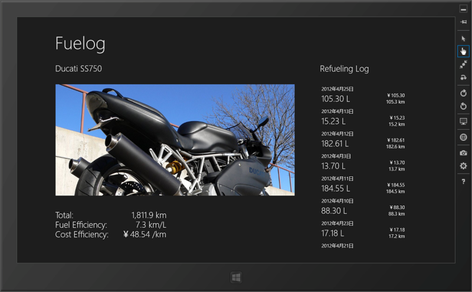
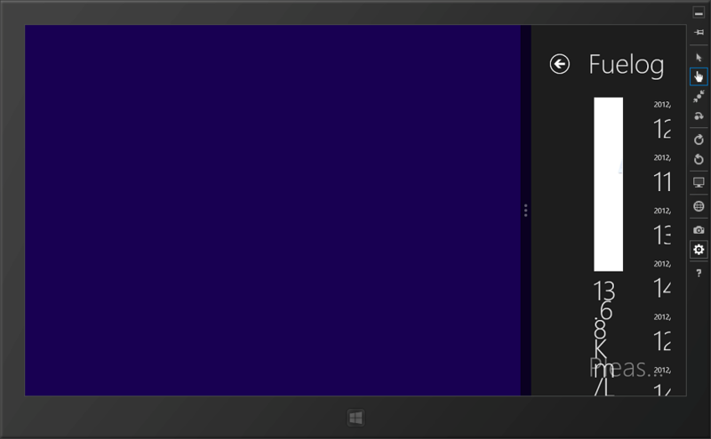
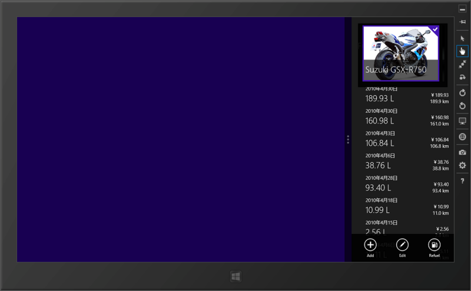

昔、Windows Phone 向けに作っていた燃費記録アプリを Windows ストアアプリに移植してみた。移植といっても、コードの共通部分はほとんどないけれど……というのも、移植元のコードが腐ってた（ぁ

丸二日ぐらい格闘していたのだけれど、ぶっちゃけ疲れた。

<ul>
<li>ライブラリがいろいろ足りない。ファイルベースのデータベースすらない<a href="#f1" name="fn1" title="いくつか試してみたけど動かなかったり……">*1</a></li>
<li>サンプルがてら開いてみたテンプレのコード量に挫折しそう<a href="#f2" name="fn2" title="あとになってみると、それほどたいそうなことをしていないのがわかった">*2</a></li>
<li>WPF/Silverlight と微妙に違うところに足をすくわれる（まぁ、WinRT だし）</li>
<li>XAML に慣れてない＆タイプミスでバインディングがうまくいかず悩みまくり</li>
<li>いろいろなレイアウトに対応しなきゃいけない</li>
</ul>
とくに最後は素人には酷で、

スナップしたときのデザインがボロボロなのを、

ここまで治すのに3時間ぐらいかかった。しかも、テンプレートをよく読んでみると、もっとエレガントな方法があるらしい<a href="#f3" name="fn3" title="ViewState というのがわからない">*3</a>。Windows ストアアプリで情報発信している人までは追い切れていないけれど、全体的に情報量が少なくてかなりきつかった。だったら自分で書けよ！　って感じなのだけれど、書くためにはその何倍も理解してなきゃダメなんだよ、コンチクショウ！

でも、まぁ、ここまでできて妙な達成感はあった（ぉ

一つの収穫は M-VM-V を意識したプログラミングの長所を実感できたところ。ちゃんと M-VM を作っておけば、V の変更がとても簡単になり、かつ M への影響を（理想的には）ゼロにすることができる。

      VM ちゃんと作っておけば、必要な時に適当にプロパティ作ってバインディングしてもモデルが汚れないのだな！

<a href="http://twitter.com/daruyanagi/status/247533888572911616" class="twitter-detail-info-permalink">2012-09-17 12:14:12</a> via <a href="http://www.metrotwit.com/" rel="nofollow">MetroTwit</a>

 

      @<a class="twitter-user-screen-name" href="http://twitter.com/daruyanagi" target="_top">daruyanagi</a> さーいえっさー！

<a href="http://twitter.com/ugaya40/status/247534106848673792" class="twitter-detail-info-permalink">2012-09-17 12:15:04</a> via <a href="http://krile2.starwing.net/" rel="nofollow">Krile2</a> to @<a href="http://twitter.com/daruyanagi/status/247533888572911616"  class="twitter-user-screen-name">daruyanagi</a>

MVVM 星人の言ってたこと、やっと少しだけわかったよ ( ｀ー´)ノ

年内にはカタチにできそうだけれど、今月中のストア提出はあきらめムードだなぁ。だれだよ、Windows ストアアプリは簡単に作れるとか言ったの。

<a href="#fn1" name="f1" class="footnote-number">*1</a>:いくつか試してみたけど動かなかったり……

<a href="#fn2" name="f2" class="footnote-number">*2</a>:あとになってみると、それほどたいそうなことをしていないのがわかった

<a href="#fn3" name="f3" class="footnote-number">*3</a>:ViewState というのがわからない

