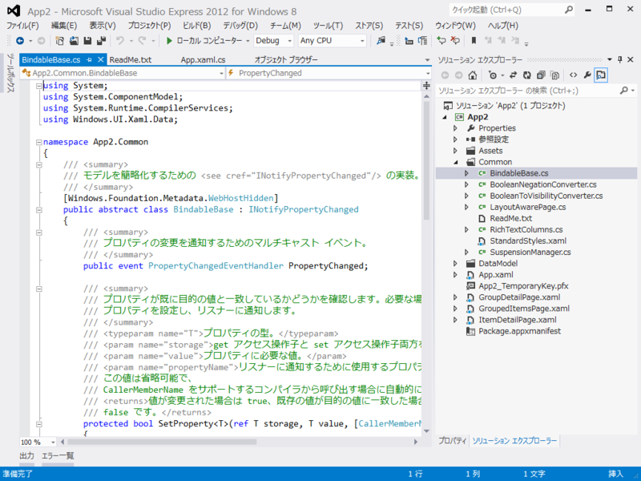
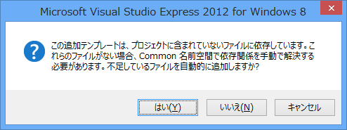

Windows ストアアプリ<a href="#f1" name="fn1" title="はぁ……もっといい呼び方はなかったんかいな！">*1</a>を作り始めたひとは、かならず一度は Common フォルダをジックリみたほうがいいと思う。わしはめんどいのでチラ見した。

<h3>LayoutAwarePage クラス</h3>

<blockquote cite="http://msdn.microsoft.com/ja-jp/library/windows/apps/br211380.aspx">

使用するテンプレート ページはすべて LayoutAwarePage クラスから派生しており、新しいアプリの MainPage.xaml に使う空白のページよりもずっと多くの既定の操作があります。LayoutAwarePage は、Metro スタイル アプリ開発の重要な機能を実現する Page を実装したものです。

<ul>
<li><b>［ViewState］</b>アプリケーション ビュー状態を表示状態にマッピングすることで、ページをさまざまな解像度、向き、ビューに対応させることができます。</li>
<li><b>［Navigation］</b>GoBack イベント ハンドラーと GoHome イベント ハンドラーは基本的なナビゲーションをサポートします。</li>
<li><b>［ViewModel］</b>既定のビュー モデルは、単純でバインド可能なデータ ソースを提供しています。</li>
<li><b>［SaveState/LoadState］</b>SaveState と LoadState メソッドは、アプリのセッション状態を管理するために SuspensionManager クラスで利用します。</li>
</ul>
また、ページ テンプレートでは、Metro スタイル アプリの設計ガイドラインに準拠した StandardStyles.xaml に記述されているスタイルとテンプレートを使います。冒頭部でこれらのスタイルのいくつかを使い、そのコピーを変更してアプリの外観をカスタマイズします。

<cite><a href="http://msdn.microsoft.com/ja-jp/library/windows/apps/br211380.aspx">&#x30D1;&#x30FC;&#x30C8; 4: &#x30D6;&#x30ED;&#x30B0; &#x30EA;&#x30FC;&#x30C0;&#x30FC;&#x3092;&#x4F5C;&#x6210;&#x3059;&#x308B; (C#/VB &#x3068; XAML &#x3092;&#x4F7F;&#x3063;&#x305F; Metro &#x30B9;&#x30BF;&#x30A4;&#x30EB; &#x30A2;&#x30D7;&#x30EA;)</a></cite>
</blockquote>

よくわからんけど、そういうものらしい。ただ、ViewModel はタダのディクショナリで、 MVC なんかで使われる ViewModel に近い感じで、単なる初期データを表示するビューワーとしてならともかく、それ以上のことをするには何か工夫がいるのかもしれない。

あと、LayoutAwarePage クラスの定義は、テンプレートによって入っていないこともある。たとえば、空のプロジェクトから始めてあとからテンプレートページを追加した場合、ビルド時に「LayoutAwarePage がない」と言われる（後述の BindableBase もそうだと思う）。そんなときはリッチなプロジェクトを一度作って、そこからコピーしてくればいいみたいだね。

<h4>追記 （2012/09/18 0:42）</h4>

勝手に追加してくれるっぽい。テキトーにダイアログを読み飛ばしていたわしが悪い。

<h3>BindableBase クラス</h3>

INotifyPropertyChanged の .NET Framework 4.5 的実装。CallerMemberName っていうのが新たに追加された属性で、呼び出し元を参照して勝手に名前をいれてくれるみたい。propertyName を文字列で渡そうとしてミスタイプで自爆する……なんてことが減るかも。

<pre class="code lang-cs" data-lang="cs" data-unlink>[Windows.Foundation.Metadata.WebHostHidden]
public abstract class BindableBase : INotifyPropertyChanged
{
public event PropertyChangedEventHandler PropertyChanged;

protected bool SetProperty&lt;T&gt;(ref T storage, T value, [CallerMemberName] String propertyName = null)
{
if (object.Equals(storage, value)) return false;

storage = value;
this.OnPropertyChanged(propertyName);
return true;
}

protected void OnPropertyChanged([CallerMemberName] string propertyName = null)
{
var eventHandler = this.PropertyChanged;
if (eventHandler != null)
{
eventHandler(this, new PropertyChangedEventArgs(propertyName));
}
}
}
</pre>
あと、バインディングに便利っぽいコンバーターとか、リッチエディット関連っぽいクラスがいくつか用意されている。

<h3>StandardStyles.xaml</h3>

既定のスタイルがいっぱい定義されている！（これはボタンスタイルの例）

Metro、じゃねぇ、Windows ストアアプリでは、Metro、もとい、Windows ストアアプリっぽさ、デザインの統一性というのが結構重要になる。なので、なるべく既定のスタイルを使うか、既定のスタイルをベースに拡張するのが望ましいんじゃないかな。

<pre class="code lang-xml" data-lang="xml" data-unlink>&lt;Button Style=&quot;{StaticResource OneBarAppBarButtonStyle}&quot; /&gt;
</pre>
なお、一部スタイルは初期状態でコメントアウトされているので、使うときは解除しなきゃいけないですよ。

<a href="#fn1" name="f1" class="footnote-number">*1</a>:はぁ……もっといい呼び方はなかったんかいな！

