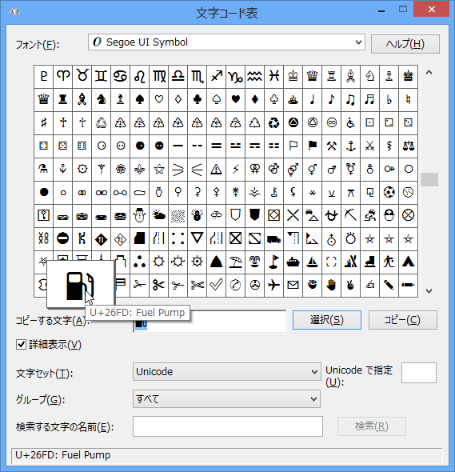
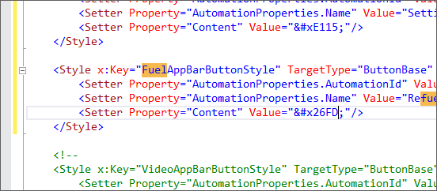
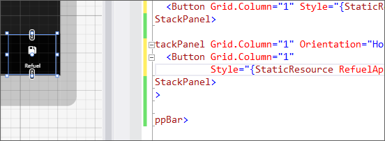
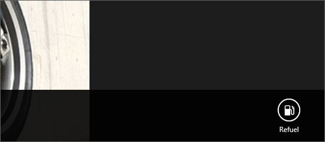
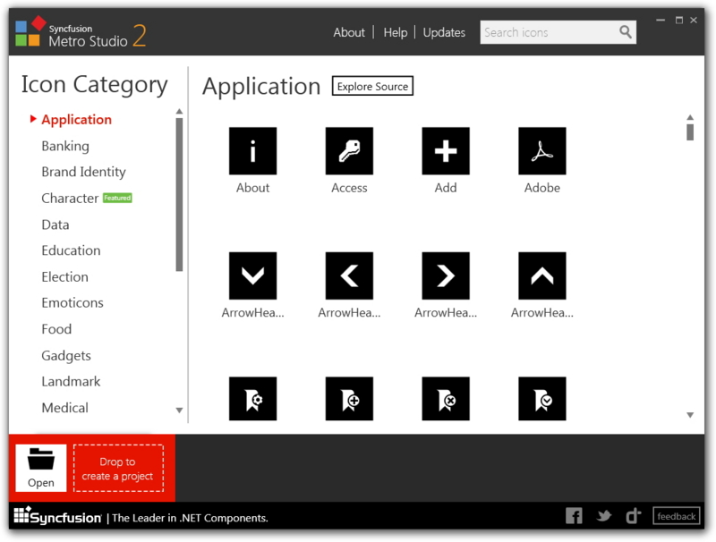

StandardStyles.xaml はお宝の宝庫や！　という話を前回（<a href="https://blog.daruyanagi.jp/entry/2012/09/17/235654">Common &#x30D5;&#x30A9;&#x30EB;&#x30C0;&#x3092;&#x30C1;&#x30E9;&#x898B;&#x3057;&#x3066;&#x307F;&#x308B; - &#x3060;&#x308B;&#x308D;&#x3050;</a>）少しした。たとえば、ボタンなんかはほとんど自分で作る必要がないぐらい、豊富に取り揃えられている。

けれど、それでも足りない場合があるかもしれない。おれは足りなかった。<a href="https://blog.daruyanagi.jp/entry/2012/09/17/222920">&#x71C3;&#x8CBB;&#x8A18;&#x9332;&#x7528;&#x306E; Windows &#x30B9;&#x30C8;&#x30A2;&#x30A2;&#x30D7;&#x30EA;&#x3092;&#x4F5C;&#x3063;&#x3066;&#x307F;&#x305F; - &#x3060;&#x308B;&#x308D;&#x3050;</a> に使う「ガソリン」アイコンのボタンがほしい！　なんでないんだっ？　レドモンドは何をしているっ！

そこでふと、死んだじいちゃんの言葉を思い出した。「なければ自分で作れ」。そうだ、じいちゃん。作ってみるよ、おれ！

<h3>まずは偵察</h3>
<pre class="code lang-xml" data-lang="xml" data-unlink>&lt;Style x:Key=&quot;FourBarsAppBarButtonStyle&quot;
       TargetType=&quot;ButtonBase&quot;
       BasedOn=&quot;{StaticResource AppBarButtonStyle}&quot;&gt;
&lt;Setter Property=&quot;AutomationProperties.AutomationId&quot;
            Value=&quot;FourBarsAppBarButton&quot;/&gt;
&lt;Setter Property=&quot;AutomationProperties.Name&quot;
            Value=&quot;Four Bars&quot;/&gt;
&lt;Setter Property=&quot;Content&quot; Value=&quot;&amp;#xE1E9;&quot;/&gt;
&lt;/Style&gt;
</pre>
これは StandardStyles.xaml で定義されている「バリ4」アイコンのソース。AppBarButtonStyle を継承していて、AutomationProperties.AutomationId、AutomationProperties.Name、Content の3つのプロパティを書き換えているのがわかる。

ちなみに、AppBarButtonStyle のコードは読む気が起きなかった。たぶん、Content を丸で囲って、下にテキストを追加する、みたいなことをやっているのだろう。知らんけど。

Content は文字の実態参照（っていうんだっけ？）で、AppBarButtonStyle はそれを Segoe UI Symbol で描画しているらしい。へぇ、あのアイコンの絵って、全部フォントだったんだ。

AutomationProperties はアイコンの下にでてくるテキストに関係があるみたい。試しに空にしてみたらテキストが消えた。

これでだいたい偵察が済んだ。簡単にカスタマイズできそうだ。

<h3>適当にカスタマイズしてみる</h3>

まず、文字コード表から目的の文字を探す。あった！　たいていのモノはありそうだな。

次に文字コードをもとにさきほどのスタイルをコピペして魔改造する。

んで、実際にバインドして使ってみる。

サークルが、消えている！ (；ﾟДﾟ) ﾅｾﾞﾀﾞ！

なんか、FlowLayout を RightToLeft にしていると消えてしまうみたい。理由まで調べるのは面倒だったけど、既定通り LeftToRight に戻したらサークルが出た。

これを応用したらボタンを腐るほど量産できるな！

<h3>おまけ</h3>

もっとボタンがほしければ、こういうのもある。有名ソフトのアイコンまでカバーされていていい感じ。

<a href="http://www.forest.impress.co.jp/docs/news/20120809_552162.html">&#x7C73;Syncfusion&#x3001;&ldquo;Metro&rdquo;&#x30A2;&#x30A4;&#x30B3;&#x30F3;&#x306E;&#x4F5C;&#x6210;&#x30BD;&#x30D5;&#x30C8;&#x300C;Metro Studio 2&#x300D;&#x3092;&#x6B63;&#x5F0F;&#x516C;&#x958B; - &#x7A93;&#x306E;&#x675C;</a>

