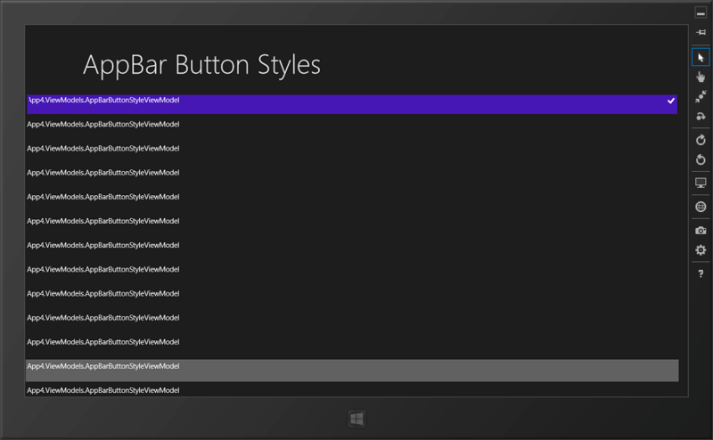

<a href="https://blog.daruyanagi.jp/entry/2012/09/18/002231">&#x30E1;&#x30C8;&#x30ED;&#x3063;&#x307D;&#x3044;&#x30AB;&#x30B9;&#x30BF;&#x30E0;&#x30DC;&#x30BF;&#x30F3;&#x3092; XAML &#x3067;&#x4F5C;&#x308B; - &#x3060;&#x308B;&#x308D;&#x3050;</a> の記事を書くためのサンプルを作ろうと、 StandardStyles.xaml をパースしてバインディングして……ということをしていたのですが、<b>だったらアプリにしてしまえばええやん</b>、と思いついたのでサクッと作ってみました。

AppBarButtonStyle のボタンを一覧表示できます。XAML コードを AppBar からクリップボードへコピー可能。また、一応、習作として検索コントラクト・共有コントラクトにも対応してみました。ところどころ満足が行っていない部分もあるし、そもそもあんまり実用性がない気がするのが残念ですけど、まぁ、ほかのアプリ開発に役立てていきたいです。

最初は XElement をそのままバインディングしていたのですが、ちゃんと Model と ViewModel を作るとあとあとのデザインが楽に。Windows フォームの時はどちらかというと見た目を作ってからイベントハンドラを足しながら機能が増えていくという感じだけれども、WinRT はちっぽけでもいいからまず Model をキッチリ作って、それを表現するために ViewModel を作り、バインドすれば見栄えは完成！　といった感じに作るのがいいみたい。まだよくわかってなくてデザイン用のデータの作り方を知らず、必然的にデザインではなくデータから作っていくしかないというのもあるんですけど。 

ふぅ、とりあえずこれで「9月中に1本」という目標は達成。本命のアプリにゆっくりとりかかれる。

