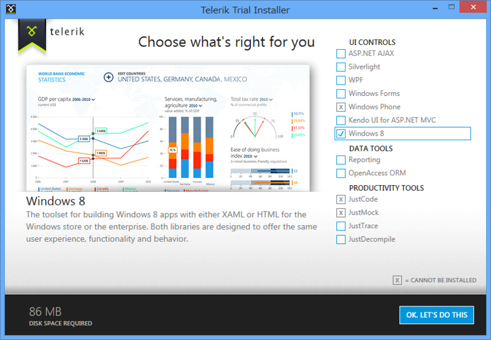
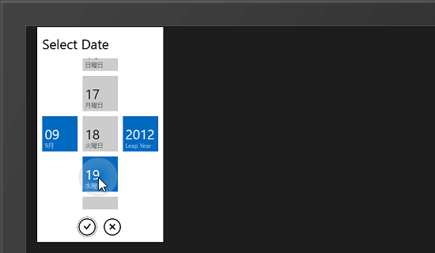
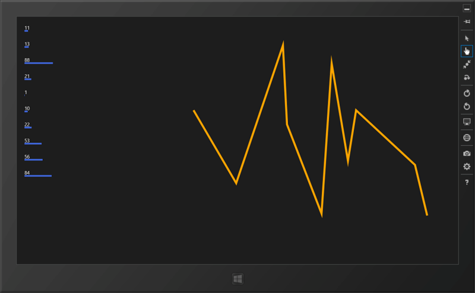

<a href="https://blog.daruyanagi.jp/entry/2012/09/17/222920">&#x71C3;&#x8CBB;&#x8A18;&#x9332;&#x7528;&#x306E; Windows &#x30B9;&#x30C8;&#x30A2;&#x30A2;&#x30D7;&#x30EA;&#x3092;&#x4F5C;&#x3063;&#x3066;&#x307F;&#x305F; - &#x3060;&#x308B;&#x308D;&#x3050;</a> を作っていてふと思った。

そうなんだ、それがあれば完璧になるんだ！　すると、すかさずナイスな情報を教えてもらえた。

さすが左の翼！（<a href="https://blog.daruyanagi.jp/entry/2012/04/26/050929">WWD &#x3044;&#x3063;&#x3066;&#x304D;&#x305F;&#x3088;&#xFF01; - &#x3060;&#x308B;&#x308D;&#x3050;</a> での内輪ネタです、ゴメンナサイ）

で、実際にちょっと試したのだけれど、チャートはなんだかうまくいかなかった。チュートリアル通りにコードを書いたんだけど、なんでだろう。サンプルアプリもあるし、動くはずなんだけれど。もう少し頑張ってみるべきだろうけれど、正式版は有償となるとどうもモチベーションが上がらない。

ただ、これに付属している DatePicker はイケてる。Windows Phone みたいだ。ただ、こういうのは標準で搭載していてほしい気もするんだ。WinRT には NumericUpDown すらない。まぁ、Silverlight Toolkit みたいなプロジェクトがすでにあるみたいだけれど。

<a href="http://jupitertoolkit.codeplex.com/">http://jupitertoolkit.codeplex.com/</a>

まだそこまで手が出せるほどの知識がないのが悲しい。

ともあれ、自分で何とかできないかなぁ、と思って Line や Polyline を使ったサンプルを作って勉強している。XAML は比較的こういうのが得意みたいで、データをグラフ表現するのはそんなに難しくない。

たとえば、左のしょぼい棒グラフ付きの ListBox ならこんな感じだ。

<pre class="code lang-cs" data-lang="cs" data-unlink>protected override void OnNavigatedTo(NavigationEventArgs e)
{
var r = new Random();
DataContext = Enumerable.Range(1, 10).Select(_ =&gt; r.Next(1, 100));
}

&lt;ListView ItemsSource=&quot;{Binding}&quot;&gt;
&lt;ListView.ItemTemplate&gt;
&lt;DataTemplate&gt;
&lt;StackPanel&gt;
&lt;TextBlock Text=&quot;{Binding}&quot; /&gt;
&lt;Line X1=&quot;0&quot; Y1=&quot;0&quot; X2=&quot;{Binding}&quot; Y2=&quot;0&quot; Stroke=&quot;RoyalBlue&quot; StrokeThickness=&quot;5&quot;/&gt;
&lt;/StackPanel&gt;
&lt;/DataTemplate&gt;
&lt;/ListView.ItemTemplate&gt;
&lt;/ListView&gt;
</pre>
けれど、入力データに対して柔軟に対応できて（拡大・縮小、任意のスケール）、それなりにカッコいいのを作ろうと思うとやっぱり大変そうだ。初心者に産毛が生えたような自分には少し難しい。でも、決してステマではないんだけれど、<a href="https://blog.daruyanagi.jp/entry/2012/09/08/062322">&#x300E;&#x300C;.NET&#x958B;&#x767A;&#x8005;&#x300D;&#x306E;&#x305F;&#x3081;&#x306E;Silverlight&#x5165;&#x9580;&#x300F; - &#x3060;&#x308B;&#x308D;&#x3050;</a> のおかげか、これぐらいのことはササッと書けるようになったのはちょっとうれしい。

