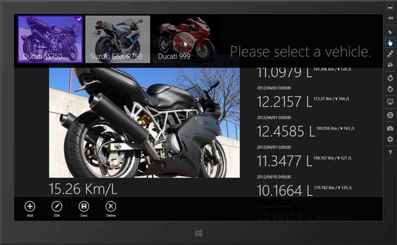
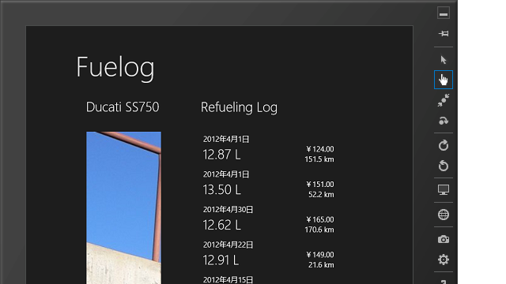
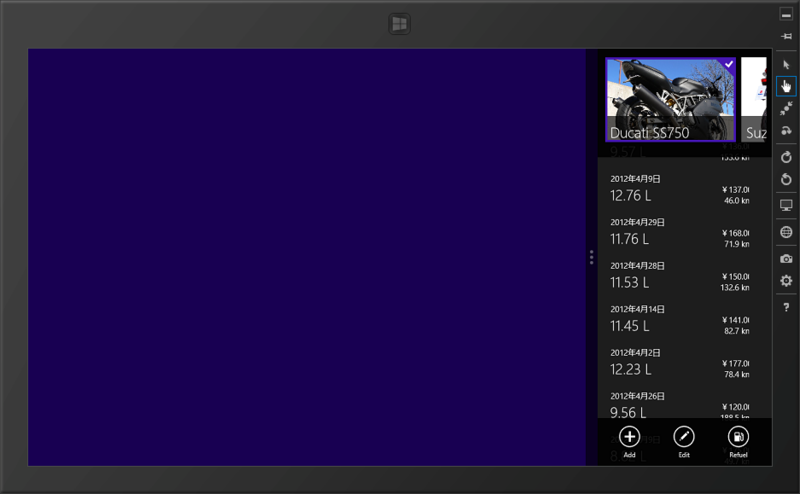

今作ってる燃費管理アプリだけど、データの入出力と表示ぐらいまではあらかたできている。ただ、タッチ操作で日付や数値を入力するのは案外めんどい。 InputScope でソフトウェアキーボードの初期レイアウトを制御できるので多少マシにはなるけれど、やっぱりタッチ専用のユーザーインターフェイスがほしい。まぁ、でも、そこは妥協してもいい。問題は回転と解像度、スナップやでぇ……

<h3>回転と解像度</h3>

たとえば、さっきのアプリを90度回転させてみる。これは惨めだ……。解像度を大きくすると画面が間延びしたりするのも悲しい。

XAML では、いわゆるテーブルレイアウトのようなことが可能な Grid が便利なのだけれど、あまり頼りすぎるとすぐに破たんする感じ。なるべく特定の解像度に依存しないフローレイアウトを行うようにしたいけれど……GridView を中心にしたほうがいいのかなぁ。

<h3>スナップ</h3>

Windows ストアアプリは、端っこに寄せる「スナップ」をサポートしなければならない。

これを当初、HTML でいうレスポンシブレイアウト的な考えで対応しようと思っていたのだけれど、やってみるとあまり現実的ではない。というのも、さまざまな解像度に加え、回転まで考えると、考慮すべきケースが結構多くて手に負えなくなる。これを一つのビューで対応するのはできないこともないけど、結構大変だ。

そこで標準のテンプレートをよく読んでみたところ、どうも <del>ViewState（どっかで聞いたような名前だけど気にしない）</del> VisualState という仕組みがあるらしい。要は、縦表示なのか、スナップ状態なのか、といった表示の状態を管理してくれる。これを利用して、スナップ状態の時だけ表示されるリストを作ってしまえばいい。それあったまいいね！　標準テンプレートの最後のほうにある XAML をちょいちょいっといじるといいみたい。

<pre class="code lang-xml" data-lang="xml" data-unlink>&lt;!-- The back button and title have different styles when snapped --&gt;
&lt;VisualState x:Name=&quot;Snapped&quot;&gt;
&lt;Storyboard&gt;
&lt;ObjectAnimationUsingKeyFrames Storyboard.TargetName=&quot;backButton&quot; Storyboard.TargetProperty=&quot;Style&quot;&gt;
&lt;DiscreteObjectKeyFrame KeyTime=&quot;0&quot; Value=&quot;{StaticResource SnappedBackButtonStyle}&quot;/&gt;
&lt;/ObjectAnimationUsingKeyFrames&gt;
&lt;ObjectAnimationUsingKeyFrames Storyboard.TargetName=&quot;pageTitle&quot; Storyboard.TargetProperty=&quot;Style&quot;&gt;
&lt;DiscreteObjectKeyFrame KeyTime=&quot;0&quot; Value=&quot;{StaticResource SnappedPageHeaderTextStyle}&quot;/&gt;
&lt;/ObjectAnimationUsingKeyFrames&gt;

&lt;ObjectAnimationUsingKeyFrames Storyboard.TargetName=&quot;contentGrid&quot; Storyboard.TargetProperty=&quot;Visibility&quot;&gt;
&lt;DiscreteObjectKeyFrame KeyTime=&quot;0&quot; Value=&quot;Collapsed&quot;/&gt;
&lt;/ObjectAnimationUsingKeyFrames&gt;
&lt;ObjectAnimationUsingKeyFrames Storyboard.TargetName=&quot;logListView&quot; Storyboard.TargetProperty=&quot;Visibility&quot;&gt;
&lt;DiscreteObjectKeyFrame KeyTime=&quot;0&quot; Value=&quot;Visible&quot;/&gt;
&lt;/ObjectAnimationUsingKeyFrames&gt;
&lt;/Storyboard&gt;
&lt;/VisualState&gt;
</pre>
下の二つの ObjectAnimationUsingKeyFrames がそれで、contentGrid/logListView という二つのエレメントの Visibility を VisualState に応じて切り替えている。コードの意味はあんまりよくわかってなくて、辛うじて StoryBoard を知っている程度だけど、まぁ、コピペでいけるから今はそれでいいことにしておく。

Windows ストアアプリは、こういうところが難しいなぁ、と思った。デスクトップアプリと違って、「未完成だけど公開してみます」というのはストアが認めてくれないわけで、ハードルはかなり高い。それに比べれば、開発者登録にお金が要るのはあまり大した問題じゃない気もする。けれど、一つアプリを完成させた（<a href="https://blog.daruyanagi.jp/entry/2012/09/18/075242">&#x521D;&#x3081;&#x3066;&#x306E; Windows &#x30B9;&#x30C8;&#x30A2;&#x30A2;&#x30D7;&#x30EA;&#x3092;&#x63D0;&#x51FA;&#x3057;&#x3066;&#x307F;&#x307E;&#x3057;&#x305F; - &#x3060;&#x308B;&#x308D;&#x3050;</a>）おかげで、ちょっとだけ慣れてきたかもしれない。やっぱり案ずるより産むが横山やすしやでぇ。

あとは WinRT <-> .NET Framework の関係があまりよくわかってなくて、MSDN ライブラリで迷子になったりするのもつらい。最初はファイルをどうやって開けばいいのかもわからなかった。けれど、これは経験を積んでいけば解消できそうな問題かな。

