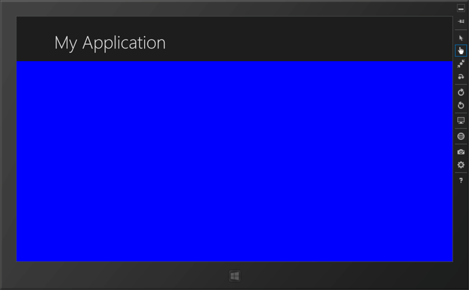
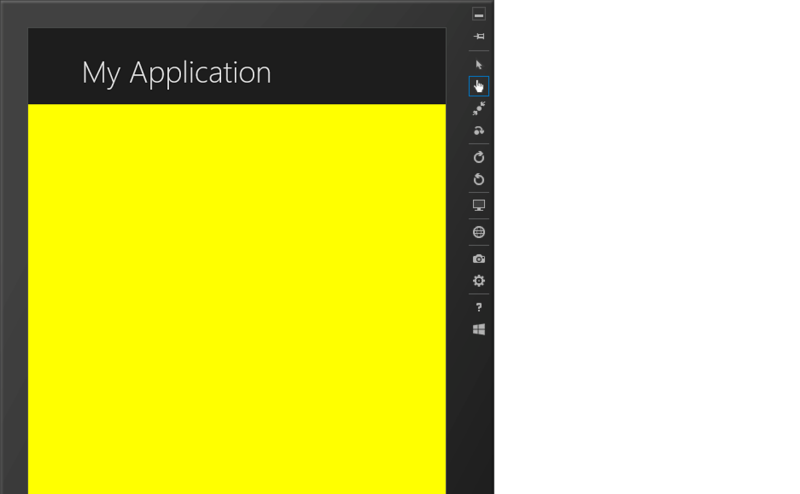
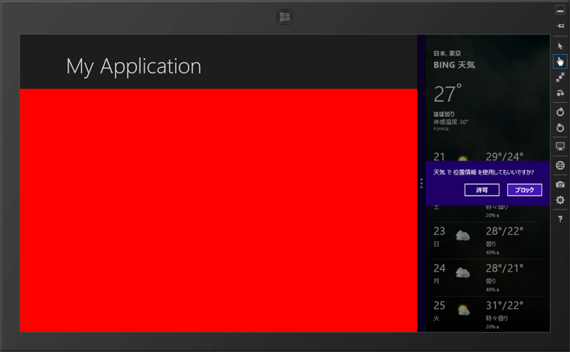

Windows ストアアプリには4つの状態（VisualState）がある

<ul>
<li><b>FullScreenLandscape</b>：全画面表示（横）</li>
<li><b>FullScreenPortrait</b>：全画面表示（縦）</li>
<li><b>Snapped</b>：端に寄せる（幅300px）</li>
<li><b>Filled</b>：ほかのアプリを Snap した残りの領域に表示</li>
</ul>
これを一つのデザインで対応しようとするととても難しい、という話が前回（<a href="https://blog.daruyanagi.jp/entry/2012/09/20/022735">WinRT/XAML &#x306E;&#x304A;&#x52C9;&#x5F37; &#x2015;&#x2015; &#x3055;&#x307E;&#x3056;&#x307E;&#x306A;&#x5229;&#x7528;&#x30B7;&#x30FC;&#x30F3;&#x306B;&#x5BFE;&#x5FDC;&#x3059;&#x308B; - &#x3060;&#x308B;&#x308D;&#x3050;</a>）だった。あれからいろいろ試したんだけれど、ひとつのデザインですべてをカバーしようとするより、4つの VisualState にそれぞれ個別にデザインを作って割り当てたほうがよさそうだ<a href="#f-d1bfc3d2" name="fn-d1bfc3d2" title="ただ、FullScreenLandscape と Filled はとてもよく似ているので、分ける必要はないかもしれない">*1</a>。

じゃぁ、VisualState によってビューを切り替えるのってどうすればいいんだ？　ってのが今日の主題。

<pre class="code lang-xml" data-lang="xml" data-unlink>&lt;Grid Style=&quot;{StaticResource LayoutRootStyle}&quot;&gt;
&lt;Grid.RowDefinitions&gt;
&lt;RowDefinition Height=&quot;140&quot;/&gt;
&lt;RowDefinition Height=&quot;*&quot;/&gt;
&lt;/Grid.RowDefinitions&gt;

&lt;!-- Back button and page title --&gt;
&lt;Grid&gt;
（ヘッダー。内容省略）
&lt;/Grid&gt;

&lt;Grid x:Name=&quot;FullScreenLandscapeGrid&quot; 
          Grid.Row=&quot;1&quot; Background=&quot;Blue&quot; /&gt;
&lt;Grid x:Name=&quot;FullScreenPortraitGrid&quot;
          Grid.Row=&quot;1&quot; Background=&quot;Yellow&quot; Visibility=&quot;Collapsed&quot; /&gt;
&lt;Grid x:Name=&quot;SnappedGrid&quot;
          Grid.Row=&quot;1&quot; Background=&quot;Green&quot; Visibility=&quot;Collapsed&quot; /&gt;
&lt;Grid x:Name=&quot;FilledGrid&quot;
          Grid.Row=&quot;1&quot; Background=&quot;Red&quot; Visibility=&quot;Collapsed&quot; /&gt;
</pre>
こうやって VisualState に対応する Grid を用意する（名前でわかるよね！）。わかりやすくセンスの悪い背景色をそれぞれ割り当てておいた。Grid.Row="1" なのはヘッダー（Grid.Row[0]）の下に表示するためやね。 

で、初期状態の FullScreenLandscape 以外は非表示（Visibility="Collapsed"）にしておく。あとは、最後のほうにある <VisualStateManager.VisualStateGroups> のところで、表示非表示を切り替えるだけ。

<pre class="code lang-xml" data-lang="xml" data-unlink>&lt;VisualStateManager.VisualStateGroups&gt;
&lt;!-- Visual states reflect the application's view state --&gt;
&lt;VisualStateGroup x:Name=&quot;ApplicationViewStates&quot;&gt;
&lt;VisualState x:Name=&quot;FullScreenLandscape&quot;&gt;
（初期表示なので別に何もしないでいい感じ）
&lt;/VisualState&gt;

&lt;!-- The entire page respects the narrower 100-pixel margin convention for portrait --&gt;
// 全画面（横向きになったら……）
&lt;VisualState x:Name=&quot;FullScreenPortrait&quot;&gt;
&lt;Storyboard&gt;
（関係のないところ省略）

// FullScreenLandscapeGrid を非表示に
&lt;ObjectAnimationUsingKeyFrames
                    Storyboard.TargetName=&quot;FullScreenLandscapeGrid&quot;
                    Storyboard.TargetProperty=&quot;Visibility&quot;&gt;
&lt;DiscreteObjectKeyFrame
                        KeyTime=&quot;0&quot; Value=&quot;Collapsed&quot;/&gt;
&lt;/ObjectAnimationUsingKeyFrames&gt;

// FullScreenPortraitGrid を表示に
&lt;ObjectAnimationUsingKeyFrames
                    Storyboard.TargetName=&quot;FullScreenPortraitGrid&quot;
                    Storyboard.TargetProperty=&quot;Visibility&quot;&gt;
&lt;DiscreteObjectKeyFrame
                        KeyTime=&quot;0&quot; Value=&quot;Visible&quot;/&gt;
&lt;/ObjectAnimationUsingKeyFrames&gt;
&lt;/Storyboard&gt;
&lt;/VisualState&gt;

// Filled になったら……
&lt;VisualState x:Name=&quot;Filled&quot;&gt;
:
: （以下略）
</pre>
結果はこんな感じ。

<h4>FullScreenLandscape</h4>

 

<h4>FullScreenPortrait</h4>

FullScreenLandscapeGrid.Visibility -> Collapsed 
FullScreenPortraitGrid.Visibility -> Visible

<h4>Snapped</h4>

FullScreenLandscapeGrid.Visibility -> Collapsed 
SnappedGrid.Visibility -> Visible

<h4>Filled</h4>

FullScreenLandscapeGrid.Visibility -> Collapsed 
FilledGrid.Visibility -> Visible

あとはそれぞれ、解像度が変わる場合をよく考えながらデザインしていけばいいと思う。まぁ、なるべくテンプレ使うのがよさそうだけど、ちょっと試してみたところ、自分の目的には合わない気がしたのでやっぱこれで行こうと思う。

<h3>余談</h3>

ここまでやるのはそんなに難しくなかったけど、途中、シミュレーターの回転に異様に時間がかかり、いろんなエラーをはいてしまってちょっと躓いた。再起動でなおったけど……。最初は自分のソースが悪かったのかなぁと思ってあちこち直してたのだけど、結局新規にページを作ってもエラーが出るので、やっとシミュレーターがおかしいんだってわかった。

まぁ、そんなこともあるよね。

<a href="#fn-d1bfc3d2" name="f-d1bfc3d2" class="footnote-number">*1</a>:ただ、FullScreenLandscape と Filled はとてもよく似ているので、分ける必要はないかもしれない

