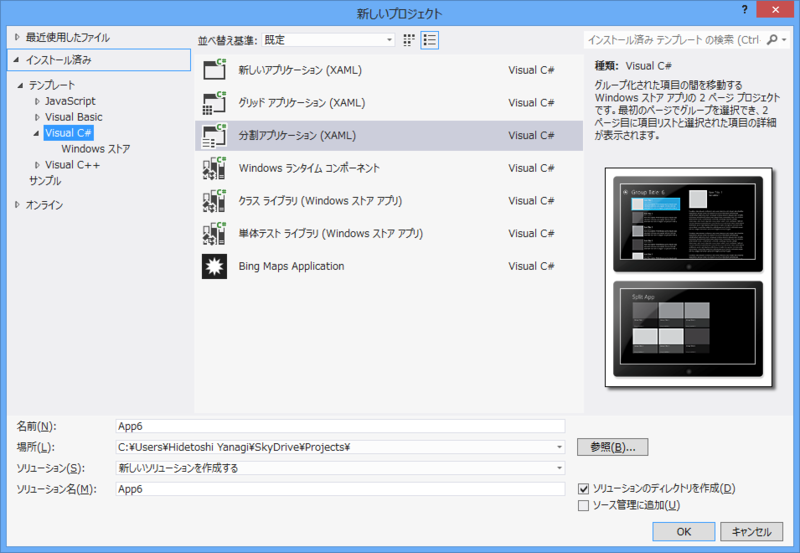
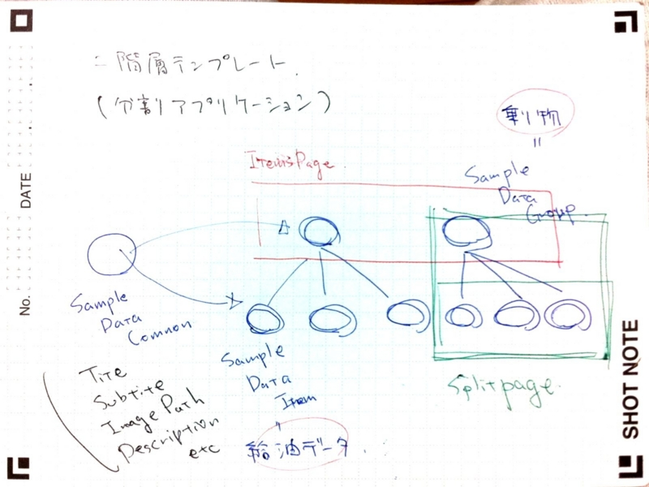
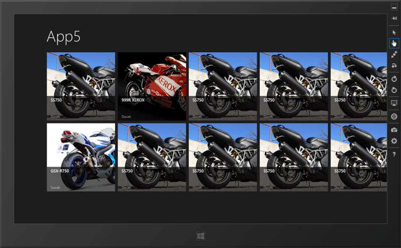
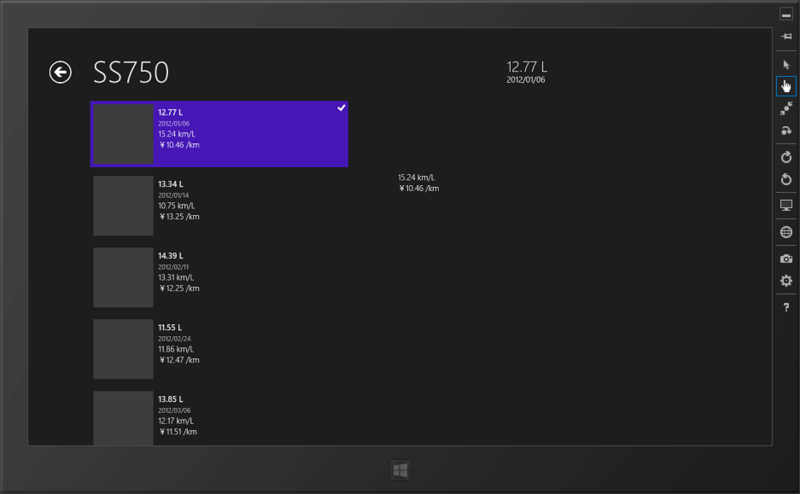
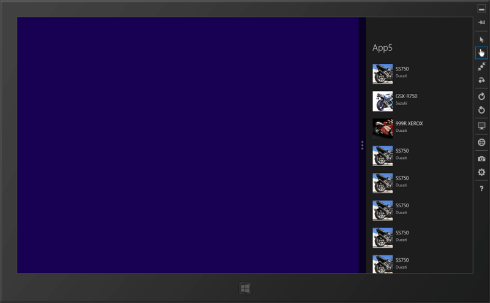
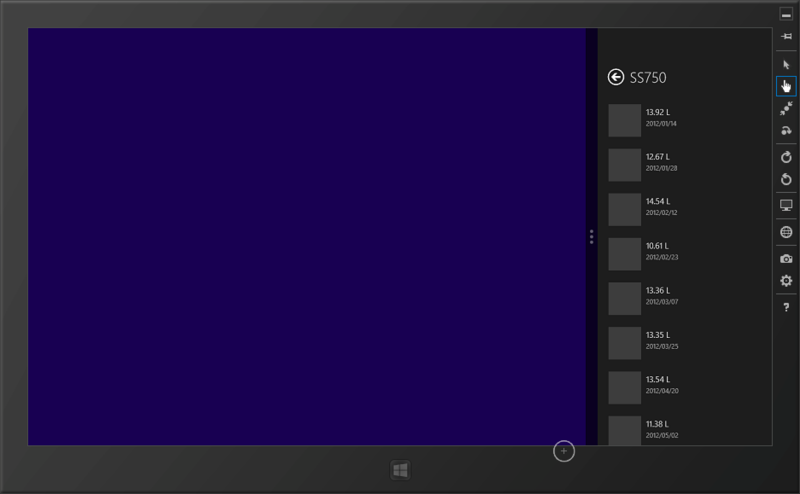
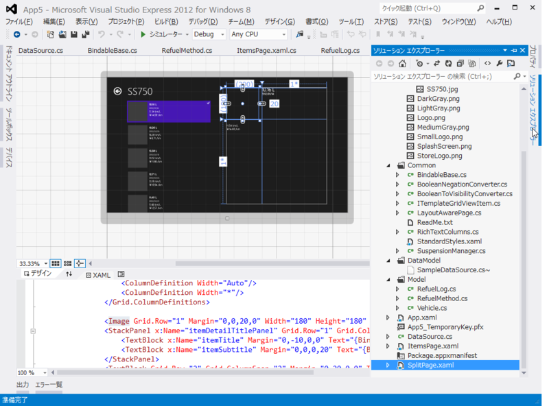
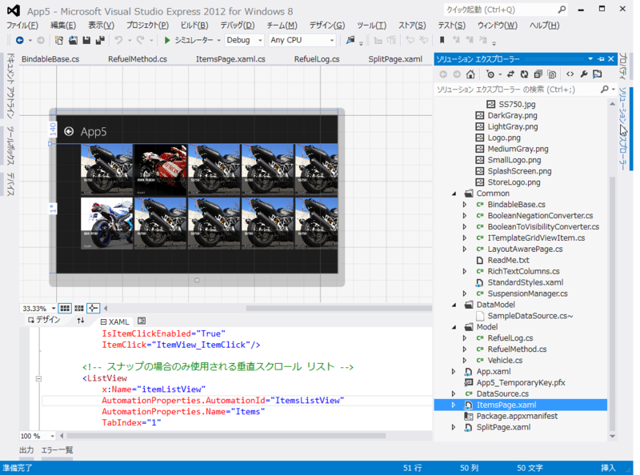

      @<a class="twitter-user-screen-name" href="http://twitter.com/xin9le" target="_top">xin9le</a> @<a class="twitter-user-screen-name" href="http://twitter.com/daruyanagi" target="_top">daruyanagi</a> MSが提供している基本構造を理解したうえで無視るのはありだと思います！知らないで無視るのは、大変だと思います。個人的に。

<a href="http://twitter.com/okazuki/status/248781444867035136" class="twitter-detail-info-permalink">2012-09-20 22:51:33</a> via <a href="http://krile2.starwing.net/" rel="nofollow">Krile2</a> to @<a href="http://twitter.com/xin9le/status/248781270149128193"  class="twitter-user-screen-name">xin9le</a>

昨日、@okazuki さんにいろいろ教えてもらったのだけど、ちょっとチンプンカンプンなところもあったので、今日は「標準テンプレート縛り」で燃費管理アプリを一から開発してみた。

使ったのは 「分割アプリケーション」。2階層のデータ表示が可能なのかな。List<Group> を表示する ItemsPage.xaml と、そこで Group を選択して List<Group.Items> を表示する SplitPage.xaml が用意されている。

いろいろ考えてみたんだけれど、キモはこのテンプレートが要求する仕様に沿ったデータを用意することかな。

じゃぁ、仕様に沿ったデータ構造って？　DataModel/SampleDataSource.cs を読むと、データは

<pre class="code lang-cs" data-lang="cs" data-unlink>SampleDataSource
    List: SampleDataGroup (SampleDataCommon)
        List: SampleDataItem (SampleDataCommon)
</pre>
になってる。こういう感じに作ればいい。うちのアプリの場合は、

<pre class="code lang-cs" data-lang="cs" data-unlink>DataSource
    List: Vehicle (乗り物)
        List: RefuelLog (給油ログ)
</pre>
って感じになるかな。乗り物＝Group、給油ログ＝Itemというイメージ。

んで、Group も Item も SampleDataCommon を継承している。要は <b>UniqueId、Title、Subtitle、Description、Image というプロパティを持ちなさい</b>ということだ。実装したら、テンプレートでバインドされますよ、と<a href="#f1" name="fn1" title="SplitPage ではこれに加えて Content というプロパティも要求する">*1</a>。

でも、だったらインターフェイスでもいいわけで、

<pre class="code lang-cs" data-lang="cs" data-unlink>namespace App5.Common
{
using Windows.UI.Xaml.Media;
using Windows.UI.Xaml.Media.Imaging;

public interface ITemplateGridViewItem
{
Guid UniqueId { get; } // &lt;- string は嫌だったので改造
string Title { get; }
string Subtitle { get; }
string Description { get; }
ImageSource Image { get; }
ITemplateGridViewItem Parent { get; } // &lt;- なくてもいい
}
}
</pre>
というのを作って、Group/Item はこれを実装するということにした。乗り物データと給油ログデータが一つのデータから継承されてるってなんかアレだけど、インターフェイスなら個人的にしっくりくる。

燃費管理アプリのデータには、タイトルやサブタイトルなどという概念はない。でも、そこは給油量（Amout）や日付（Date）といったふさわしいプロパティを別途もっておいて、

<pre class="code lang-cs" data-lang="cs" data-unlink>public string Title
{
get { return string.Format(&quot;{0:#,##0.00 L}&quot;, amount); }
}

public string Subtitle
{
get { return date.ToString(&quot;d&quot;); }
}
</pre>
という感じで、ビューに表示したいデータ（給油量をタイトルに、日付をサブタイトルに）を適当に返せばいい。なんか M-VM を分けたくなってきたね。まぁ、それは今度でいい。今回はこの汚い実装のまま先に進もう。DataSource（自分で書いたデータソース）も、SampleDataSource のコピペをベースにあまり構造を変えないように実装していく。

あとは SampleDataSource.cs を消すなりリネームして、ビルドエラーが出た個所をこちょこちょ DataSource に置き換えれば、こんな感じ！

さすが標準テンプレート、Snapped にもばっちり対応だぜ。

<h3>デザイン時バインディング</h3>

      @<a class="twitter-user-screen-name" href="http://twitter.com/xin9le" target="_top">xin9le</a> d:DataContext="{d:DesignInstance Type=***, IsDesignTimeCreatable=True}"を適切なところに設定することで、デザイナの支援も受けれます

<a href="http://twitter.com/okazuki/status/248781837265170433" class="twitter-detail-info-permalink">2012-09-20 22:53:06</a> via <a href="http://krile2.starwing.net/" rel="nofollow">Krile2</a> to @<a href="http://twitter.com/xin9le/status/248781431248134146"  class="twitter-user-screen-name">xin9le</a>

Page.Resource の CollectionViewSource で、d:Source って書いてある部分は、デザイン時のみ有効なデータバインディング。これをやっておけばサンプルデータがバインディングされて、デザインがやりやすくなる。

<pre class="code lang-xml" data-lang="xml" data-unlink>&lt;Page.Resources&gt;

&lt;!-- このページで表示されるアイテムのコレクション --&gt;
&lt;CollectionViewSource
        x:Name=&quot;itemsViewSource&quot;
        Source=&quot;{Binding Items}&quot;
        d:Source=&quot;{Binding AllGroups[0].Items, Source={d:DesignInstance Type=local:DataSource, IsDesignTimeCreatable=True}}&quot;/&gt;
&lt;/Page.Resources&gt;
</pre>
標準では DataModel/SampleDataSource がバインディングされているけれど、これもちょちょいと local:DataSource <a href="#f2" name="fn2" title="local はアプリケーションの名前空間。XAML の最初のほうに定義してある">*2</a>に書き換えれば……

うおおー、デザイン時にもバインディングされてる。これは超便利だな！

ちょっとわかった気がするので、これでテンプレートから足を踏み外せるぜー。これで今日のお勉強は終わり！

<a href="#fn1" name="f1" class="footnote-number">*1</a>:SplitPage ではこれに加えて Content というプロパティも要求する

<a href="#fn2" name="f2" class="footnote-number">*2</a>:local はアプリケーションの名前空間。XAML の最初のほうに定義してある

