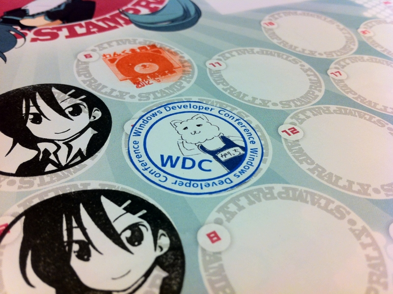
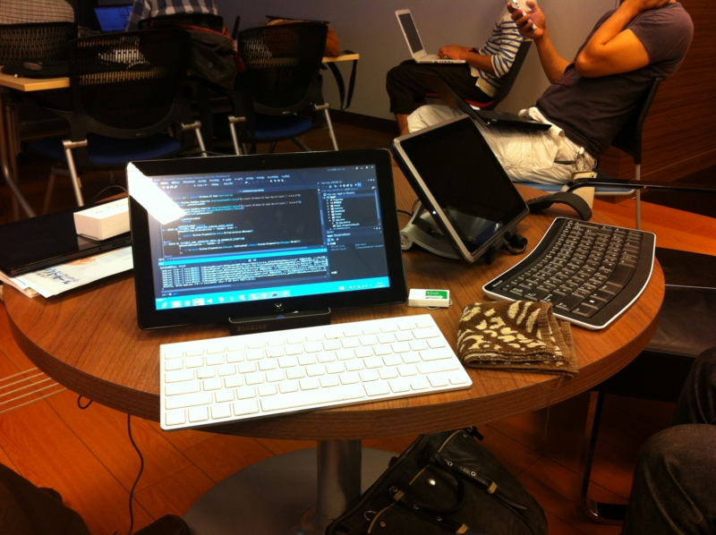
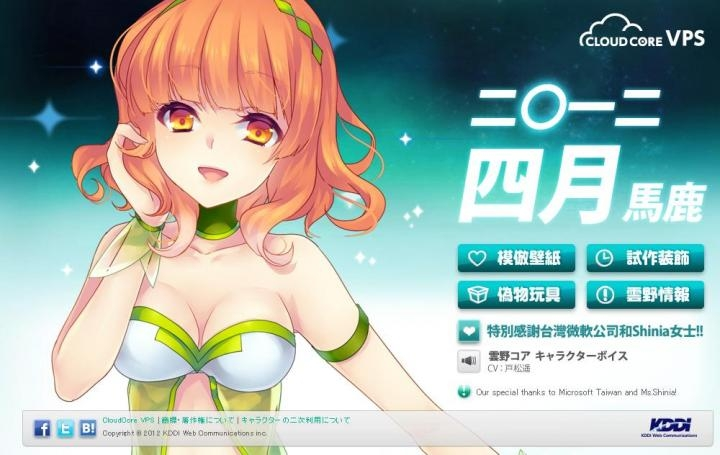
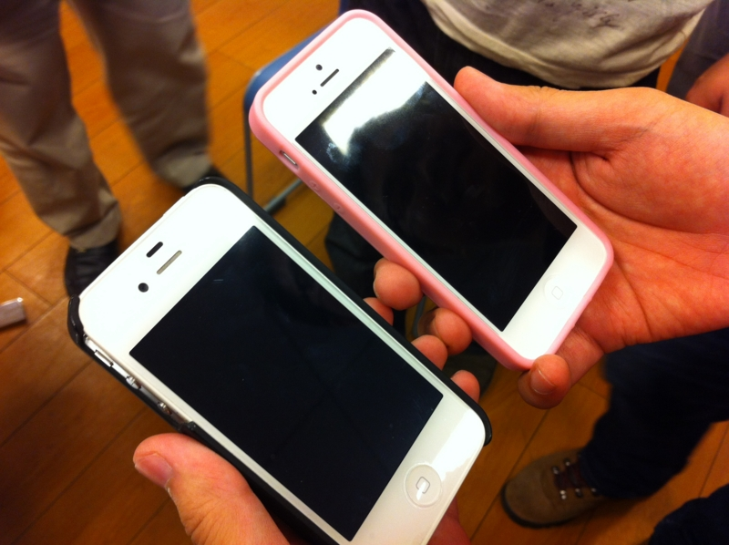
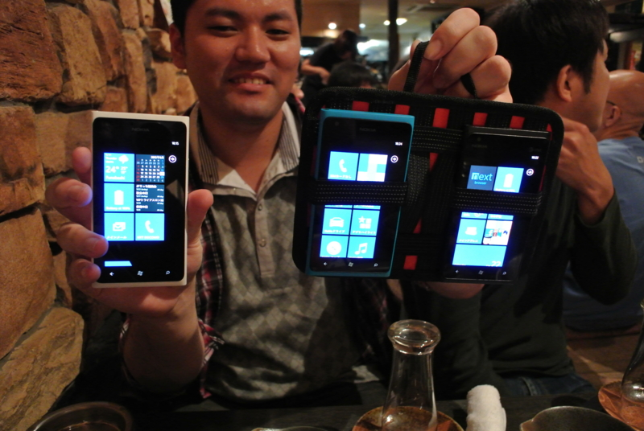
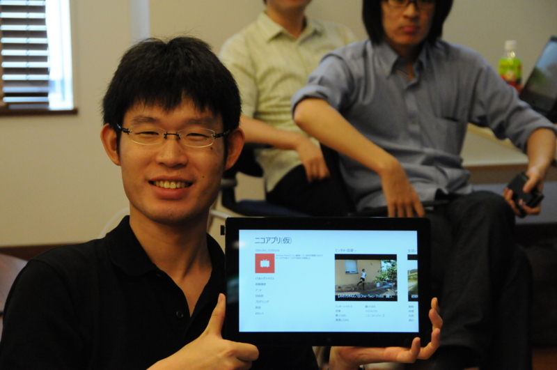
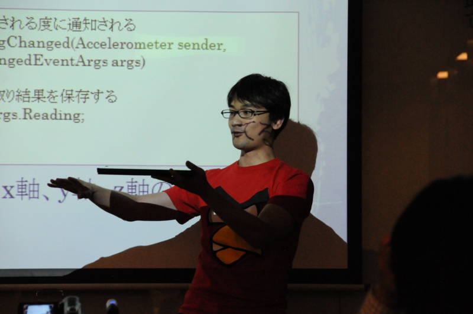
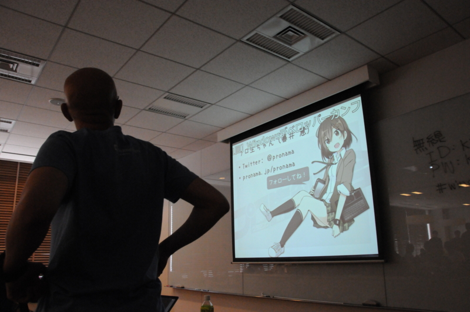

<a href="http://atnd.org/events/32054">&#x3010;&#x7B2C;1&#x56DE;&#x3011;Windows&#x30C7;&#x30D9;&#x30ED;&#x30C3;&#x30D1;&#x30FC;&#x30AB;&#x30F3;&#x30D5;&#x30A1;&#x30EC;&#x30F3;&#x30B9; in &#x6771;&#x4EAC; : ATND</a> に参加してきました。この勉強会の正式名は「Windowsデベロッパーカンファレンス（WDC）」なのらしいけど、@garicchi が主催したので「ガリ勉」て呼んでいいと思います。

<h3>会場</h3>

会場になった KDDI ウェブコミュニケーションズさんのセミナールームは居心地がよかったです。わしの椅子にはクッションもあって、危うく寝るところでした。

さすがこんなことやっている会社だと思いました。

<h3>雰囲気</h3>

さっそく iPhone 5 が！　なげえ！

まぁ、でも Windows Phone だよね。噂の某氏にコレクションを見せてもらったのだけど、ひとつくれよって感じだった。

リジェクトマスター @daisuke_nomura のニコ動ストアアプリ。完成度はかなり高いけれど、検索結果に幼女をぺろぺろしていいですかみたいな動画が引っ掛かったのでまたリジェクトされると思う。

全体的に、和気藹々としていていい感じだったんじゃないかな。

<h3>セッション</h3>

日本の赤シャツこと @ch3cooh をはじめとする豪華メンバーが登壇。内容に関しては省略。誰かが書いてくれそう。

自分も手探りでストアアプリを作っていたので、どれもとても役に立った。ストアアプリは新しい分野なので、まだまだ知らないことが多いし、気をつけなきゃいけない部分も多い。そういう部分を補強できたのは収穫だったと思う。セッション聞いている間にも @daisuke_nomura のストアアプリにもリストがピンチ操作で拡大縮小できるバグが見つかったりね。

自分のアプリにもいまいちな部分が見えてきて、「忘れないうちに！」と思ってその場で Dropbox で同期したプロジェクトを書き換えてビルドしようと思ったのだけど、これができないみたいでもどかしかった。うーん、できなんだな。

ちなみに放送はプロ生ちゃんのプロデューサー @5zj が出張ってきて担当。

LT を申し込んでいたのに @garicchi にガン無視されるという事件が発生して、第三者的には面白かった。

<h3>最後に</h3>

@garicchi はまだ若干19歳なのに、ちゃんと勉強会を切り盛りしていて素晴らしかった。とくにナチュラルな無茶振りで、登壇者から貪欲にネタを引き出そうとする姿勢には感銘を受けたよ。おつかれさま。次は12月に広島でやるみたいなので、そっちも期待したい。

