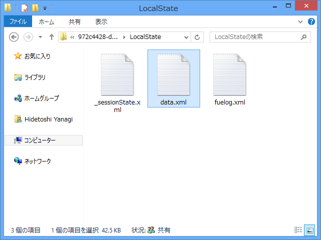
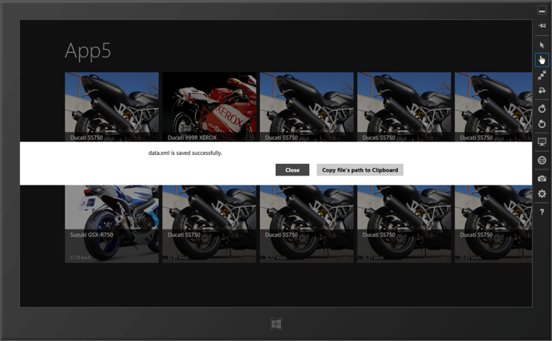

WinRT のファイル操作はまだ慣れていないので、いちいち MSDN を徘徊しなくちゃいけないのでつらい。でも、ちょっとずつ覚えていかなければ。

たとえば、.NET の XmlSerializer を使うときは Stream が必要なんだけれど、これは .NET のクラス。WinRT とどうやってつなげればいいんだろう…… 

<pre class="code lang-cs" data-lang="cs" data-unlink>public async void Save(object o, string filename)
{
if (o == null) throw new ArgumentException();

try
{
// WinRT のファイル操作
var folder = ApplicationData.Current.LocalFolder;
var file = await folder.CreateFileAsync(
filename,
CreationCollisionOption.ReplaceExisting
);

// .NET の書き込み stream として開く
using (var stream = await file.OpenStreamForWriteAsync())
{
// おなじみの .NET ！
new XmlSerializer(o.GetType()).Serialize(stream, o);
}
// *
}
catch
{
throw;
}
}
</pre>
調べてみると、 WindowsRuntimeStorageExtensions（<a href="http://msdn.microsoft.com/ja-jp/library/hh582101.aspx">http://msdn.microsoft.com/ja-jp/library/hh582101.aspx</a>）のような、WinRT と .NET のファイル操作を橋渡しする拡張メソッドが結構用意されているので、それを使えばいいみたい。

ちょっと注意が必要なのは、ファイルの保存場所。標準ではアプリフォルダしか認められていないみたい。アクセス権限がないって怒られまくってちょっと凹みそうになった。

そのアプリフォルダだけど、階層が結構深くてたどるのが面倒。なので、上記のコードの // * にダイアログを表示してパスをクリップボードにコピーするコードを仕込んでおいた。

<pre class="code lang-cs" data-lang="cs" data-unlink>var dialog = new MessageDialog(
Path.GetFileName(file.Path) + &quot; is saved successfully.&quot;);
dialog.Commands.Add(new UICommand(&quot;Close&quot;));
dialog.Commands.Add(new UICommand(&quot;Copy file's path to Clipboard&quot;,
(_) =&gt; {
var p = new DataPackage();
p.SetText(file.Path);
Clipboard.SetContent(p);
Clipboard.Flush();
}));
await dialog.ShowAsync();
</pre>

Process.Start() みたいなので一発でフォルダを開けたらいいんだけど、あり方がよくわからなかった。 Windows.System.Launcher はローカルフォルダ開くためには使えないのかなぁ。

アプリフォルダ、今回初めてのぞいてみたんだけど、いろいろ面白そうなファイルがあった。ふぅん、そういうことか、みたいな。

