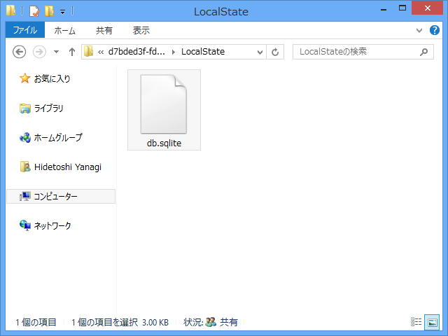

UPDATED HOWTO: SQLite with Windows 8 apps 
<a href="http://timheuer.com/blog/archive/2012/08/07/updated-how-to-using-sqlite-from-windows-store-apps.aspx">http://timheuer.com/blog/archive/2012/08/07/updated-how-to-using-sqlite-from-windows-store-apps.aspx</a>

@kaorun さんのはてブ経由で知った。前試したときはうまくいかなかったのだけど、今回はうまくできたっぽい。ポータブルなデータベースはやっぱりほしいよねぇ……。

<h3>拡張機能「SQLite for Windows Runtime」をインストール</h3>

グローバルにインストールされるので、最初に一度やればよい。

<h3>NuGet パッケージ「sqlite-net」をインストール</h3>

これはプロジェクトごとにインストール。マネージドで扱うためのラッパーのようで、C# のソースコードで提供されている。Visual Basic で使いたい場合は一工夫必要みたい。

<h3>参照の追加</h3>

「Microsoft Visual C++ Runtime Pakage」と「SQLite for Windows Runtime」を参照に追加。

<h3>ビルドターゲットを変更</h3>

Any CPU では動かないので、ほかの適当なものに変えておく。まぁ、とりあえず x86 とかでいいんじゃないかな。

<h3>動かしてみる。</h3>

空のテンプレートで、サンプルコードを試してみる。

<pre class="code lang-cs" data-lang="cs" data-unlink>namespace App1
{
sealed partial class App : Application
{
public App()
{
this.InitializeComponent();
this.Suspending += OnSuspending;

LoadData();
}

：
：

public void LoadData()
{
var dbPath = Path.Combine(
ApplicationData.Current.LocalFolder.Path,
&quot;db.sqlite&quot;);

using (var db = new SQLite.SQLiteConnection(dbPath))
{
db.CreateTable&lt;Person&gt;();

db.RunInTransaction(() =&gt;
{
db.Insert(new Person() {
FirstName = &quot;Tim&quot;, LastName = &quot;Heuer&quot;
});
});
}
}
}
}

public class Person
{
[SQLite.AutoIncrement, SQLite.PrimaryKey]
public int ID { get; set; }
public string FirstName { get; set; }
public string LastName { get; set; }
}
</pre>

LocalFolder に db.sqlite ができていた。結構簡単に扱えそうで、こりゃいいな。

データもちゃんと入っていたよ！

SQLite の GUI ブラウザは <a href="http://www.forest.impress.co.jp/lib/offc/business/db/sqldbbrowser.html">&#x7A93;&#x306E;&#x675C; - SQLite Database Browser</a> あたりが定番かな。

