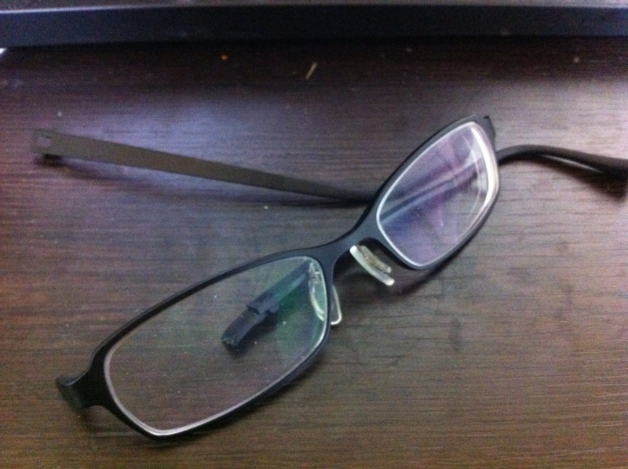
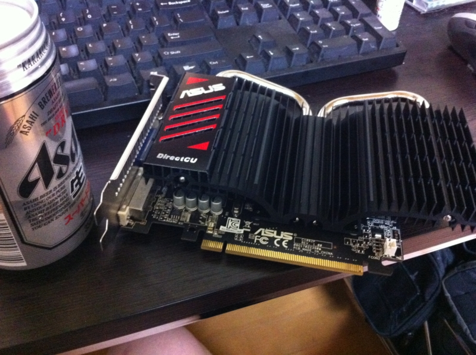

6月に無駄遣いをして30万のカード請求で大爆死。9月、10月は出費が多いので、あらかじめ節約生活を入していたのだけれど……

メガネふんで壊しました。

足の裏に違和感を感じて、踏み抜かずにとっさに足をあげたのだけど……レンズに傷はないものの、フレームはパッキリと折れていた。このフレーム、軽くてとても気に入っていたのだけれど、圧力にはとことん弱いみたい。

結局レンズはそのままで同じフレームを買ったのだけど、17,000円もとられた。ちょっとはまけてくれればお店のファンになるんだが……ほんとに痛い。ほかにも予定外の出費が3万ほど出たので、今月の財政は＋30,000円という非常に厳しい事態に。ほんとは10月に親父を連れて旅行しようと思っていたので、その倍ぐらいはお金を貯めておきたかったのだけれど……これぐらいすぐに宿代で消えてしまうから貯金取り崩しはほぼ確定だな。

上司のお下がり GPU をタダでもらったので、メガネはその代金として消えたんだと、半ば強引に思い込むことで忘れることにしたい。17,000円でこの素敵なファンレス GPU をゲットしたんだ。そうだ、そうに違いない。

