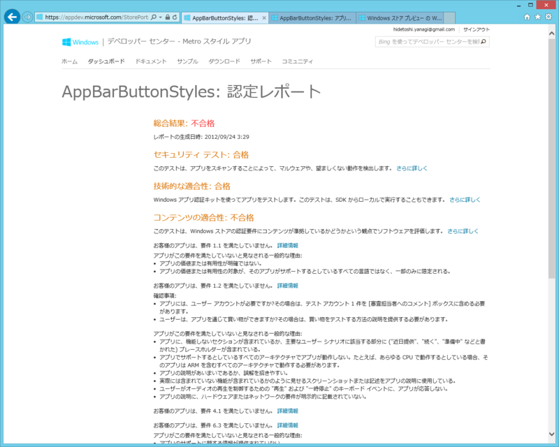

<a href="https://blog.daruyanagi.jp/entry/2012/09/24/210732">&#x521D;&#x3081;&#x3066;&#x306E; Windows &#x30B9;&#x30C8;&#x30A2;&#x30A2;&#x30D7;&#x30EA;&#x304C;&#x516C;&hellip;&hellip;&#x3046;&#x304E;&#x3083;&#x30FC;&#xFF01; - &#x3060;&#x308B;&#x308D;&#x3050;</a> から3日、無事、ストアの審査を通過しました！

<ul>
<li><a href="http://apps.microsoft.com/webpdp/ja-JP/app/appbarbuttonstyles/24b07f02-446a-4861-b265-1d2fe4dd5383">http://apps.microsoft.com/webpdp/ja-JP/app/appbarbuttonstyles/24b07f02-446a-4861-b265-1d2fe4dd5383</a></li>
</ul>
普通の人にはまったく役に立たないし、普通じゃない人にもほとんど役に立たないアプリなのでダウンロードする必要はないです。ただ、これからもちょくちょく機能を実装して、ストアに通るか試すためにアップデートしようかなと思います。

今回はそれよりも、 @ch3cooh 先生に習ってリジェクト理由とその対策を検討したいと思います（<a href="http://d.hatena.ne.jp/ch3cooh393/20120926/1348641903">Windows &#x30B9;&#x30C8;&#x30A2; &#x30A2;&#x30D7;&#x30EA;&#x304C;&#x30EA;&#x30B8;&#x30A7;&#x30AF;&#x30C8;&#x3055;&#x308C;&#x305F; - &#x9162;&#x308D;&#x3050;&#xFF01;</a>）。

<h3>認定レポート</h3>

審査が終わると、このような「認定レポート」がもらえます。リジェクト理由はその中に書いてあるのですけど、前回は以下の理由でリジェクトされていました。

<ul>
<li>お客様のアプリは、要件 1.1 を満たしていません。</li>
<li>お客様のアプリは、要件 1.2 を満たしていません。</li>
<li>お客様のアプリは、要件 4.1 を満たしていません。</li>
<li>お客様のアプリは、要件 6.3 を満たしていません。</li>
</ul>
では、順にみていきましょう。

<h4>要件 1.1：アプリは、サポートしているすべての言語と市場で、ユーザーに独特かつ独創的な価値または実用性を提供しなければならない</h4>

<h4>要件 1.2：ユーザーが Windows ストアからアプリを入手したとき、そのアプリは完全に機能しなければならない</h4>

確かに実用性には欠けるかもしれませんが、ほかに似たようなアプリがあるとは思えません。また、不完全な機能や実装予定の機能を付けた覚えもありません。レビュアーに「何ができるアプリなのか」があまり伝わっていなかったのかもしれません。

僕のアプリの機能は、

<ul>
<li>StandardStyles.xaml で定義されている AppBarButtonStyle のカタログを提供すること</li>
<li>スタイルを検索チャームで検索できること</li>
<li>スタイルの XAML コードをクリップボードへコピーできること</li>
</ul>
の3点。

なので、まず英語での説明を1.5倍ぐらいに増やしました。あと、“Show samples of style”という表現が「不完全な機能」を連想させて誤解を生むかもしれないと思ったので、“Show catalog of styles”と細部の表現に気を使いました。英語としてはそんなに推敲してないし、ダメダメだと思いますけど、今回の審査には通ったのでまぁ、いいんじゃないでしょうか。

あと、クリップボードへコピーされたということがわかってもらえなかったのかもしれないと思ったので、トーストで通知するように改良しました。ちょっと過剰な対応かなと思ったけれど、こういう配慮が必要なのも含めて“Metro”デザインなのかもしれません。

<h4>要件 4.1：プライバシーに関する次の要件に準拠しなければならない</h4>

ストアアプリに提出した人で一番引っかかるのはこれなんじゃないでしょうか。

認定レポートに付属していたPDFによると、

<ul>
<li>4.1.1 アプリで個人情報を収集する場合はプライバシーに関する声明を用意しなければならない</li>
</ul>
に引っかかったみたい。おとなしくプライバシーポリシーへのリンクを設定チャームに掲載しましょう。具体的な対応方法については、以前の記事（<a href="https://blog.daruyanagi.jp/entry/2012/09/24/210732">&#x521D;&#x3081;&#x3066;&#x306E; Windows &#x30B9;&#x30C8;&#x30A2;&#x30A2;&#x30D7;&#x30EA;&#x304C;&#x516C;&hellip;&hellip;&#x3046;&#x304E;&#x3083;&#x30FC;&#xFF01; - &#x3060;&#x308B;&#x308D;&#x3050;</a>）で書いておきました。僕の場合、インターネットにはアクセスしないアプリなので、個人情報の保護方針は要らないと思っていたのですが……。

もしかしたら、マニフェストでインターネットクライアント機能が有効化されていたのが原因かもしれません。これは初期状態で有効なので注意が必要ですね。ただ、プライバシーポリシーがあれば問題はないので、どちらにしろ付けておくに越したことはないです。

<h4>要件 6.3：アプリのテクニカル サポート情報を提供しなければならない</h4>

<blockquote cite="http://msdn.microsoft.com/ja-JP/library/windows/apps/hh694083.aspx">

Microsoft は、お客様のアプリに対するカスタマー サポートやテクニカル サポートを提供することはありません。お客様がサポートを提供し、[説明] の [サポートの問い合わせ先情報] フィールドに、簡単に見つかる正確なテクニカル サポート情報を指定する必要があります。

<cite><a href="http://msdn.microsoft.com/ja-JP/library/windows/apps/hh694083.aspx">http://msdn.microsoft.com/ja-JP/library/windows/apps/hh694083.aspx</a></cite>
</blockquote>

適当に Twitter の URL を貼っておいたのですが、これはダメみたい。無難にメールアドレスにしておきました。聞いたところ、メールアドレスなど連絡先が記載された Web ページを指定しておくのが一番いいみたいですね。

