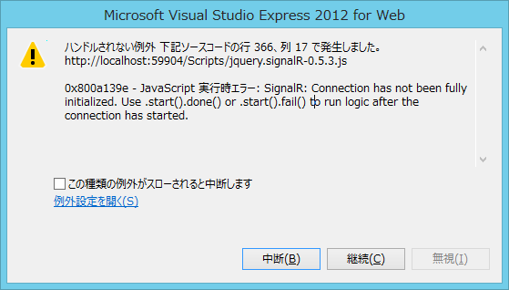
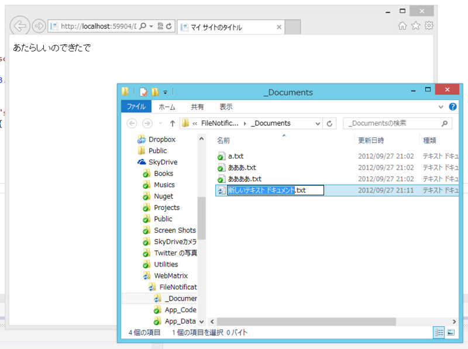

SignalR の面白い使い方ってないかなーと思ってたのだけど、たとえば誰かがファイルをアップロードした時、同時接続している人たちにそれを知らせられたら面白くないかな？　と思いついた。さっそくやってみる。

自分の作ったサンプルコード（<a href="https://blog.daruyanagi.jp/entry/2012/08/31/031730">SignalR Deep Dive ! &#x306B;&#x53C2;&#x52A0;&#x3057;&#x3066;&#x304D;&#x305F;&#xFF0B;WebMatrix &#x3067; SignalR &#x52D5;&#x304B;&#x3057;&#x3066;&#x307F;&#x305F; - &#x3060;&#x308B;&#x308D;&#x3050;</a>）をコピペして、必要な処理を足して、要らない部分を消して……以下のようなコードを書いてみた。

<pre class="code lang-cs" data-lang="cs" data-unlink># ~/App_Code/SampleHub.cs

using SignalR.Hubs;
using System.IO;

[HubName(&quot;sample&quot;)]
public class SampleHub : Hub
{
public SampleHub()
{
var watcher = new FileSystemWatcher();

watcher.Path =  System.Web.HttpContext.Current
.Server.MapPath(@&quot;~/_Documents&quot;);
watcher.Filter = &quot;*.txt&quot;;
watcher.NotifyFilter = NotifyFilters.FileName
| NotifyFilters.DirectoryName
| NotifyFilters.LastWrite;
watcher.IncludeSubdirectories = false;
watcher.Changed +=
(o, s) =&gt; { Clients.Echo(&quot;なんかかわったで&quot;); };
watcher.Created +=
(o, s) =&gt; { Clients.Echo(&quot;あたらしいのできたで&quot;); };
watcher.Deleted +=
(o, s) =&gt; { Clients.Echo(&quot;きえてもうた……&quot;); };
watcher.Renamed +=
(o, s) =&gt; { Clients.Echo(&quot;なまえかわったわ&quot;); };
watcher.EnableRaisingEvents = true;
}
}
</pre>
めんどくさいので <a href="http://dobon.net/vb/dotnet/file/filesystemwatcher.html">&#x30D5;&#x30A9;&#x30EB;&#x30C0;&#x3001;&#x30D5;&#x30A1;&#x30A4;&#x30EB;&#x306E;&#x5909;&#x66F4;&#x3092;&#x76E3;&#x8996;&#x3059;&#x308B; - .NET Tips (VB.NET,C#...)</a> をほとんど丸コピしている。原理的には、これで _Documents フォルダ内のテキストファイルが更新されると、クライアント側の Echo() が呼ばれるはず。

ちなみにクライアント側はこんな感じ。

<pre class="code lang-html" data-lang="html" data-unlink># ~/Default.cshtml

&lt;!DOCTYPE html&gt;

&lt;html lang=&quot;ja&quot;&gt;
&lt;head&gt;
        &lt;meta charset=&quot;utf-8&quot; /&gt;
        &lt;title&gt;マイ サイトのタイトル&lt;/title&gt;
        &lt;script type=&quot;text/javascript&quot;
                src=&quot;Scripts/jquery-1.6.4.js&quot;&gt;&lt;/script&gt;
        &lt;script type=&quot;text/javascript&quot;
                src=&quot;Scripts/jquery.signalR-0.5.3.js&quot;&gt;&lt;/script&gt;
        &lt;script&gt;
            var connection = $.hubConnection();
            var sample = connection.createProxy(&quot;sample&quot;);
            connection.start();
            sample.on(&quot;Echo&quot;, function (value) {
                $(&quot;#value&quot;).html(value);
            });
        &lt;/script&gt;
    &lt;/head&gt;
&lt;body&gt;
&lt;p id=&quot;value&quot;&gt;&lt;/p&gt;
&lt;/body&gt;
&lt;/html&gt;
</pre>

<h3>反応がない、ただの屍のようだ。</h3>

でも、これだと動かない。なぜだ！

元のサンプルコードをいじりながらいろいろ試してみたところ、クライアントから一度なんらかのアクションがあれば、期待通りの動作をするみたい。ということで、コードを少し足した。

<pre class="code lang-cs" data-lang="cs" data-unlink># ~/App_Code/SampleHub.cs

using SignalR.Hubs;
using System.IO;

[HubName(&quot;sample&quot;)]
public class SampleHub : Hub
{
public SampleHub()
{
（省略）
}

public void Initialize()
{
// 追加：コネクションを叩き起こすための何もしないメソッド
}
}
</pre>
で、クライアント側から SampleHub.Initialize() を叩く。

<pre class="code lang-html" data-lang="html" data-unlink># ~/Default.cshtml

&lt;!DOCTYPE html&gt;

&lt;html lang=&quot;ja&quot;&gt;
&lt;head&gt;
        &lt;meta charset=&quot;utf-8&quot; /&gt;
        &lt;title&gt;マイ サイトのタイトル&lt;/title&gt;
        &lt;script type=&quot;text/javascript&quot;
                src=&quot;Scripts/jquery-1.6.4.js&quot;&gt;&lt;/script&gt;
        &lt;script type=&quot;text/javascript&quot;
                src=&quot;Scripts/jquery.signalR-0.5.3.js&quot;&gt;&lt;/script&gt;
        &lt;script&gt;
            var connection = $.hubConnection();
            var sample = connection.createProxy(&quot;sample&quot;);
            connection.start();
            sample.on(&quot;Echo&quot;, function (value) {
                $(&quot;#value&quot;).html(value);
            });
            sample.invoke('initialize'); // &lt;-- 追加！
        &lt;/script&gt;
    &lt;/head&gt;
&lt;body&gt;
&lt;p id=&quot;value&quot;&gt;&lt;/p&gt;
&lt;/body&gt;
&lt;/html&gt;
</pre>

<h3>無理やり叩いたらゲロ吐きやがった</h3>

そうしたらエラーで止まった。

connection.start() が終わってないのに SampleHub.Initialize() を叩くんじゃねえ、バカ。そういいたいらしい。connection.start().done() を使えというので、素直に従おう。

<pre class="code lang-html" data-lang="html" data-unlink># ~/Default.cshtml

&lt;!DOCTYPE html&gt;

&lt;html lang=&quot;ja&quot;&gt;
&lt;head&gt;
        &lt;meta charset=&quot;utf-8&quot; /&gt;
        &lt;title&gt;マイ サイトのタイトル&lt;/title&gt;
        &lt;script type=&quot;text/javascript&quot;
                src=&quot;Scripts/jquery-1.6.4.js&quot;&gt;&lt;/script&gt;
        &lt;script type=&quot;text/javascript&quot;
                src=&quot;Scripts/jquery.signalR-0.5.3.js&quot;&gt;&lt;/script&gt;
        &lt;script&gt;
            var connection = $.hubConnection();
            var sample = connection.createProxy(&quot;sample&quot;);
            connection.start().done(function () { // &lt;-- done()!
                sample.invoke('initialize');
            });
            sample.on(&quot;Echo&quot;, function (value) {
                $(&quot;#value&quot;).html(value);
            });
        &lt;/script&gt;
    &lt;/head&gt;
&lt;body&gt;
&lt;p id=&quot;value&quot;&gt;&lt;/p&gt;
&lt;/body&gt;
&lt;/html&gt;
</pre>

ぉー！ ちゃんと動いたぞ。けれど、あんまりスマートじゃないな？　まぁ、いいか。

