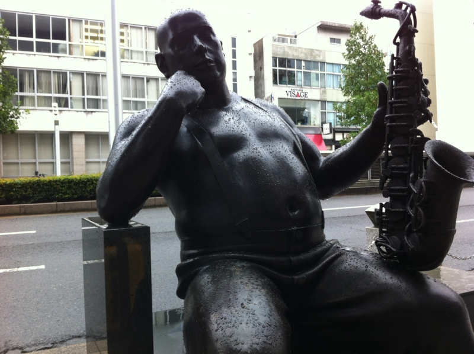
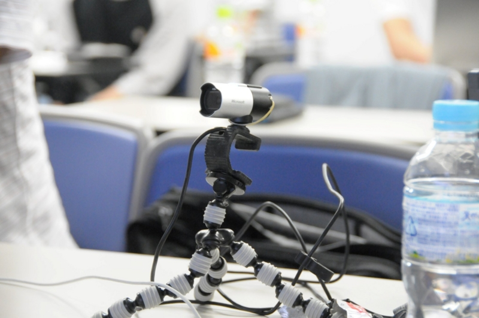
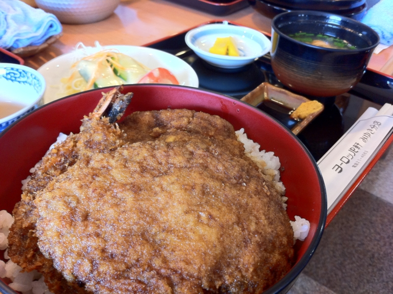

<a href="http://atnd.org/events/30789">Hokuriku.NET vol.10 : ATND</a> に参加してきました。

<h3>街の印象</h3>

あんまり特徴はない感じ？　でも、育った伊賀・名張市より大きくて、綺麗で、広くて、しかも路面電車がある！　しょうもないコダワリだけど、今度住む街は路面電車がある街がいいな。ああいうのって、ちょっと憧れる。

あと、福井までくるとさすがに関西って感じじゃない。信号機が縦についてたりして、越の国なのだなーって感じました。

<h3>勉強会の印象</h3>

勉強会については、また別に書く機会があるので詳しく書くつもりはないです。

でも、おおざっぱに印象を言うなら……なんて言えばいいんだろう！　まず、スピーカー陣がすごかったですね……前日はあまり寝ていなかったのだけど、内容に重量感があって全然眠くなかったです（ぉ

とくに西脇さんなんか、圧巻ですよね……あれだけでだいぶ得したなぁ、と思いますもん。あと、チャックさんのセッションを個人的に楽しみにしていたので、聞けてよかったです。Project Silk（<a href="http://silk.codeplex.com/">http://silk.codeplex.com/</a>）ってなんなのかなぁ、と思ってたのだけど、手を出してはいなかったので。

運営に関しては、手作り感はあるけどちゃんと準備されている印象を受けました。愛媛（<a href="https://blog.daruyanagi.jp/entry/2012/04/02/232457">&#x30D7;&#x30ED;&#x30B0;&#x30E9;&#x30DF;&#x30F3;&#x30B0;&#x751F;&#x653E;&#x9001;&#x52C9;&#x5F37;&#x4F1A; &#x7B2C;13&#x56DE;&#xFF20;&#x611B;&#x5A9B; &#x306B;&#x53C2;&#x52A0;&#x3057;&#x3066;&#x304D;&#x307E;&#x3057;&#x305F; #pronama - &#x3060;&#x308B;&#x308D;&#x3050;</a>）のときは“プロ生”っていう“パッケージ”があったけれど、今回はそうじゃない地方の勉強会をみられたなぁ、と思います。いろいろ感じたのだけれど、まだ整理しきれていないのでその話はまた今度。

あとは、ホスピタリティというか、なんというか。初めてなのにたくさん話しかけてくれてうれしかった。愛媛ばっかり比較にだして申し訳ないけれど、あっちは休憩時間結構静かで……ｗ　その分、懇親会になってやっと火がついてなんか大変なことになっていましたけれど<a href="#f-f6c66439" name="fn-f6c66439" title="愛媛の人はツンデレですね！　とても親近感がわきましたｗ">*1</a>。それに比べると、福井は休憩時間もにぎやかな感じでした。懇親会もにぎやかでしたね。若干、エロい人が多めなのかなぁ、と感じました（ぉ

そして、みんなして移住を勧めてくるのが嬉しくて困っちゃう。ほんとに行きたくなるじゃないか！

<h3>おひるごはん</h3>

そのホスピタリティの延長になるのかな？　ランチにいいところ連れていってもらえたのも楽しかった。

ヨーロッパ軒のソースかつ丼だよ！　わしがたべたのはトリオ丼で、ミンチカツとエビフライも入っている。ソースは後味に酸味があるタイプで、さっぱり。結構な量でちょっと苦戦したけれど、なかなかどうして、おいしかったです。個人的にはミンチカツが気に入ったかも。食べる前は「どこがヨーロッパやねん！」と思っていたのだけど、食べると少しヨーロッパかもしらんと思いました。

<iframe width="425" height="350" frameborder="0" scrolling="no" marginheight="0" marginwidth="0" src="https://maps.google.co.jp/maps?f=q&amp;source=s_q&amp;hl=ja&amp;geocode=&amp;q=%E7%A6%8F%E4%BA%95%E7%9C%8C%E7%A6%8F%E4%BA%95%E5%B8%82%E5%9F%8E%E6%9D%B1%EF%BC%92%E4%B8%81%E7%9B%AE%EF%BC%91%EF%BC%93%E2%88%92%EF%BC%91%EF%BC%95+%E3%83%A8%E3%83%BC%E3%83%AD%E3%83%83%E3%83%91%E8%BB%92+%E3%81%BF%E3%82%86%E3%81%8D%E5%88%86%E5%BA%97&amp;aq=0&amp;oq=%E3%83%A8%E3%83%BC%E3%83%AD%E3%83%83%E3%83%91%E8%BB%92+%E3%81%BF%E3%82%86%E3%81%8D&amp;sll=35.656119,136.070158&amp;sspn=0.01339,0.023346&amp;gl=jp&amp;brcurrent=3,0x5ff8beaf3b742b4f:0xa41b1476580dbbbd,0&amp;ie=UTF8&amp;hq=%E7%A6%8F%E4%BA%95%E7%9C%8C%E7%A6%8F%E4%BA%95%E5%B8%82%E5%9F%8E%E6%9D%B1%EF%BC%92%E4%B8%81%E7%9B%AE%EF%BC%91%EF%BC%93%E2%88%92%EF%BC%91%EF%BC%95+%E3%83%A8%E3%83%BC%E3%83%AD%E3%83%83%E3%83%91%E8%BB%92+%E3%81%BF%E3%82%86%E3%81%8D%E5%88%86%E5%BA%97&amp;t=m&amp;cid=827284862273092180&amp;hnear=&amp;ll=36.072898,136.237764&amp;spn=0.024281,0.036478&amp;z=14&amp;iwloc=A&amp;output=embed"></iframe> <small><a href="https://maps.google.co.jp/maps?f=q&amp;source=embed&amp;hl=ja&amp;geocode=&amp;q=%E7%A6%8F%E4%BA%95%E7%9C%8C%E7%A6%8F%E4%BA%95%E5%B8%82%E5%9F%8E%E6%9D%B1%EF%BC%92%E4%B8%81%E7%9B%AE%EF%BC%91%EF%BC%93%E2%88%92%EF%BC%91%EF%BC%95+%E3%83%A8%E3%83%BC%E3%83%AD%E3%83%83%E3%83%91%E8%BB%92+%E3%81%BF%E3%82%86%E3%81%8D%E5%88%86%E5%BA%97&amp;aq=0&amp;oq=%E3%83%A8%E3%83%BC%E3%83%AD%E3%83%83%E3%83%91%E8%BB%92+%E3%81%BF%E3%82%86%E3%81%8D&amp;sll=35.656119,136.070158&amp;sspn=0.01339,0.023346&amp;gl=jp&amp;brcurrent=3,0x5ff8beaf3b742b4f:0xa41b1476580dbbbd,0&amp;ie=UTF8&amp;hq=%E7%A6%8F%E4%BA%95%E7%9C%8C%E7%A6%8F%E4%BA%95%E5%B8%82%E5%9F%8E%E6%9D%B1%EF%BC%92%E4%B8%81%E7%9B%AE%EF%BC%91%EF%BC%93%E2%88%92%EF%BC%91%EF%BC%95+%E3%83%A8%E3%83%BC%E3%83%AD%E3%83%83%E3%83%91%E8%BB%92+%E3%81%BF%E3%82%86%E3%81%8D%E5%88%86%E5%BA%97&amp;t=m&amp;cid=827284862273092180&amp;hnear=&amp;ll=36.072898,136.237764&amp;spn=0.024281,0.036478&amp;z=14&amp;iwloc=A" style="color:#0000FF;text-align:left">大きな地図で見る</a></small>

北陸の旅、悲劇編はまた今度。

<a href="#fn-f6c66439" name="f-f6c66439" class="footnote-number">*1</a>:愛媛の人はツンデレですね！　とても親近感がわきましたｗ

