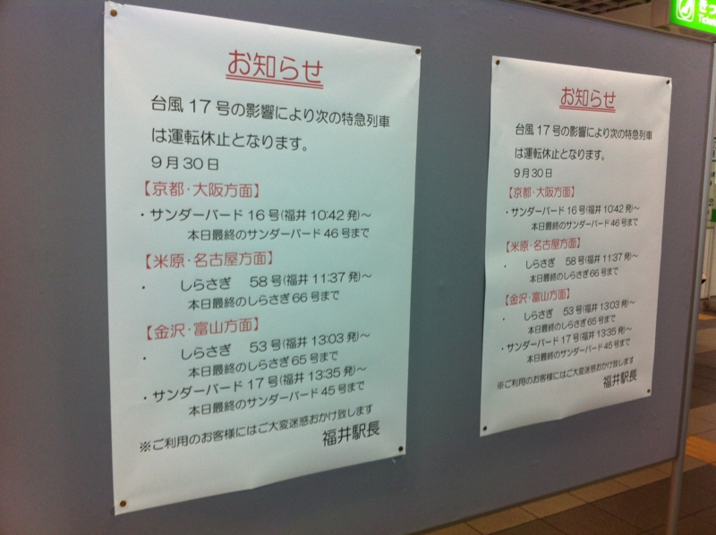
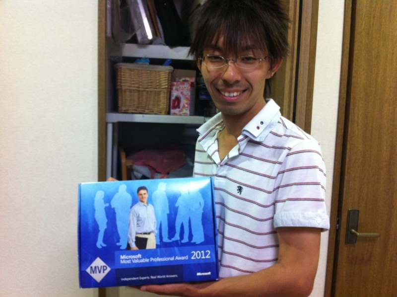
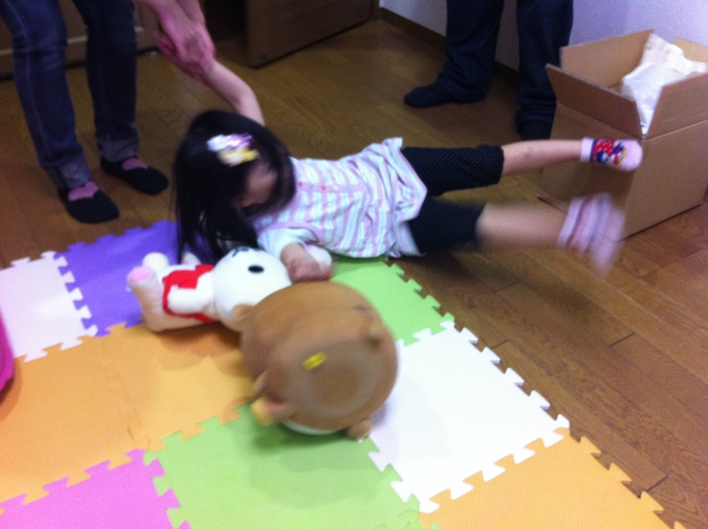
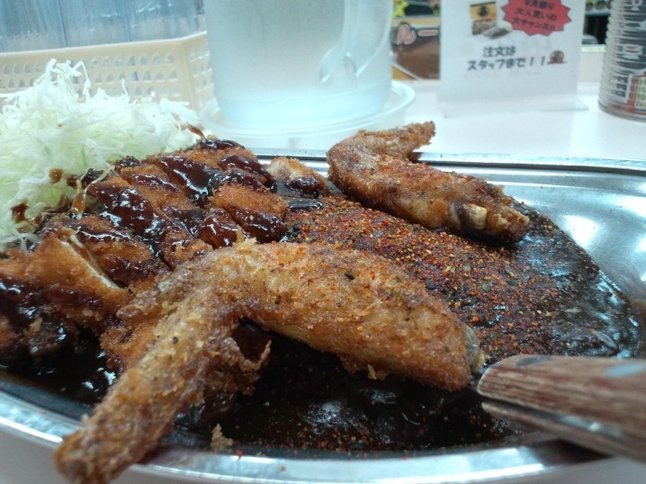

<a href="https://blog.daruyanagi.jp/entry/2012/10/01/202730">Hokuriku.NET vol.10 &#x306B;&#x53C2;&#x52A0;&#x3057;&#x3066;&#x304D;&#x307E;&#x3057;&#x305F;&#xFF01; - &#x3060;&#x308B;&#x308D;&#x3050;</a> で2次会までキッチリ楽しんで、翌朝は9:30に起床。ゆるゆる10時にホテルをチェックアウトして、てくてくJR福井駅へ向かったのですが……

<i>ジーザス／(＾o＾)＼！</i>なんてこったい、電車がなかった。困った。一瞬、小松空港までいって飛行機に乗ろうかと思ったけれど、無駄足だったら嫌だし、経費で落ちないかもしれんし<a href="#f-ca471484" name="fn-ca471484" title="あとで聞いたら出してくれるとのことだった……orz">*1</a>、諦めて駅前のホテルをとった。まぁ、そのあとネットカフェを見つけたのでホテルはキャンセルしたのだけど。デスクトップ PC があったほうが、仕事が進みそうだったし。

そしたら @Xin9le さんが金沢観光に誘ってくれたので<i>「台風が来るのに正気か( ﾟДﾟ)？」</i>と思いつつもご一緒させていただくことにしました。

<h3>マジ天使！</h3>

まず、 @Xin9le 家へお邪魔しました。自己紹介するとき、お母さまに「パソコンオタクなの？」と聞かれる先制パンチをあびる。「そうです」としか答えようがない！　なんかとても愉快な方でした。

あとは @Xin9le の Microsoft MVP 自慢に付き合ったり<a href="#f-8b023405" name="fn-8b023405" title="冗談です。別に嫌味な人ではないので">*2</a>、

お嬢さんと遊んだり。

で、これがまたすんごくかわいい！　おままごと（？）をして遊んだのだけど、結構なついてくれたみたいでとっても嬉しい。ひよこまんじゅうを目と鼻だけ食べる仕草がかわいい……もう、稼ぎが許す限り何でも買ってあげたい！<a href="#f-32538efe" name="fn-32538efe" title="もはや、はたから見たら変質者やな">*3</a>

彼女が経営するなぞなぞ屋さんは朝7時開店、夜9時閉店。あとの時間は寝るだけで、大人になって社畜にならないか少しだけ心配になりました。あと、おままごと中に「ずっと一緒にいよう！」だの「一緒に寝よう？」だのとキワドイことを言われるのが、非モテなおっさんにとっては心臓に悪い。これからもっと素敵な男の人を見つけてほしいと願うばかりです。 @Xin9le さんは発狂しそうだけど。

<h3>デビルカレー</h3>

あと、金沢のゴーゴーカレーで“デビルカレー”を食べました。辛さがウリっぽいのだけど、個人的にはちょうどいい辛さ。辛いのはそんなに得意ではないと思っていたのだけど、モノによるのかな。こういう辛さは大丈夫みたい。アキバで食べる時もこれがいいなぁ、と思いました。

そんなわけで、とんだ災難に遭ったのだけど @Xin9le さんのおかげでほんとに楽しかった！　本当にありがとうございました。帰りのクルマは、横風がすごくてだいぶ怖かったですけどｗ

<a href="#fn-ca471484" name="f-ca471484" class="footnote-number">*1</a>:あとで聞いたら出してくれるとのことだった……orz

<a href="#fn-8b023405" name="f-8b023405" class="footnote-number">*2</a>:冗談です。別に嫌味な人ではないので

<a href="#fn-32538efe" name="f-32538efe" class="footnote-number">*3</a>:もはや、はたから見たら変質者やな

