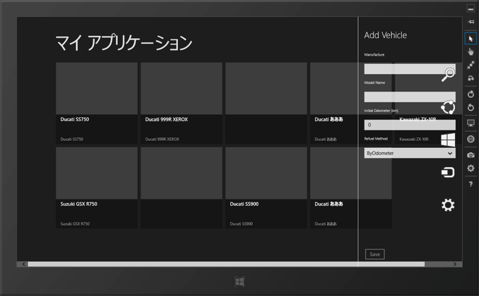
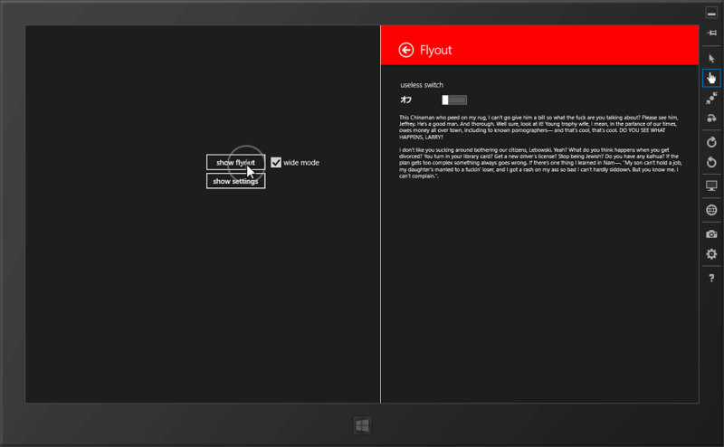
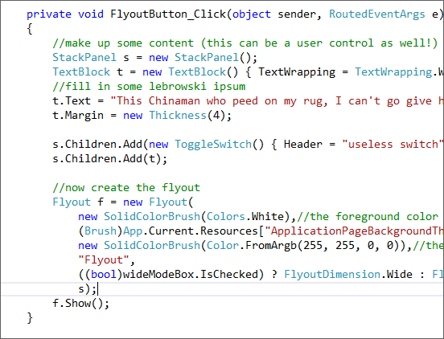

書いたようで書いていなかったので。

Windows ストアアプリでデータを入力する際、当初は入力ページに遷移していたのだけれど、ちょっと大げさかなと思う。そこで、一時的にサイドバーみたいなものをだして入力するインターフェイスを考えた。標準アプリでも、「カレンダー」なんかがそんな感じだよね。

で、これを<b>自分で実装しようとした</b>わけだ。AppBar を押したらアニメーション付きで表示して、フォーカスを失ったら閉じる。これが結構めんどくさくて、意図したとおりに動いてくれない。たとえば、サイドバーの表示中にチャームをだしても閉じてくれなかったり、サイドバー内でコントロールが変わった時に非表示になったり……

でも、そんなダメなひとのために、<a href="http://nuget.org/packages/TCD.Controls">NuGet Gallery | TCD.Controls 1.3.7</a> があるわけなんだな。これの Flyout コントロールを使うと、意図したことがとても簡単に実現できそうだ。

<a href="http://kuchenzeit.wordpress.com/2012/03/26/settingscontractwrapper-the-easy-way-to-integrate-w-settings/">SettingsContractWrapper &ndash; the easy way to integrate w/ settings &laquo; Kuchenzeit</a> のサンプルがとてもわかりやすかったので、よくわかんない人は試してみたらいいかもしれない。設定コントラクトのラッパーなんかも用意されている。

