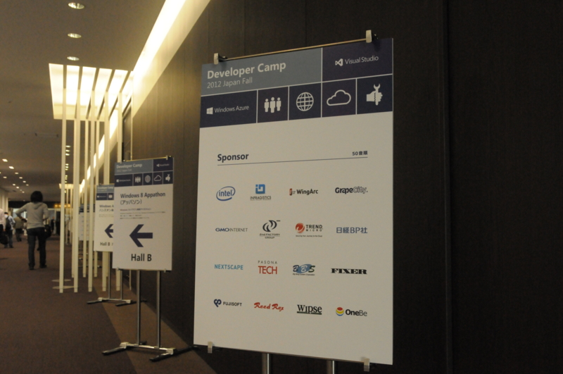
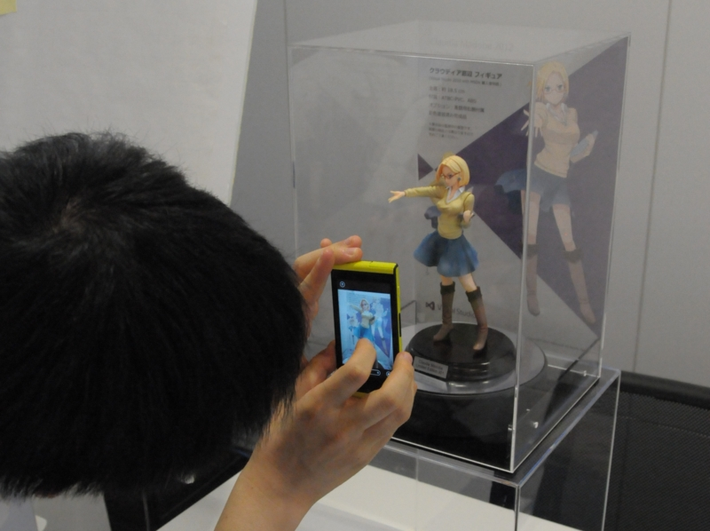
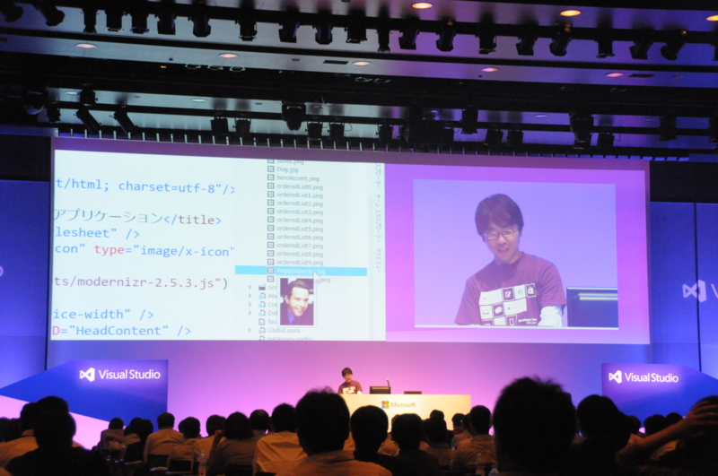

有給休暇をとって <a href="http://msdn.microsoft.com/ja-jp/jj614595.aspx">Developer Camp 2012 Japan Fall | MSDN</a> に参加してきました！　朝起きられなくて（目覚ましが鳴らなかった？）、楽しみにしていた @scottgu のキーノートをオンライン視聴する羽目になったのがちょっと残念だけれども、まぁ、明日もあるさ！

技術的な内容は詳しい人にお譲りするとして……結構エキサイティングでしたよ！　とくにクラウディアさんのフィギュアは大人気。みんなエロい顔をしながら写メをとっていたのが印象的でした（顔と名前は本人の名誉のために伏せておくことにしましょう！）。

セッションのほうは…… @chack411 さんのギャグが滑ったような滑らなかったような、そういうギリギリなところを突いていて、さすがだなと思いました。ただ、壁紙がウェブマトリクスマンだったせいで Ustream の調子がよくなかったらしく、リモートの人はちょっと残念だったのかもしれない。

あと、最後のセッションが圧巻。あんなにディープな話が聞けるとは思いませんでした。Azure Web サイトのなかをあんなに詳しく解説してもらえるなんて！　セッションのデモでやってた Web サイトでコマンドを実行する<a href="#f1" name="fn1" title="なんかシステムフォルダの内容が Web から見えとった！ｗｗｗ">*1</a>のは自分も試してみたいと思ったけれど、万が一共有サーバーでゴーストプロセス作ったらどうなるんだろ？　と思うと ((((；ﾟДﾟ)))ｻﾞｸｸﾞﾌｹﾞﾙｸﾞｸﾞ して試せません<a href="#f2" name="fn2" title="十分テストした上で試してみたくはあります">*2</a>。帝国兵さんの実物と Twitter が結びついたのも収穫でした（違

<a href="#fn1" name="f1" class="footnote-number">*1</a>:なんかシステムフォルダの内容が Web から見えとった！ｗｗｗ

<a href="#fn2" name="f2" class="footnote-number">*2</a>:十分テストした上で試してみたくはあります

