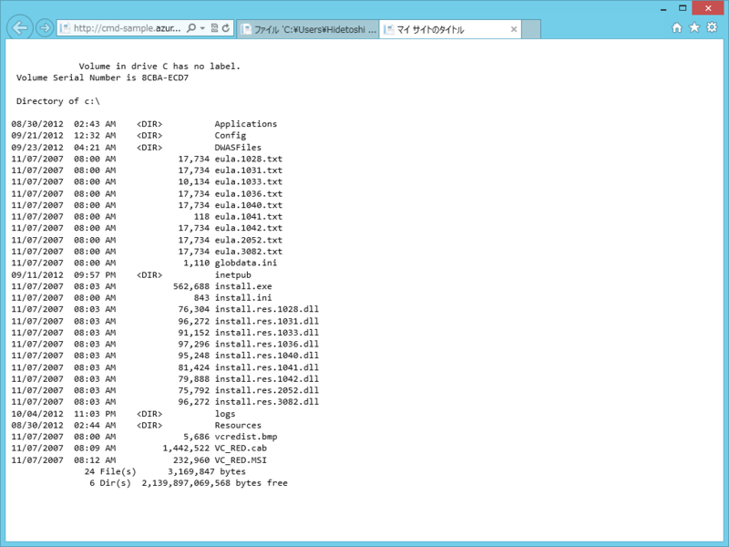
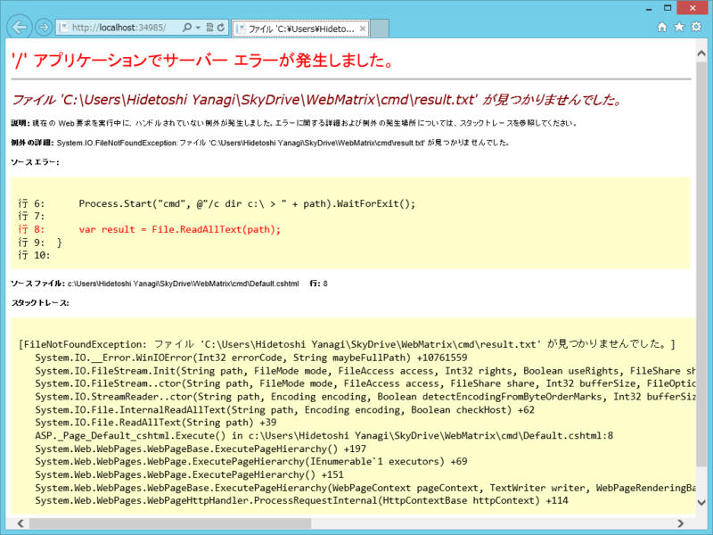
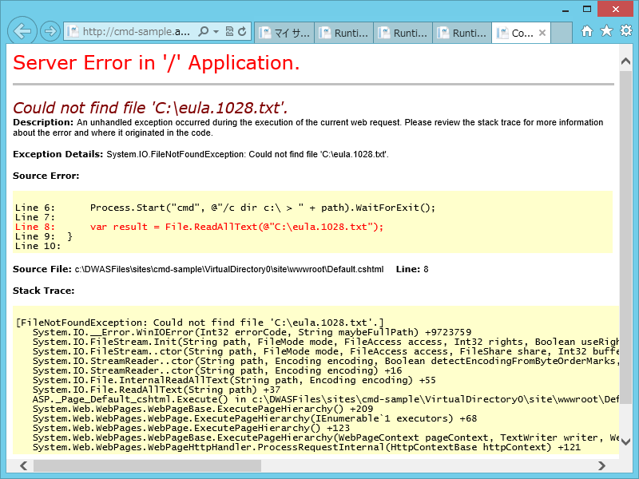

<a href="https://blog.daruyanagi.jp/entry/2012/10/04/221735">Developer Camp 2012 Japan Fall &#x306B;&#x53C2;&#x52A0;&#x3057;&#x3066;&#x304D;&#x307E;&#x3057;&#x305F;&#xFF01;&#xFF08;1&#x65E5;&#x76EE;&#xFF09; - &#x3060;&#x308B;&#x308D;&#x3050;</a> でやってたデモを真似してみた。

<pre class="code lang-cs" data-lang="cs" data-unlink># Default.cshtml

@using System.IO
@using System.Diagnostics

@{
// 結果を出力するファイルのパスを決める
var path = HttpContext.Current.Server.MapPath(&quot;~/result.txt&quot;);

// dir c:\ &gt; result.txt を実行（ /c は実行して終了するオプション）
Process.Start(&quot;cmd&quot;, @&quot;/c dir c:\ &gt; &quot; + path).WaitForExit();

// result.txt　を読み込む
var result = File.ReadAllText(path);
}

&lt;!DOCTYPE html&gt;

&lt;html lang=&quot;ja&quot;&gt;
&lt;head&gt;
&lt;meta charset=&quot;utf-8&quot; /&gt;
&lt;title&gt;マイ サイトのタイトル&lt;/title&gt;
&lt;link href=&quot;~/favicon.ico&quot; rel=&quot;shortcut icon&quot; type=&quot;image/x-icon&quot; /&gt;
&lt;/head&gt;
&lt;body&gt;
&lt;pre&gt;&lt;code style=&quot;font-family: Consolas, monospace;&quot;&gt;
@result
&lt;/code&gt;&lt;/pre&gt;
&lt;/body&gt;
&lt;/html&gt;
</pre>

わぉ！　サーバーの C ドライブ直下の内容がみえてる！　これをああしたりこうしたりすれば ruby が動いちゃったりするのか（ゲフンゲフン

でも、よい子は真似しないように。実際のデモでは WaitForExit() をし忘れて result.txt が読めなくなるなんてハプニングがあったけど、こういうことをやり続ければいずれサーバーが不安定になるよね（知らんけど）。少なくとも、Free/Share ではあんまりやらないほうがいいんだろう。Reserved が使えるお金持ちだけやれ。

ちなみに、帝国兵のひとは App_Code フォルダが好きだということでそこにクラスを書いていたけれど、今回はそのままだと面白くないかなと思ったので Default.cshtml に書いてある。わしも App_Code フォルダ大好き。結構いろんなところで使えて便利なんだよね。

<ul>
<li><a href="https://blog.daruyanagi.jp/entry/2012/09/27/213159">SignalR + WebMatrix &#x3067;&#x30B5;&#x30FC;&#x30D0;&#x30FC;&#x30D5;&#x30A9;&#x30EB;&#x30C0;&#x306E;&#x76E3;&#x8996;&#x3092;&#x884C;&#x3063;&#x3066;&#x307F;&#x308B; - &#x3060;&#x308B;&#x308D;&#x3050;</a></li>
<li><a href="https://blog.daruyanagi.jp/entry/2012/08/31/031730">SignalR Deep Dive ! &#x306B;&#x53C2;&#x52A0;&#x3057;&#x3066;&#x304D;&#x305F;&#xFF0B;WebMatrix &#x3067; SignalR &#x52D5;&#x304B;&#x3057;&#x3066;&#x307F;&#x305F; - &#x3060;&#x308B;&#x308D;&#x3050;</a></li>
<li><a href="https://blog.daruyanagi.jp/entry/2012/08/30/040609">&#x5BC4;&#x308A;&#x9053;&#xFF1A; Rails &#x306E; Flash &#x3063;&#x307D;&#x3044;&#x6A5F;&#x80FD;&#x3092; WebMatrix &#x3067;&#x4F7F;&#x3044;&#x305F;&#x3044;&#xFF08;2&#xFF09; &#x2015;&#x2015; @helper &#x3068; @functions &#x3068;&#x308F;&#x305F;&#x3057; - &#x3060;&#x308B;&#x308D;&#x3050;</a></li>
<li><a href="https://blog.daruyanagi.jp/entry/2012/08/16/182105">App_Code &#x3067;&#x30B5;&#x30D6;&#x30D5;&#x30A9;&#x30EB;&#x30C0;&#x30FC;&#x3092;&#x5229;&#x7528;&#x3059;&#x308B; - &#x3060;&#x308B;&#x308D;&#x3050;</a></li>
</ul>
使いこなしていきたいところ。

<h3>ついでに（1） ―― ローカルで実行した場合</h3>

dir c:\ > result.txt の時点でコケるみたい。きっと権限の問題なんだろうな。

<h3>ついでに（2） ―― ファイル、読んでみたくなるよね？</h3>

試しに C:\eula.1028.txt を読んでみようと思ったけど失敗した。まぁ、そうだろうな。

