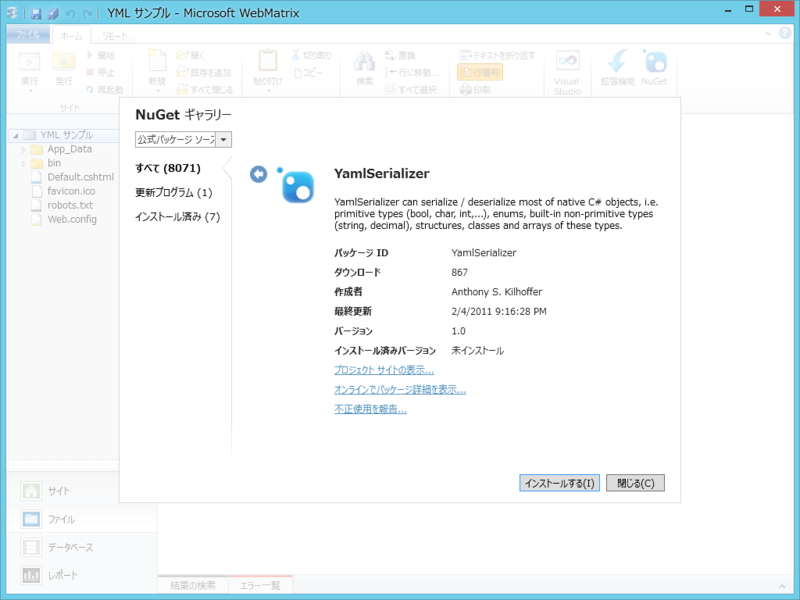
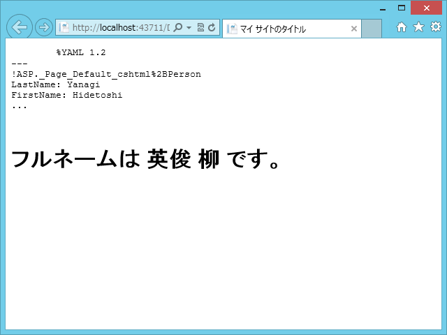

ちょっと YAML を使いたいなーというシーンがあったので、いろいろ調べたみた。

<h3>YAML って？</h3>

<blockquote>

YAML は XML よりも読みやすく、書きやすく、JSON よりも型にうるさく、しかも自由度がある、Ruby 使い達に人気の(?) データ記述形式です。

</blockquote>

ほんとう？　それを確かめるためにちょっと比較してみました。例は <a href="http://www.ibm.com/developerworks/jp/xml/library/x-matters23/">XML&#x306E;&#x8AD6;&#x8003;: YAML&#x306F;XML&#x306B;&#x6539;&#x826F;&#x3092;&#x52A0;&#x3048;&#x308B;</a> のものをベースに、<a href="http://bluehawk.infinitybird.com/dev/xmljson.html">XML-JSON&#x76F8;&#x4E92;&#x5909;&#x63DB;&#x30C4;&#x30FC;&#x30EB; - Bluehawk&#39;s lab.</a> で作成した JSON 形式のものを追加してあります。

<h4>XML で表現した場合</h4>
<pre class="code lang-xml" data-lang="xml" data-unlink>&lt;?xml version=&quot;1.0&quot;?&gt;
&lt;club&gt;
&lt;players&gt;
&lt;player id=&quot;kramnik&quot;
            name=&quot;Vladimir Kramnik&quot;
            rating=&quot;2700&quot;
            status=&quot;GM&quot; /&gt;
&lt;player id=&quot;fritz&quot;
            name=&quot;Deep Fritz&quot;
            rating=&quot;2700&quot;
            status=&quot;Computer&quot; /&gt;
&lt;player id=&quot;mertz&quot;
            name=&quot;David Mertz&quot;
            rating=&quot;1400&quot;
            status=&quot;Amateur&quot; /&gt;
&lt;/players&gt;
&lt;matches&gt;
&lt;match&gt;
&lt;Date&gt;2002-10-04&lt;/Date&gt;
&lt;White refid=&quot;fritz&quot; /&gt;
&lt;Black refid=&quot;kramnik&quot; /&gt;
&lt;Result&gt;Draw&lt;/Result&gt;
&lt;/match&gt;
&lt;match&gt;
&lt;Date&gt;2002-10-06&lt;/Date&gt;
&lt;White refid=&quot;kramnik&quot; /&gt;
&lt;Black refid=&quot;fritz&quot; /&gt;
&lt;Result&gt;White&lt;/Result&gt;
&lt;/match&gt;
&lt;/matches&gt;
&lt;/club&gt;
</pre>
タグがウザい。何でもできるけれど、少し厳格すぎるきらいがある。

<h4>JSON で表現した場合</h4>
<pre class="code lang-" data-lang="" data-unlink>{
&#34;club&#34;: {
&#34;players&#34;: {
&#34;player&#34;: [
{
&#34;-id&#34;: &#34;kramnik&#34;,
&#34;-name&#34;: &#34;Vladimir Kramnik&#34;,
&#34;-rating&#34;: &#34;2700&#34;,
&#34;-status&#34;: &#34;GM&#34;
},
{
&#34;-id&#34;: &#34;fritz&#34;,
&#34;-name&#34;: &#34;Deep Fritz&#34;,
&#34;-rating&#34;: &#34;2700&#34;,
&#34;-status&#34;: &#34;Computer&#34;
},
{
&#34;-id&#34;: &#34;mertz&#34;,
&#34;-name&#34;: &#34;David Mertz&#34;,
&#34;-rating&#34;: &#34;1400&#34;,
&#34;-status&#34;: &#34;Amateur&#34;
}
]
},
&#34;matches&#34;: {
&#34;match&#34;: [
{
&#34;Date&#34;: &#34;2002-10-04&#34;,
&#34;White&#34;: { &#34;-refid&#34;: &#34;fritz&#34; },
&#34;Black&#34;: { &#34;-refid&#34;: &#34;kramnik&#34; },
&#34;Result&#34;: &#34;Draw&#34;
},
{
&#34;Date&#34;: &#34;2002-10-06&#34;,
&#34;White&#34;: { &#34;-refid&#34;: &#34;kramnik&#34; },
&#34;Black&#34;: { &#34;-refid&#34;: &#34;fritz&#34; },
&#34;Result&#34;: &#34;White&#34;
}
]
}
}
}</pre>
ネストが深い。JavaScript との相性が抜群だが、いろいろユルい部分も多い。

<h4>YAML で表現した場合</h4>
<pre class="code lang-yaml" data-lang="yaml" data-unlink>---
players:
Vladimir Kramnik: &amp;kramnik
rating: 2700
status: GM
Deep Fritz: &amp;fritz
rating: 2700
status: Computer
David Mertz: &amp;mertz
rating: 1400
status: Amateur
matches:
-
Date: 2002-10-04
White: *fritz
Black: *kramnik
Result: Draw
-
Date: 2002-10-06
White: *kramnik
Black: *fritz
Result: White
</pre>
タグがないし、ネストも深くないのでスッキリ。ただ、構造化データを記述する以外の用途には向かない。

あと、参照の仕組み（アンカーとエイリアス、アドレスとポインタのようなもの）をもっているのがいい。これって、データベースをテキストに書きだしたり、オブジェクトをシリアライズするときにも便利だよね。

<ul>
<li><a href="http://jp.rubyist.net/magazine/?0009-YAML">Rubyist Magazine - &#x30D7;&#x30ED;&#x30B0;&#x30E9;&#x30DE;&#x30FC;&#x306E;&#x305F;&#x3081;&#x306E; YAML &#x5165;&#x9580; (&#x521D;&#x7D1A;&#x7DE8;)</a></li>
</ul>

<h3><a href="http://yamlserializer.codeplex.com/wikipage?title=Home-ja">
YamlSerializer for .NET
</a></h3>

<blockquote>

主に２つの目的で使うことができます。

<ul>
<li>C# のオブジェクトをそのまま YAML テキストにシリアライズ・デシリアライズすることができます。=> YamlSerizlizer クラス</li>
<li>一般の YAML ファイルを扱うこともできます。 => YamlNode クラス</li>
</ul>
</blockquote>

というわけで、今日はこのライブラリを使ってみる。ちゃんと NuGet にもパッケージングされていて、WebMatrix からもサックリ使えるよ。

<h4>サンプルコード</h4>
<pre class="code lang-cs" data-lang="cs" data-unlink># Default.cshtml

@functions {
// シリアライズ・デシリアライズのためのサンプルクラス
public class Person
{
public string FirstName { get; set; }
public string LastName { get; set; }

public override string ToString()
{
return string.Format(&quot;{0} {1}&quot;, FirstName, LastName);
}
}
}

@{
var person = new Person()
{
FirstName = &quot;Hidetoshi&quot;, LastName = &quot;Yanagi&quot;,
};

// シリアライザの生成
// using System.Yaml.Serialization;
var serializer = new YamlSerializer();

// YML形式のテキスト
string yml =@&quot;
LastName: 柳
FirstName: 英俊
&quot;;

// YMLテキスト → Person
var deserialised = serializer.Deserialize(
yml, typeof(Person)
);
}

&lt;!DOCTYPE html&gt;

&lt;html lang=&quot;ja&quot;&gt;
&lt;head&gt;
&lt;meta charset=&quot;utf-8&quot; /&gt;
&lt;title&gt;マイ サイトのタイトル&lt;/title&gt;
&lt;/head&gt;
&lt;body&gt;
&lt;pre&gt;
@serializer.Serialize(person) //&lt;-- YMLテキストに！
&lt;/pre&gt;

// 返り値は object 配列だよ！
&lt;h1&gt;フルネームは @(deserialised[0] as Person) です。&lt;/h1&gt;
&lt;/body&gt;
&lt;/html&gt;
</pre>

<h4>結果</h4>

ちょっとアレだな、とおもったのは @(deserialised[0] as Person) の部分だけれど、dynamic でうければいいのかもしれない。

<pre class="code lang-cs" data-lang="cs" data-unlink>dynamic deserialised = serializer.Deserialize(
yml, typeof(Person)
)[0];

deserialised.FirstName;
</pre>

