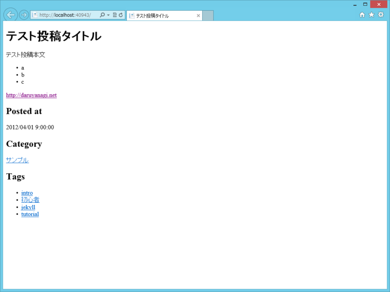

<a href="https://github.com/mojombo/jekyll">GitHub - jekyll/jekyll: Jekyll is a blog-aware static site generator in Ruby</a> というのは、Markdown ドキュメントを置いておくとそれを HTML に変換しておいてくれる静的コンテンツの生成システムらしい。

Jekyll ドキュメントはこんなかんじ。

<pre class="code" data-lang="" data-unlink>---
layout: post
title: テスト投稿タイトル
date: 2012-04-01 09:00:00
category : サンプル
tags : [intro, 初心者, jekyll, tutorial]
---

テスト投稿本文

- a
- b
- c

[http://daruyanagi.net](http://daruyanagi.net/)</pre>
Markdown テキストの先頭に YAML Front-Matter と呼ばれる設定を書いておけば、タイトル・レイアウト・投稿日時・カテゴリ・タグといったメタデータを付与することもできる。なんだか便利臭がプンプンするぜ。

さて、これを WebMatrix で HTML ドキュメントに変換してみようというのが今日のお題。<a href="https://blog.daruyanagi.jp/entry/2012/09/27/213159">SignalR + WebMatrix &#x3067;&#x30B5;&#x30FC;&#x30D0;&#x30FC;&#x30D5;&#x30A9;&#x30EB;&#x30C0;&#x306E;&#x76E3;&#x8996;&#x3092;&#x884C;&#x3063;&#x3066;&#x307F;&#x308B; - &#x3060;&#x308B;&#x308D;&#x3050;</a> などと組み合わせたら面白いものができそうな気がする。

<h3>必要なライブラリ</h3>

<ul>
<li>MarkdownSharp</li>
<li>YamlSerializer for .NET（<a href="https://blog.daruyanagi.jp/entry/2012/10/07/113945">WebMatrix/ASP.NET Web Pages &#x3067; YAML &#x3092;&#x6271;&#x3046; - &#x3060;&#x308B;&#x308D;&#x3050;</a>）</li>
</ul>
どちらも NuGet で取得できる。

<h3>サンプルコード</h3>

先ほどの Jekyll ドキュメントを ~/Default.md としておき、これを ~/Default.cshtml で読み込んで変換・表示してみる。あくまでもサンプルなので、汚いところ、あからさまにダメなところは無視してほしいかな（笑

<pre class="code lang-cs" data-lang="cs" data-unlink>@using System.Text.RegularExpressions
@using System.Yaml

@{
var path = Server.MapPath(&quot;~/Default.md&quot;);

var s = System.IO.File.ReadAllText(path);

// YAML Front-Matter を抽出する適当な正規表現
var r = new Regex(&quot;---.+---&quot;, RegexOptions.Singleline);

// YAML Front-Matter を取得（エラー処理なし！）

/* 配列として受け取る → 先頭はマッピング（ハッシュ）のはず */
var node = YamlNode.FromYaml(r.Match(s).ToString())[0]
as YamlMapping;

//YAML Front-Matter の値を変数に格納する

/* スカラ（値）の場合 */
var title = (node[&quot;title&quot;] as YamlScalar)
.Value; // &lt;- 生テキスト！
var date = (node[&quot;date&quot;] as YamlScalar)
.NativeObject; // &lt;- DateTime!
var category = (node[&quot;category&quot;] as YamlScalar).Value;
var layout = (node[&quot;layout&quot;] as YamlScalar).Value;

/* シーケンス（配列）の場合 */
var tags = (node[&quot;tags&quot;] as YamlSequence)
.Select(_ =&gt; (_ as YamlScalar).Value);

// YAML Front-Matter を除去（危険が危ないデシ！）
s = r.Replace(s, string.Empty);

// 残りは Markdown ドキュメントです
var m = new MarkdownSharp.Markdown();
var text = m.Transform(s);
}

&lt;!DOCTYPE html&gt;

&lt;html lang=&quot;ja&quot;&gt;
&lt;head&gt;
&lt;meta charset=&quot;utf-8&quot; /&gt;
&lt;title&gt;@title&lt;/title&gt;
&lt;/head&gt;
&lt;body&gt;
&lt;h1&gt;@title&lt;/h1&gt;

@Html.Raw(text)

&lt;h2&gt;Posted at&lt;/h2&gt;
&lt;p&gt;@date&lt;/p&gt;

&lt;h2&gt;Category&lt;/h2&gt;
&lt;p&gt;&lt;a href=&quot;~/Category/@category&quot;&gt;@category&lt;/a&gt;&lt;/p&gt;

&lt;h2&gt;Tags&lt;/h2&gt;
&lt;ul&gt;
@foreach(var tag in tags)
{
&lt;li&gt;&lt;a href=&quot;~/Tag/@tag&quot;&gt;@tag&lt;/a&gt;&lt;/li&gt;
}
&lt;/ul&gt;
&lt;/body&gt;
&lt;/html&gt;
</pre>

なんとなく動いてるっぽい。

