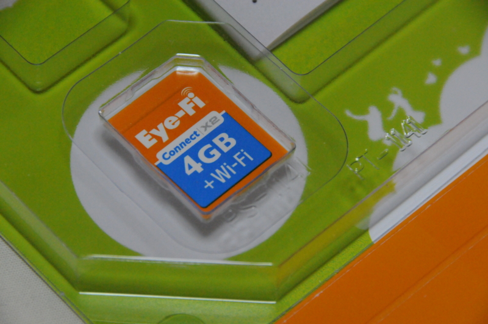
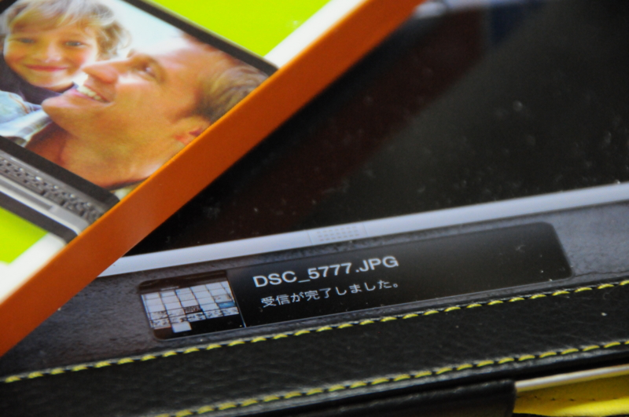
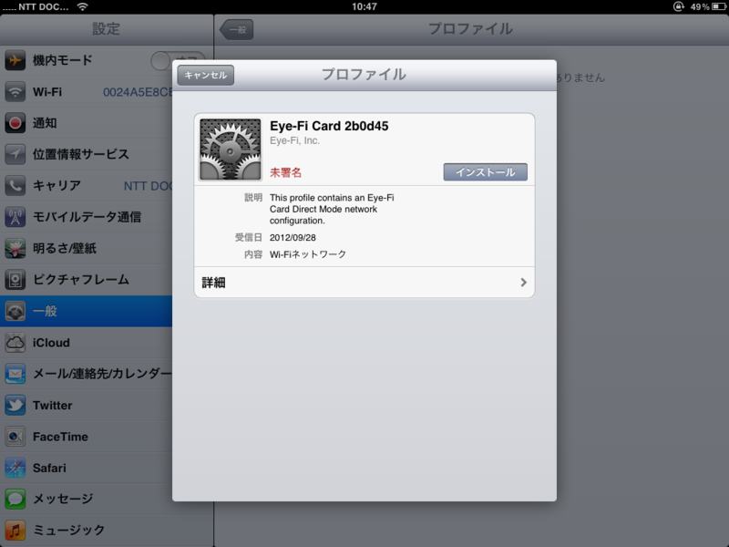

すっかり書くのを忘れていたのだけど、このまえ Eye-Fi デビューしました。今までもっていなかったんだよね。<a href="https://blog.daruyanagi.jp/entry/2012/10/01/202730">Hokuriku.NET vol.10 &#x306B;&#x53C2;&#x52A0;&#x3057;&#x3066;&#x304D;&#x307E;&#x3057;&#x305F;&#xFF01; - &#x3060;&#x308B;&#x308D;&#x3050;</a> で使ってみたのでどんな感じだったか紹介するよ。

<h3>そもそも Eye-Fi ってなんや</h3>

<a href="http://eyefi.co.jp/">http://eyefi.co.jp/</a>

Eye-Fi は SD カードに無線 LAN 機能が内蔵されていて、PC だの iPhone だのへデジタルカメラで撮った写真をワイヤレスで直接転送できる。

たとえば、デジタル一眼レフで撮った写真を iPad で確認したいとする。その場合、普通はいちいちメモリカードを抜いて、変換アダプタ経由で iPad にとりこまねばならない。

けれど、Eye-Fi があればそんな面倒は一切ない。一眼レフ <=> iPad のワイヤレスかつダイレクトな転送が可能というわけ！！

いちいちメモリカードを抜き差しする手間が省けるし、変換アダプタを忘れても平気。バシャバシャ撮ったら、モコモコ iPad に撮った写真が生えてくるんだぜ？　超素敵だよ。

無線 LAN（Wi-Fi）の面倒な設定も要らない。iOS の場合は専用アプリを入れるだけでいい。プロファイルがインストールされて、アプリの起動中は勝手につなげてくれるようになるみたい。ただ、なんか Eye-Fi ID っぽいものが必要。初めて利用するときだけ、デスクトップにアプリをインストールしてアカウントを作成した。無論、iOS アプリにもそれを設定してやる必要がある。まぁ、これぐらいの手間は仕方ないって感じだ。

あとほかにも機能はあるみたいだけど、そんなのはどうでもいいや。

<h3>不便なところ</h3>

そんな Eye-Fi にも弱点がある。<i>消費電力がヤバすぎる！　</i>今回の取材ではフル充電のバッテリーを2個もって行ったのだけど、1日足らずで使い果たした。いつもは GPS アダプタを付けた状態で 4GB ぐらい撮影し（RAW＋FINE JPEG）、やっとこさバッテリーをひとつ使うかなーといった程度なのに。油断して充電器を持参し忘れたので、翌日（<a href="https://blog.daruyanagi.jp/entry/2012/10/02/212321">https://blog.daruyanagi.jp/entry/2012/10/02/212321</a>）には一眼レフがタダのオブジェに成り果てていた。

というわけで、超絶便利なのだけど、バッテリーのことを考えるとちょっと不安。電源のオン・オフを心がけてみたけれど、ウォームアップでバッテリーを食うならばあまり意味はなさそうというか、かえって逆効果かもしれない。

ちなみに、安定性についてはほとんど問題はなかった。iPad への写真の転送がたまにとまることはあったけど、アプリの再起動でなんなく転送が再開された。この程度なら許容範囲内かな。

<a href="http://www.amazon.co.jp/exec/obidos/ASIN/B003M05LMM/bestylesnet-22/">アイファイジャパン Eye-Fi Connect X2 4GB EFJ-CN-4G</a>
<ul><li>出版社/メーカー: Eye-Fi Japan</li><li>発売日: 2010/05/20</li><li>メディア: Personal Computers</li><li>購入: 25人 クリック: 295回</li><li><a href="http://d.hatena.ne.jp/asin/B003M05LMM/bestylesnet-22" target="_blank">この商品を含むブログ (49件) を見る</a></li></ul>

容量が大きい上位版だとデキることが増えるみたいだけど、とりあえず今回試した基本的な機能なら5,000円未満で買えるエントリーモデルでも楽しめるよ。

