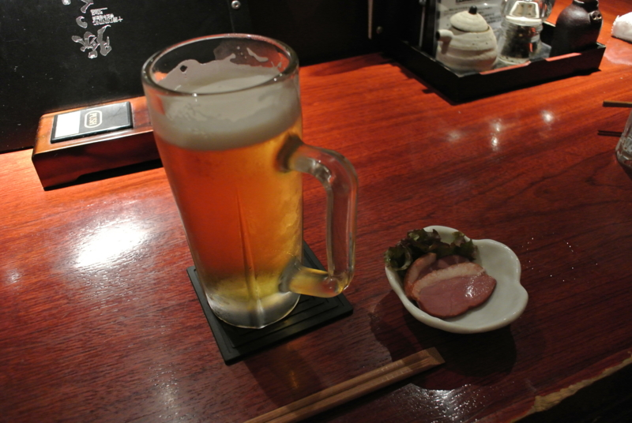
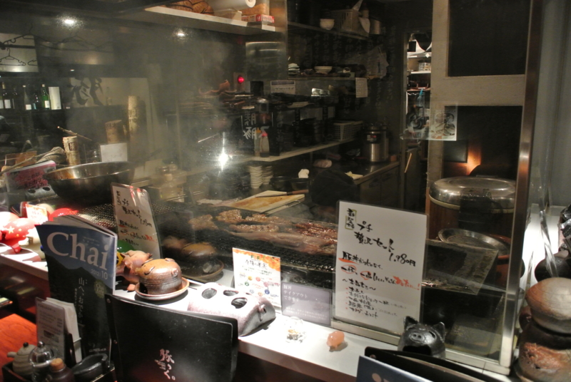
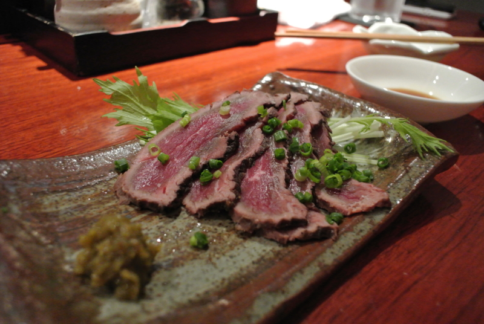
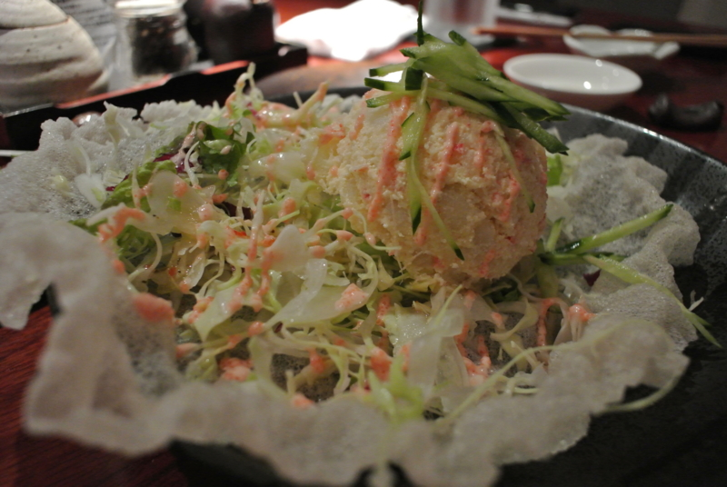
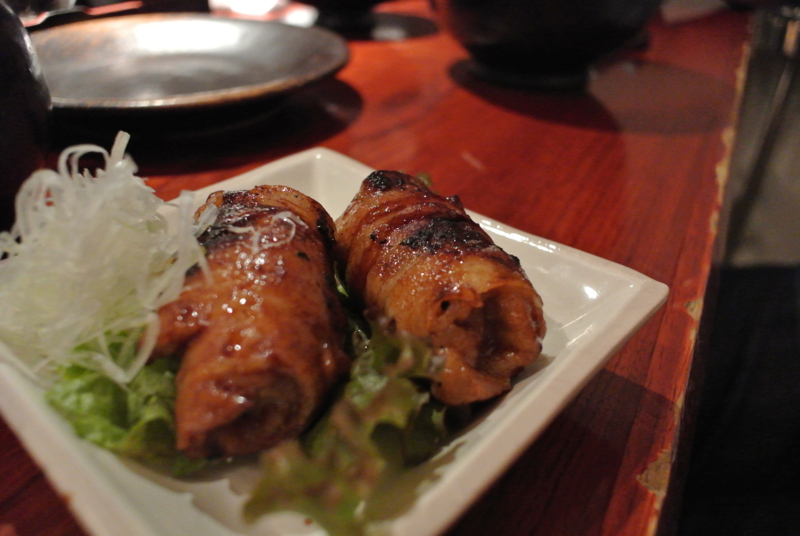
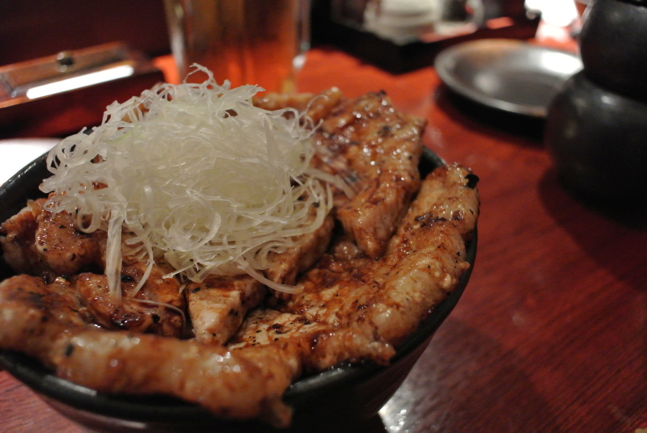
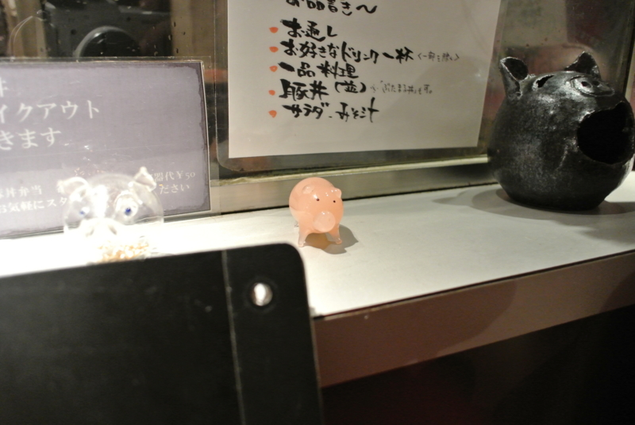

この前（<a href="https://blog.daruyanagi.jp/entry/2012/10/06/194142">&#x30D6;&#x30BF;&#x306E;&#x3064;&#x3082;&#x308A;&#x304C;&#x30DE;&#x30B0;&#x30ED;&#x306E;&#x88CF;&#x306E;&#x30A4;&#x30AB;&#x58A8;&#x306B;&#x306A;&#x3063;&#x305F;&#x8A71;&#x3002; - &#x3060;&#x308B;&#x308D;&#x3050;</a>）豚丼を食べ損なったということもあり、豚丼を求めて @shibayan と「十勝DINING 帯広本格豚丼 豚っく」まで行ってきた。この店はちょっとオシャレな居酒屋さんって感じで、結構おいしい。お店の名前はなんて読むんだ？　ぶたっく？　トニック？　ちゃんと聞いておけばよかったよ。

<ul>
<li><a href="http://akiba-pc.watch.impress.co.jp/hotline/20120915/etc_comic1.html">&#x3061;&#x3087;&#x3073;&#xFF06;&#x59C9;&#x3061;&#x3083;&#x3093;&#x306E;&#x300E;&#x30A2;&#x30AD;&#x30D0;&#x3067;&#x3054;&#x306F;&#x3093;&#x98DF;&#x3079;&#x305F;&#x3044;&#x306A;&#x3002;&#x300F; &#x301C;&#x300C;&#x5341;&#x52DD;DINING &#x5E2F;&#x5E83;&#x672C;&#x683C;&#x8C5A;&#x4E3C; &#x8C5A;&#x3063;&#x304F;&#x300D;&#x7DE8;&#x301C;</a></li>
</ul>

お肉をじゅーじゅー焼くのが目で愉しめるカウンター席へ陣取る（@shibayan 撮影）。

@shibayan が3分おきにわしのことを<i>「ホモやなぎさん、ホモやなぎさん」</i>と呼ぶのを<i>「(＃＾ω＾)ﾋﾟｷﾋﾟｷ」</i>と耐えながら、まずは牛肉の炙りたたきとタラコドレッシングのポテトサラダで一杯。わーいゆず胡椒、ホモやなぎゆず胡椒大好き！

あと、よくわかんないけどお店のおすすめであるこの物体がおいしかった。薄切りの豚肉をぎっちぎちに巻きタレで焼き上げた逸品で、噛むと口の中でふわふわ、ぱらっと広がる。小振りな割には肉々しく、それでいてアブラがウザくない。

あとは、お目当ての豚丼！　結構厚切りで、まさに「お肉食べた！」という感触。大盛りは1,700円だけど、吉野家でいえば並と特盛りの間か、見た目ほどのボリュームはない。おそらく、本来はお酒を飲んだ〆として頼むものなのだろう。ビール3杯とサイドメニューをいくつか食べたお腹に、ピッタリと収まった。

店内のあちこちにブタさんが隠れているのもかわいい。素敵な彼女ができて晴れて「ホモやなぎ」を返上できたら、ここで楽しくごはんを食べてみたいですね。まぁ、まずはこのブタ体型をなんとかしなければなるまい。

<iframe width="425" height="350" frameborder="0" scrolling="no" marginheight="0" marginwidth="0" src="https://maps.google.co.jp/maps?ie=UTF8&amp;q=%E5%8D%81%E5%8B%9DDINING+%E5%B8%AF%E5%BA%83%E6%9C%AC%E6%A0%BC%E8%B1%9A%E4%B8%BC+%E8%B1%9A%E3%81%A3%E3%81%8F&amp;fb=1&amp;gl=jp&amp;hq=%E5%8D%81%E5%8B%9DDINING+%E5%B8%AF%E5%BA%83%E6%9C%AC%E6%A0%BC%E8%B1%9A%E4%B8%BC+%E8%B1%9A%E3%81%A3%E3%81%8F&amp;cid=0,0,16053991750175516948&amp;t=m&amp;brcurrent=3,0x60188ea07a31d5cd:0x638aff91f748ede6,0&amp;ll=35.708799,139.773409&amp;spn=0.006098,0.00912&amp;z=16&amp;iwloc=A&amp;output=embed"></iframe> <small><a href="https://maps.google.co.jp/maps?ie=UTF8&amp;q=%E5%8D%81%E5%8B%9DDINING+%E5%B8%AF%E5%BA%83%E6%9C%AC%E6%A0%BC%E8%B1%9A%E4%B8%BC+%E8%B1%9A%E3%81%A3%E3%81%8F&amp;fb=1&amp;gl=jp&amp;hq=%E5%8D%81%E5%8B%9DDINING+%E5%B8%AF%E5%BA%83%E6%9C%AC%E6%A0%BC%E8%B1%9A%E4%B8%BC+%E8%B1%9A%E3%81%A3%E3%81%8F&amp;cid=0,0,16053991750175516948&amp;t=m&amp;brcurrent=3,0x60188ea07a31d5cd:0x638aff91f748ede6,0&amp;ll=35.708799,139.773409&amp;spn=0.006098,0.00912&amp;z=16&amp;iwloc=A&amp;source=embed" style="color:#0000FF;text-align:left">大きな地図で見る</a></small>

