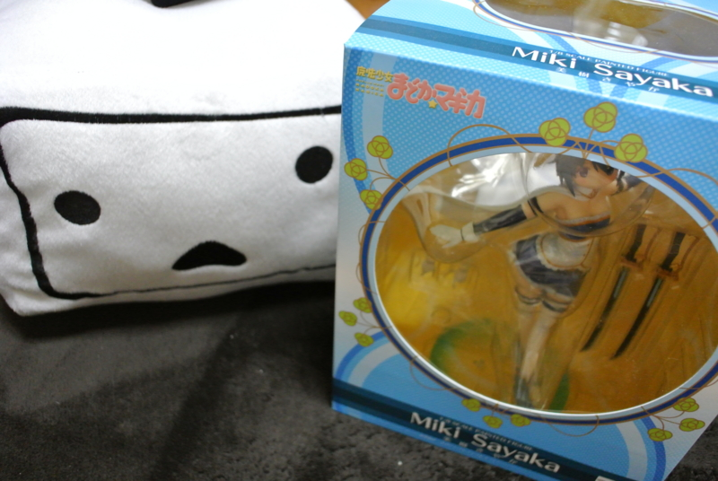
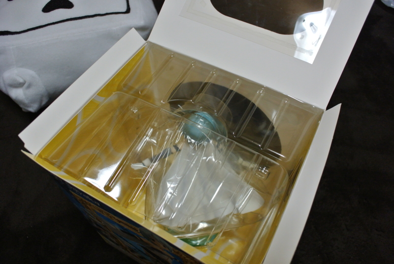
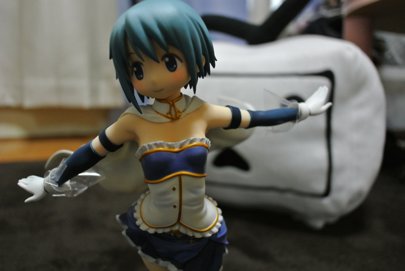

とうとうこの日が来た。これが諦めの境地か……実にすがすがしい。

<a href="http://www.amazon.co.jp/exec/obidos/ASIN/B0071IE23A/bestylesnet-22/">魔法少女まどか☆マギカ 美樹さやか (1/8スケール PVC塗装済み完成品)</a>
<ul><li>出版社/メーカー: グッドスマイルカンパニー</li><li>発売日: 2012/07/13</li><li>メディア: おもちゃ＆ホビー</li><li>購入: 4人 クリック: 899回</li><li><a href="http://d.hatena.ne.jp/asin/B0071IE23A/bestylesnet-22" target="_blank">この商品を含むブログ (15件) を見る</a></li></ul>

今年の1月に予約、もはや忘れかけていた6月に到着、そのまま4か月塩漬け。開けてはダメだ、開けてはダメだ。この一線を越えてしまえばもう戻れない。もし万が一奇跡的に彼女ができてウチにお泊りなんてことになった時、フィギュアがばばーんと置いてあったら？　だいたい、母ちゃんだって泣くだろうし、妹にだって思いっきり蔑まれるだろう。そのうち部屋がフィギュアだらけになったりでもしたら目も当てられない。

でも、もうそれも心配しないことにした。

30超えたし、4年ぐらい彼女いないし、もうこのままずっとこんな気がする。だったら今を楽しまずしてどうする！？　1個ぐらい、いいじゃない！

<h3>美樹さやかちゃんとは？</h3>

『魔法少女まどか☆マギカ』は近年稀にみる気合の入ったアニメだったように思う。

“魔法少女”モノという既成概念に乗っかりつつ、その裏と隙間を重厚な設定で埋めつくす。“魔法少女”モノらしからぬヘビーなストーリに最初は困惑するが、最後にはそれがキレイに解消されてとても爽やかに終わる。

しかも、『まどマギ』はそれだけにとどまらない。“魔法少女”モノ＝一話完結という既成概念ですら、アニメの重要な設定の一つとしてとりこんでしまった。富野由悠季がガンダムでやった「一話完結のロボットモノからシーズン単位のロボットドラマ」への進化という構図に加え、「なぜ一話完結だったのか」という命題を、運命を変えるためになんどでも時間をやり直す暁美ほむらの物語へと昇華させている。

この点が、なんか今までのアニメとは違って一皮剥けたところだなぁ、と感じられる。もっとも、それほどアニメに詳しいわけではないので、もしかしたらそういった作品はすでにあるのかもしれないけれど。ただ、こういう“メタアニメ”が作れるって結構すごいことだ。土台となる作品が十分にあって、それがみんなに共有されていないと、パロディっていうのは難しい。しかも、単体の作品としても完成度が高い。そういうところに文化的な成熟を感じて、ちょっと感心してしまう。まぁ、一方で暴走的浪費としての『ニャル子さん』という作品もあるのだけど。

そんなことはともかく。

美樹さやかは『まどマギ』で一番損な役回りを演じているし、巷でも人気ないとか言われてる。けれど、それがいい。こんな健気な子いねーだろ！　かわいいじゃないか。だいたい、わしは剣をもった女の子とバイクに乗ったお姉さんキャラはだいたいファンになってしまう性分なので、さやかちゃんを気に入る理由は十分にある。

あとのことは <a href="http://www.madoka-magica.com/tv/character/index.html">CHARACTER&#xFF5C;&#x9B54;&#x6CD5;&#x5C11;&#x5973;&#x307E;&#x3069;&#x304B;&#x2606;&#x30DE;&#x30AE;&#x30AB;</a> を参照。

<h3>開封式！</h3>

箱には3か所、ビニールテープによる封印が施されている。焦らずこれをじっくり、ゆっくり剥がしていく。

なかのパッケージも3か所、ビニールテープによる封印が施されている。あーめんどくせえ！　こっちはバリバリと剥がした。

やっとご尊顔が拝めた！　そして、震える手でビニールをひんむいていく。

開・封・完・了！

これはやべぇ、なんというクオリティの高さだ！　初めてフィギュアというものを買ったんだけど、すさまじいまでの造形美だな。スカートのヒダヒダの表現に至っては、感心してため息をつくばかりだ。

手首は交換できて、剣をもたせられる。なくさないようにしないと……。

最近、劇場版のフォルテッシモかわいいバージョンが販売されたらしくて、正直そっちもほしい。でも、なけなしの理性をかき集めて我慢することにする。それよりも、マクロレンズがほしくなってきたなぁ。

<a href="http://www.amazon.co.jp/exec/obidos/ASIN/B009L14JM4/bestylesnet-22/">劇場版 魔法少女まどか☆マギカ 美樹さやか 劇場版ver. (1/8スケール PVC製塗装済み完成)</a>
<ul><li>出版社/メーカー: グッドスマイルカンパニー</li><li>発売日: 2013/02/28</li><li>メディア: おもちゃ＆ホビー</li><li> クリック: 242回</li><li><a href="http://d.hatena.ne.jp/asin/B009L14JM4/bestylesnet-22" target="_blank">この商品を含むブログ (4件) を見る</a></li></ul>

<h3>最後に</h3>

