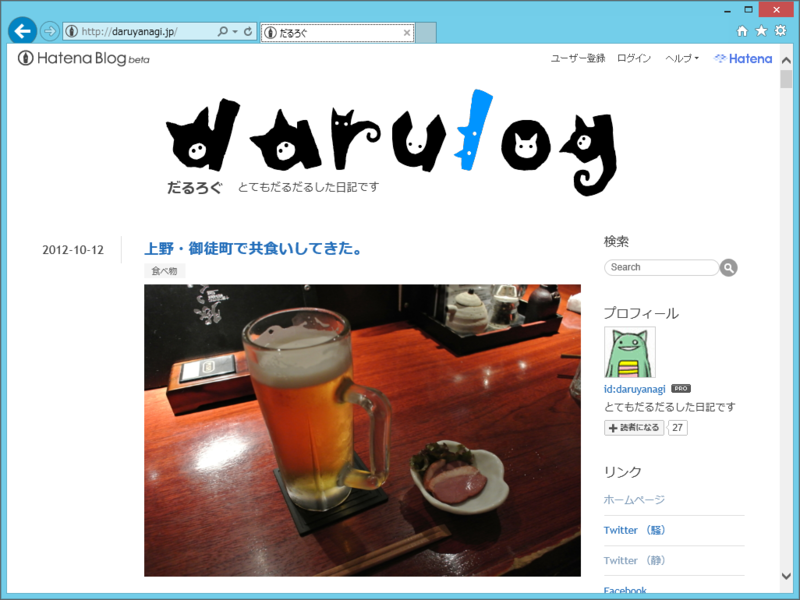
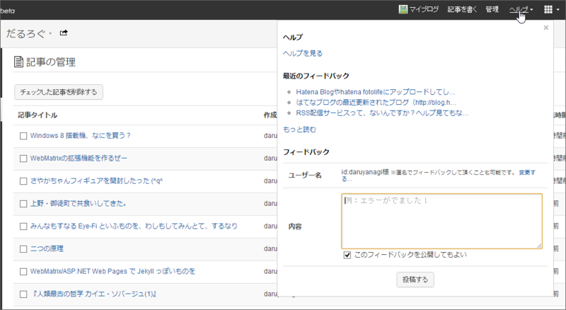

トップページに、

<ul>
<li><a href="https://blog.daruyanagi.jp/entry/2012/10/13/001617">Windows 8 &#x642D;&#x8F09;&#x6A5F;&#x3001;&#x306A;&#x306B;&#x3092;&#x8CB7;&#x3046;&#xFF1F; - &#x3060;&#x308B;&#x308D;&#x3050;</a></li>
<li><a href="https://blog.daruyanagi.jp/entry/2012/10/12/223708">WebMatrix&#x306E;&#x62E1;&#x5F35;&#x6A5F;&#x80FD;&#x3092;&#x4F5C;&#x308B;&#x305C;&#x30FC; - &#x3060;&#x308B;&#x308D;&#x3050;</a></li>
<li><a href="https://blog.daruyanagi.jp/entry/2012/10/12/193154">&#x3055;&#x3084;&#x304B;&#x3061;&#x3083;&#x3093;&#x30D5;&#x30A3;&#x30AE;&#x30E5;&#x30A2;&#x3092;&#x958B;&#x5C01;&#x3057;&#x305F;&#x3063;&#x305F; (^q^ - &#x3060;&#x308B;&#x308D;&#x3050;</a></li>
</ul>
が表示されなくなった。

管理画面にはあるし、URL を直接たたけばアクセスはできる。さっそくサポートに報告しようかと思ったら……ヘルプのところに窓口へのリンクがないし。なんか自分たちがほしいフィードバックのリンクはつけておいて、聞きたくはないトラブルの受付窓口へのリンクは貼らないって、とってもはてならしいと思う。

ということなので、一応記事にしてみた。

<h3>追記</h3>

あ、直った／(＾o＾)＼

