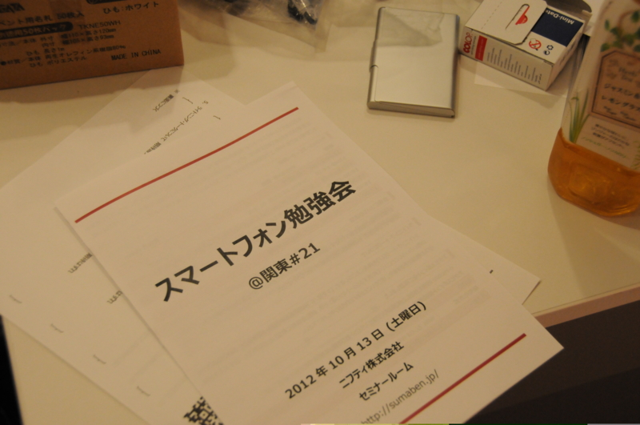
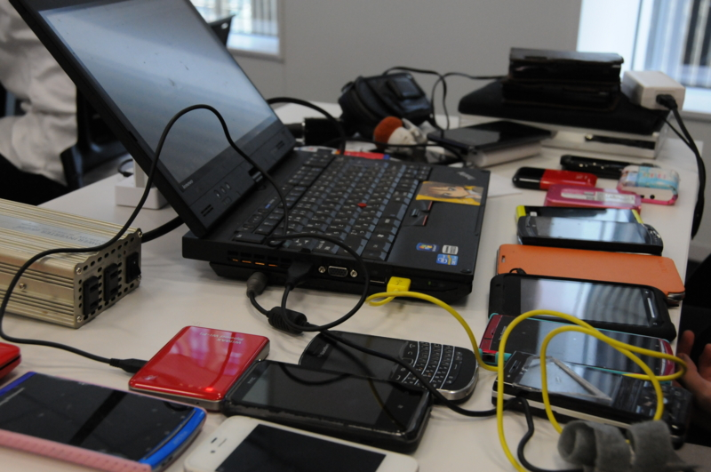
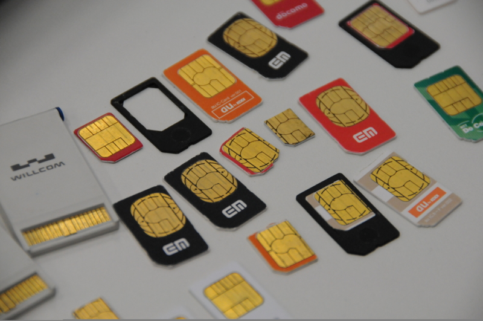

<a href="http://sumaben.jp/?SPWorkshopKanto21">&#x30B9;&#x30DE;&#x30FC;&#x30C8;&#x30D5;&#x30A9;&#x30F3;&#x52C9;&#x5F37;&#x4F1A; - &#x30B9;&#x30DE;&#x30FC;&#x30C8;&#x30D5;&#x30A9;&#x30F3;&#x52C9;&#x5F37;&#x4F1A;@&#x95A2;&#x6771; #21</a> に参加してきました。

すまべんは初めてだったのだけど、第一印象はちゃんと準備されていて、キビキビしているなぁ、ってことですかね。とても好印象でした（ほかがそうじゃないという意味ではないですよ！）。酢酸先生ってそういう性格なのかな？

セッションのほうは、コンパクトながら濃度が高い。めちゃくちゃプレゼンがうまい人と、初めてのセッションの方と両方いたみたいだけれど、どちらもとても楽しかったです。まぁ、この辺りはほかのところに書くのでここでは特に。

あえていうなら、個人的には北村さんの著作権の話はだいぶためになりました。この辺りは、自分のためにもあとでまとめたいかな。そういえば、懇親会の時はちょっと席が離れていた関係で話できなかったかも。また機を改めてお話を聞きたいです。

ちなみに、女性の参加者ゼロの勉強会は初めてでした（ぉ

次は仕事抜きに参加したいですね。

